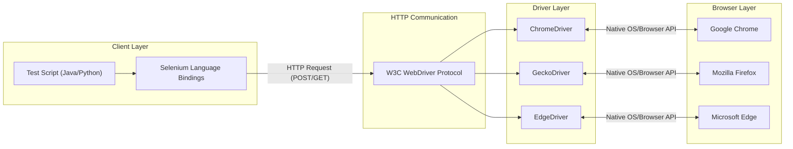

# Part 1A: Selenium Fundamentals (Intro)

## Topic 1: What is Selenium?

### 1. What is it?
Selenium is an open-source, automated testing suite primarily designed to test web applications across different browsers and platforms. Created originally by Jason Huggins at ThoughtWorks in 2004, it is not just a single tool but rather a collection of tools (IDE, WebDriver, Grid) that each caters to different testing needs. It supports multiple programming languages (Java, Python, C#, Ruby, JavaScript) and works seamlessly on various operating systems (Windows, macOS, Linux) and browsers (Chrome, Firefox, Edge, Safari).

### 2. Why do we need it?
Before Selenium, testing web applications required an army of manual testers clicking through screens, filling out forms, and verifying results. This was slow, error-prone, and expensive. Alternatively, companies used expensive commercial tools like QTP/UFT, which were tied to specific languages (VBScript) and platforms (Windows). We need Selenium because it democratizes test automation. It allows developers and testers to write robust, repeatable scripts in their preferred programming language to simulate real user interactions in a browser, drastically reducing regression testing time and catching bugs early in the CI/CD pipeline.

### 3. Where do we use it?
Selenium is used almost everywhere a web application exists. E-commerce platforms use it to verify the checkout flow. Banking applications use it to ensure secure login and fund transfer functionalities work correctly. SaaS products use it to automate the testing of new feature deployments. Essentially, any project that involves a web browser (HTML/CSS/JS frontend) and requires repetitive regression testing is a prime candidate for Selenium automation.

### 4. How does it work internally?
At a high level, Selenium acts as a bridge between your code and the browser. When you run a script, Selenium translates your code (e.g., `click()`, `sendKeys()`) into HTTP requests. These requests are sent to a specific Browser Driver (like ChromeDriver). The Browser Driver receives the request, communicates natively with the actual web browser to perform the action, and then returns the response (success or failure) back through the HTTP protocol to your script.

### 5. Syntax
```java
// Core concept: Instantiating a browser and navigating
WebDriver driver = new ChromeDriver();
driver.get("https://www.example.com");
```

### 6. Complete practical example
```java
import org.openqa.selenium.By;
import org.openqa.selenium.WebDriver;
import org.openqa.selenium.WebElement;
import org.openqa.selenium.chrome.ChromeDriver;
import java.time.Duration;

public class BasicSeleniumTest {
    public static void main(String[] args) {
        // 1. Initialize the WebDriver (Chrome)
        WebDriver driver = new ChromeDriver();
        
        try {
            // 2. Configure timeouts
            driver.manage().timeouts().implicitlyWait(Duration.ofSeconds(10));
            driver.manage().window().maximize();
            
            // 3. Navigate to a web application
            driver.get("https://opensource-demo.orangehrmlive.com/");
            
            // 4. Interact with elements
            WebElement usernameInput = driver.findElement(By.name("username"));
            usernameInput.sendKeys("Admin");
            
            WebElement passwordInput = driver.findElement(By.name("password"));
            passwordInput.sendKeys("admin123");
            
            WebElement loginButton = driver.findElement(By.cssSelector("button[type='submit']"));
            loginButton.click();
            
            // 5. Verify the outcome
            String currentUrl = driver.getCurrentUrl();
            if (currentUrl.contains("dashboard")) {
                System.out.println("Login Test Passed!");
            } else {
                System.out.println("Login Test Failed!");
            }
        } finally {
            // 6. Clean up and close the browser
            driver.quit();
        }
    }
}
```

### 7. Real-time project usage
Experienced SDETs rarely write raw scripts in a `main` method like the example above. In real projects, Selenium is the "engine" hidden underneath layers of a custom framework. We use design patterns like Page Object Model (POM) to separate UI locators from test logic. We wrap Selenium commands in custom utility classes (e.g., `ElementUtil.java`) to handle synchronization (explicit waits), logging, and exception handling gracefully. Selenium is also integrated with build tools (Maven/Gradle), testing frameworks (TestNG/JUnit), and CI/CD pipelines (Jenkins, GitHub Actions) for nightly regression runs.

### 8. Important points ⭐
*   ⭐ Selenium is a **suite** (IDE, WebDriver, Grid), not a single tool.
*   ⭐ It only automates **web applications**. It cannot automate desktop apps (like Excel) or native mobile apps (without Appium).
*   ⭐ It supports **multiple languages**, which is its biggest advantage over Cypress (JS/TS only).
*   ⭐ Selenium does not have built-in reporting; it relies on TestNG, ExtentReports, or Allure.

### 9. Common mistakes ❌
*   ❌ Believing Selenium can test everything. People often try to automate Captcha, OTPs, or Desktop file upload dialogs using pure Selenium.
*   ❌ Confusing Selenium IDE with Selenium WebDriver. IDE is a record-and-playback tool, WebDriver is an API for programmatic automation.
*   ❌ Thinking Selenium is a testing framework. It's an automation library. TestNG/JUnit is the testing framework.

### 10. Interview questions & answers
**Q1: How does Selenium differ from Cypress or Playwright?**
*Answer:* Selenium is a mature, W3C-standardized tool that communicates with browsers out-of-process via HTTP drivers. It supports many languages (Java, Python, C#, etc.) and handles multi-tab/multi-window testing well. Cypress runs in-process (inside the browser itself), meaning it executes very fast and has native access to the DOM, but it's limited to JavaScript/TypeScript and has historical struggles with multiple tabs. Playwright is a modern tool by Microsoft that uses DevTools protocols directly to talk to browsers, offering faster execution than Selenium, built-in auto-waiting, and multi-language support, but Selenium still has the largest market share and community support.

**Q2: Can we automate Captcha or OTP using Selenium?**
*Answer:* No, and we shouldn't try. Captcha (Completely Automated Public Turing test to tell Computers and Humans Apart) is explicitly designed to block automation tools like Selenium. If Selenium could easily bypass it, the Captcha would be useless. In a test environment, the best practice is to ask the development team to disable Captcha for the staging/QA environment, or provide a static OTP/bypass token that the automation script can use.

**Q3: Why do we say Selenium is an API and not a tool?**
*Answer:* A tool usually implies a standalone application with a user interface (like Postman or SoapUI). Selenium WebDriver is a collection of libraries and interfaces (an Application Programming Interface). You add it as a dependency in your Java/Python project and call its methods via code. It doesn't have an executable UI for writing tests; your IDE (IntelliJ/Eclipse) is where you use the Selenium API.

**Q4: Who created Selenium and why?**
*Answer:* Jason Huggins created Selenium in 2004 at ThoughtWorks. He was working on a web application that required frequent testing and was tired of manually stepping through the same test cases. He created a JavaScript program called "JavaScriptTestRunner" to automatically execute tests on the browser. This evolved into Selenium Core and eventually the Selenium suite we know today. The name "Selenium" was a joke in an email mocking a competitor tool called Mercury (Mercury Interactive, which made QTP). Since selenium is a known cure for mercury poisoning, the name stuck.

**Q5: What are the main components of the Selenium Suite?**
*Answer:* The suite consists of Selenium IDE (a browser extension for simple record-and-playback, mainly for rapid prototyping), Selenium WebDriver (the core API that allows writing complex, logic-driven automation scripts in various languages), and Selenium Grid (a tool for distributing and executing tests concurrently across multiple machines and browser versions to reduce execution time). Selenium RC (Remote Control) was the predecessor to WebDriver but is now deprecated.

### 11. Scenario-based questions
**Scenario 1:** Your manager asks you to automate a newly developed Windows desktop application using Selenium. How do you respond?
*Answer:* I would explain to my manager that Selenium is strictly designed for web application testing (applications that run inside a web browser and render HTML/DOM). It cannot interact with native Windows OS components. I would propose using an appropriate tool for desktop automation, such as WinAppDriver (which uses the WebDriver protocol but for Windows apps), AutoIt, or a commercial tool like UFT.

**Scenario 2:** A client wants to migrate their legacy automation suite written in VBScript (QTP/UFT) to Selenium. They want to know the major challenges they will face.
*Answer:* The main challenges include: 1. Language shift (VBScript to Java/Python/C#), requiring team upskilling. 2. Loss of built-in object repository (we must implement our own using Page Object Model). 3. Lack of built-in reporting (we must integrate TestNG and ExtentReports). 4. Inability to interact with desktop pop-ups natively (might require AutoIt integration). However, the benefits (no licensing cost, cross-browser, cross-OS) far outweigh these challenges.

**Scenario 3:** Your team is evaluating between Playwright and Selenium for a new Java-based automation project. What factors do you consider?
*Answer:* I would consider team expertise, community support, and specific feature needs. Selenium has a massive community, meaning any issue we face has likely been solved and documented on StackOverflow. It also supports older browsers if needed. Playwright offers faster execution, native auto-waiting (reducing flaky tests), and built-in API testing capabilities. If the application is highly dynamic and we want fast, modern execution, Playwright is tempting. If we need guaranteed stability, a huge talent pool for hiring, and integration with legacy grids, Selenium is the safer bet.

### 12. Hands-on task
**Task:** Create a Maven project in IntelliJ. Add the latest Selenium Java dependency to your `pom.xml`. Write a simple class with a `main` method that opens your favorite website (e.g., Wikipedia), prints the page title to the console, and then closes the browser.

### 13. Exam answer
**Define Selenium and its core advantages.**
Selenium is an open-source suite of tools designed for the automated testing of web applications. Its core advantages include:
1. **Open Source:** Free to use, with no licensing costs.
2. **Language Agnostic:** Supports Java, Python, C#, Ruby, and JavaScript.
3. **Cross-Browser:** Compatible with Chrome, Firefox, Edge, Safari.
4. **Cross-Platform:** Runs on Windows, Linux, and macOS.
5. **Community:** Has a vast community and comprehensive documentation.

---

## Topic 2: Why Selenium?

### 1. What is it?
"Why Selenium" addresses the specific pain points of software testing that Selenium resolves. It highlights the transition from manual testing and expensive proprietary tools to an open-source, flexible, and scalable automation solution.

### 2. Why do we need it?
Before Selenium, manual testing was the norm. Imagine checking 100 links on a website manually every time a new version is released—it's exhausting and you might miss something. Automated tools existed (like Mercury QTP), but they cost thousands of dollars per license and only worked on Windows with VBScript. We need Selenium because it breaks these barriers: it's free, it works on a Mac or Linux machine, you can code in Java or Python, and you can run your tests on 50 browsers at the same time using Grid.

### 3. Where do we use it?
We use it whenever an organization adopts Agile or DevOps practices. In these environments, code is deployed daily or weekly. Manual regression testing cannot keep up with this pace. Selenium scripts are integrated into CI/CD pipelines (like Jenkins) to run automatically on every code commit, acting as a quality gatekeeper before code reaches production.

### 4. How does it work internally?
(Covered broadly in Topic 1, but specifically regarding *why* it works well): Selenium's architecture allows it to decouple the test script from the browser. Because it uses a standardized protocol (W3C WebDriver) to talk to browser drivers, Selenium itself doesn't need to be updated every time Chrome releases a new version—only the ChromeDriver needs an update. This decoupled nature makes it highly maintainable and adaptable to the ever-changing browser landscape.

### 5. Syntax
*N/A - This is a conceptual topic.*

### 6. Complete practical example
*N/A - This is a conceptual topic, but the impact is seen in POM frameworks.*

### 7. Real-time project usage
In real projects, "Why Selenium" translates to cost savings and speed. A company might have a suite of 2,000 regression test cases. Manually, this takes a team of 5 people two weeks to execute. Using Selenium Grid and cloud providers like BrowserStack or SauceLabs, an SDET configures these 2,000 tests to run in parallel. The entire suite finishes in 30 minutes, providing instant feedback to developers. This is the true "Why" of Selenium.

### 8. Important points ⭐
*   ⭐ **Open Source:** Zero licensing cost.
*   ⭐ **Platform Agnostic:** Write on Mac, run on Linux.
*   ⭐ **Language Flexibility:** Fits into the tech stack the company already uses.
*   ⭐ **Hardware Resource Efficiency:** Tests can run in headless mode (no UI), saving CPU/RAM on CI servers.

### 9. Common mistakes ❌
*   ❌ Thinking Selenium is the *only* solution. Sometimes API testing (using RestAssured) is faster and more reliable than UI testing with Selenium.
*   ❌ Using Selenium for performance testing. Selenium is functional testing tool. It should not be used to simulate 10,000 users hitting a website (use JMeter instead).

### 10. Interview questions & answers
**Q1: What are the primary limitations of Selenium?**
*Answer:* Selenium has several limitations. It can only test web applications, not desktop or native mobile apps. It lacks built-in reporting mechanisms and relies on third-party libraries like ExtentReports. It does not natively handle image-based testing (like verifying a graph or chart). It requires significant programming knowledge compared to record-and-playback tools. Finally, it cannot handle OS-level dialogs like file upload/download windows natively without workarounds like Robot class or AutoIt.

**Q2: When should you NOT use Selenium?**
*Answer:* You should not use Selenium if you are testing a desktop application or a standalone mobile app. You should also avoid it for performance or load testing, as creating hundreds of browser instances is incredibly resource-intensive and inaccurate for load metrics. Additionally, if the tests are simple data validations that can be done via an API call, you should use API testing instead, as Selenium UI tests are slower and more prone to flakiness.

**Q3: How did Selenium solve the problems of older tools like QTP?**
*Answer:* QTP (Quick Test Professional, now UFT) was the industry standard but had major drawbacks: it was incredibly expensive, tied strictly to the Windows OS, only supported VBScript, and predominantly focused on Internet Explorer. Selenium solved this by being free and open-source, supporting multiple operating systems (Windows, Mac, Linux), multiple languages (Java, Python, C#, etc.), and driving all major browsers (Chrome, Firefox, Safari).

**Q4: Why is language support an important feature of Selenium?**
*Answer:* Language support is crucial because it allows the testing team to work in the same ecosystem as the development team. If a company builds its backend in Java, the SDETs can write Selenium tests in Java. This allows for code sharing, easier code reviews by developers, and better integration into the existing build tools (like Maven/Gradle) and CI/CD pipelines.

**Q5: What is the benefit of cross-browser testing with Selenium?**
*Answer:* Users access web applications using a wide variety of browsers (Chrome, Safari, Firefox, Edge) and devices. HTML, CSS, and JavaScript can render or behave differently across these engines (WebKit, Blink, Gecko). Cross-browser testing ensures that the application delivers a consistent and bug-free experience for all users, regardless of their browser choice. Selenium automates this tedious process.

### 11. Scenario-based questions
**Scenario 1:** Your company is deciding between purchasing an expensive proprietary automation tool (which has great reporting and object repositories) vs using Selenium. How do you argue for Selenium?
*Answer:* I would highlight the Total Cost of Ownership (TCO). While the proprietary tool has upfront features, the licensing costs scale poorly as the team grows or as we need to run more tests in parallel. With Selenium, we pay zero licensing. Although we have to build the framework, reporting (ExtentReports), and object repository (POM) ourselves, this is a one-time engineering effort. Furthermore, Selenium's flexibility allows us to integrate it perfectly with our custom CI/CD pipeline, and finding engineers skilled in Selenium Java is much easier than finding specialists for niche proprietary tools.

**Scenario 2:** A developer tells you, "We should use Selenium to verify the API response payload when a user clicks submit." Is this a good approach?
*Answer:* No. While Selenium can trigger the API call by clicking the UI, parsing network responses through Selenium is complex and slow. It violates the test pyramid. If the goal is to verify the API payload, we should write an API test using tools like RestAssured or Postman. We should use Selenium only to verify that the UI correctly displays the success message or navigates to the next page after the click.

**Scenario 3:** You need to automate the verification of a PDF document generated and downloaded by your web application. Can Selenium do this alone?
*Answer:* No, Selenium alone cannot do this. Selenium can click the download button, but it cannot parse or read the contents of a PDF file. I would use Selenium to trigger the download, configure Chrome preferences to download the file to a specific directory without an OS prompt, and then use a Java library like Apache PDFBox to open the downloaded file and assert its text contents.

### 12. Hands-on task
**Task:** Research and write a brief comparison table between Selenium and Cypress. Focus on: Architecture (Out-of-process vs In-process), Language Support, Browser Support, and Handling of Multiple Tabs.

### 13. Exam answer
**Discuss the main limitations of the Selenium framework.**
While powerful, Selenium has notable limitations:
1. **Scope:** Restricted strictly to web applications.
2. **OS Dialogs:** Cannot interact with native OS elements (e.g., file upload windows, Captchas).
3. **Reporting:** Lacks built-in reporting; requires integration with TestNG/ExtentReports.
4. **Learning Curve:** Requires strong programming skills in languages like Java or Python to build robust frameworks, unlike purely codeless tools.
5. **Image Verification:** Cannot perform pixel-by-pixel image comparisons out of the box.

---

## Topic 3: Selenium Components

### 1. What is it?
Selenium is a suite consisting of different components, each serving a specific testing need. Historically, it included Selenium IDE, Selenium RC (Remote Control), Selenium WebDriver, and Selenium Grid. Today, RC is deprecated, and the active components are IDE, WebDriver, and Grid.

### 2. Why do we need it?
Different users and scenarios require different tools. A business analyst who doesn't know how to code but wants to quickly record a workflow needs **Selenium IDE**. An SDET building a robust, maintainable test framework needs **Selenium WebDriver**. A DevOps engineer who wants to run 500 tests in parallel across different operating systems and browsers needs **Selenium Grid**. The components provide a complete ecosystem.

### 3. Where do we use it?
*   **Selenium IDE:** Used for rapid prototyping, bug reproduction scripts, or by non-technical team members.
*   **Selenium WebDriver:** Used in the core automation framework repository by SDETs to write complex test scripts.
*   **Selenium Grid:** Deployed on cloud servers (AWS/Azure) or managed services (BrowserStack) to execute WebDriver scripts in parallel.

### 4. How does it work internally?
*   **IDE:** An extension/add-on in Chrome/Firefox that monitors user interactions with the DOM and records them as commands (like `click target=id=btn`).
*   **RC (Deprecated):** Injected JavaScript into the browser to automate actions. It suffered from the Same-Origin Policy, requiring a proxy server to trick the browser.
*   **WebDriver:** Uses native OS and browser-specific APIs to control the browser directly, acting exactly like a real user.
*   **Grid:** Follows a Hub-and-Node architecture. The test script points to the Hub. The Hub routes the JSON/W3C commands to an available Node (a machine with a specific OS/Browser combo) which executes the test using WebDriver.

### 5. Syntax
*N/A - Architecture/Component overview.*

### 6. Complete practical example
While there isn't code for all components at once, here is how a WebDriver script connects to a Grid Hub:
```java
import org.openqa.selenium.Platform;
import org.openqa.selenium.WebDriver;
import org.openqa.selenium.remote.DesiredCapabilities;
import org.openqa.selenium.remote.RemoteWebDriver;
import java.net.URL;

public class GridExample {
    public static void main(String[] args) throws Exception {
        // Define what environment we want on the Grid
        DesiredCapabilities cap = new DesiredCapabilities();
        cap.setBrowserName("chrome");
        cap.setPlatform(Platform.LINUX);

        // Point WebDriver to the Hub URL instead of local ChromeDriver
        URL hubUrl = new URL("http://localhost:4444/wd/hub");
        WebDriver driver = new RemoteWebDriver(hubUrl, cap);

        driver.get("https://www.google.com");
        System.out.println(driver.getTitle());
        driver.quit();
    }
}
```

### 7. Real-time project usage
In a mature setup, an SDET never runs the full test suite locally. They write tests using **WebDriver** on their laptop. When they push code to Git, a Jenkins pipeline triggers. The pipeline compiles the tests and sends them to a **Selenium Grid** hub. The Hub distributes the tests across 20 different Docker containers (Nodes) running various browsers. This reduces test execution time from hours to minutes.

### 8. Important points ⭐
*   ⭐ **Selenium RC is dead.** It was officially deprecated in Selenium 3.
*   ⭐ **WebDriver is an API.** It's the core engine of modern Selenium automation.
*   ⭐ **Grid enables Parallel Execution.** It does not *write* tests; it *distributes* tests.

### 9. Common mistakes ❌
*   ❌ Thinking Selenium IDE generates production-ready code. While IDE can export scripts to Java, the exported code is brittle, lacks POM structure, and shouldn't be used in enterprise frameworks.
*   ❌ Confusing WebDriver with Grid. WebDriver drives the browser; Grid manages multiple machines running WebDriver.

### 10. Interview questions & answers
**Q1: What is the difference between Selenium RC and Selenium WebDriver?**
*Answer:* Selenium RC (Selenium 1) worked by injecting JavaScript programs (Selenium Core) into the browser to simulate actions. Because of browser security restrictions (Same-Origin Policy), it required a complex proxy server setup. It was slow and simulated user actions rather than acting natively. Selenium WebDriver (Selenium 2+) interacts directly with the browser using native OS and browser-level APIs. It is faster, more realistic, doesn't require a proxy server, and can interact with elements exactly as a real user would.

**Q2: What is Selenium Grid and when do you use it?**
*Answer:* Selenium Grid is a tool used for parallel and distributed testing. It consists of a Hub (a central server) and multiple Nodes (machines registered to the hub with different OS and browser configurations). You use it when you have a large test suite that takes too long to run sequentially on a single machine, or when you need to verify cross-browser compatibility across multiple platforms simultaneously without maintaining separate physical hardware on your desk.

**Q3: Can Selenium IDE be used for complex data-driven testing?**
*Answer:* No, Selenium IDE is not suited for complex data-driven testing. It is a simple record-and-playback browser extension. While modern versions have added some basic flow control (like loops and if-statements), it lacks the power of a full programming language. For data-driven testing (e.g., reading from Excel or a Database), Selenium WebDriver combined with a framework like TestNG or JUnit is required.

**Q4: Why was Selenium RC deprecated?**
*Answer:* Selenium RC was deprecated because its architecture was inherently flawed for modern web testing. Injecting JavaScript to control a browser was slow and constantly fought against the browser's built-in security mechanisms. WebDriver's approach of natively driving the browser was fundamentally superior. Maintaining both codebases became impractical, so the Selenium project merged RC and WebDriver into Selenium 2, and eventually removed RC completely in Selenium 3.

**Q5: What are DesiredCapabilities in the context of Grid?**
*Answer:* DesiredCapabilities (or `Options` classes in newer Selenium versions) are key-value pairs used to instruct the Selenium Grid Hub about the specific environment you need. For example, your script might request `browserName="firefox"` and `platform="WINDOWS"`. The Hub reads these capabilities and searches its registered Nodes. If it finds a Node matching those exact requirements, it routes the test execution to that specific machine.

### 11. Scenario-based questions
**Scenario 1:** A QA manager wants to speed up test creation and suggests the team completely drop Java/WebDriver and just use Selenium IDE to record all 500 test cases. How do you respond?
*Answer:* I would strongly advise against this. While IDE speeds up initial test creation, the maintenance cost is catastrophic. Recorded tests are brittle—if an element's ID changes, the IDE script breaks, and you have to re-record or manually edit it. IDE doesn't support Page Object Model, meaning there is no centralized locators management. For 500 test cases, a code-based WebDriver framework is mandatory for long-term maintainability, reusability, and stability.

**Scenario 2:** You need to run a test script on Safari on macOS, but your development laptop is a Windows machine. How do you achieve this?
*Answer:* I cannot run Safari locally on a Windows machine. I would use Selenium Grid. I would write the test using WebDriver on my Windows machine. Then, I would configure a Mac machine on the network as a Node registered to a Selenium Grid Hub. I would update my test script to use `RemoteWebDriver`, pointing to the Hub, and pass `DesiredCapabilities` requesting Safari and Mac. The Hub will execute the test on the Mac Node. Alternatively, I could use a cloud Grid provider like BrowserStack.

**Scenario 3:** During an interview, you are asked: "We have an old project using Selenium 2 (RC). We are upgrading to Selenium 4. What is the major breaking change?"
*Answer:* The most significant breaking change is that the `DefaultSelenium` class and the entire Selenium RC API have been completely removed. Any test scripts written using the old RC syntax will simply not compile. The team must rewrite the interaction layers using the WebDriver API (e.g., changing `selenium.click("locator")` to `driver.findElement(By...).click()`).

### 12. Hands-on task
**Task:** Download the Selenium IDE extension for Chrome. Record a simple flow: Go to Google, search for "Selenium WebDriver", and click the first result. Export the recorded script to "Java JUnit" format. Open the exported Java file and inspect how the IDE generated the `WebDriver` code. Note how hardcoded and unstructured the locators are compared to a POM approach.

### 13. Exam answer
**Describe the architecture of Selenium Grid.**
Selenium Grid operates on a Hub-and-Node architecture:
*   **The Hub:** The central server that receives test execution requests from the test scripts (via `RemoteWebDriver`). It parses the requested capabilities (e.g., Chrome on Linux).
*   **The Nodes:** Multiple machines (or containers) registered to the Hub. Each node has a specific OS, Browser, and WebDriver version.
*   **Flow:** The Hub finds a Node that matches the requested capabilities and routes the WebDriver commands to that Node. The Node executes the browser automation and sends the results back to the Hub, which forwards it to the test script. This enables massive parallel execution.

---

## Topic 4: Selenium Architecture (DEEP DIVE)

### 1. What is it?
Selenium Architecture is the internal mechanism that explains exactly how a line of code written in an IDE (like Java) results in a physical click inside a web browser. It details the communication protocols and the intermediaries involved in translating code into browser actions.

### 2. Why do we need it?
As an SDET, you cannot debug flaky tests or connection issues if you don't understand the architecture. Knowing the architecture helps you understand why you get a `SessionNotCreatedException`, why version mismatch between ChromeDriver and Chrome Browser causes failures, and how Selenium is fundamentally different from tools that inject JavaScript.

### 3. Where do we use it?
This knowledge is used daily when setting up infrastructure, debugging pipeline failures, configuring remote execution (Grid/Docker), and during senior-level architectural discussions and interviews.

### 4. How does it work internally?
The architecture consists of four main layers:
1.  **Client Libraries (Language Bindings):** Your Java code. It doesn't know anything about browsers. It just provides methods like `.click()`.
2.  **The Protocol:** When you call `.click()`, the Java library converts this command into an HTTP request.
    *   *Selenium 3:* Used JSON Wire Protocol (sending JSON over HTTP).
    *   *Selenium 4:* Uses the W3C WebDriver Protocol standard directly.
3.  **Browser Drivers:** Executable files (like `chromedriver.exe`, `geckodriver.exe`). These run as local servers. They receive the HTTP request from your code, interpret it, and talk to the actual browser.
4.  **Real Browsers:** The actual application (Chrome, Firefox). It receives native commands from the Browser Driver, performs the action, and sends the response back down the chain.

> [!NOTE]
> **Mermaid Architecture Diagram**



### 5. Syntax
*N/A - Conceptual architecture.*

### 6. Complete practical example
Let's look at what happens behind the scenes of one line of code:
```java
driver.get("https://google.com");
```
1.  **Java Client:** The Selenium Java binding creates an HTTP POST request.
2.  **HTTP Request:** It sends this request to the local ChromeDriver server running on your machine (e.g., `http://localhost:9515/session/{session_id}/url` with a JSON payload `{"url": "https://google.com"}`).
3.  **ChromeDriver:** Receives the request, parses the URL, and uses Chrome's DevTools Protocol to instruct the Chrome browser to navigate.
4.  **Chrome Browser:** Loads the page. Once fully loaded, it tells ChromeDriver.
5.  **Response:** ChromeDriver sends an HTTP 200 OK response back to the Java code.
6.  **Java Client:** The Java execution unblocks and moves to the next line of code.

### 7. Real-time project usage
Understanding this architecture is crucial when deploying tests to CI/CD. Often, a test runs fine locally but fails on Jenkins with `Connection Refused` or `SessionNotCreated`. An architect knows this means the Java binding (Layer 1) cannot establish HTTP communication (Layer 2) with the Driver (Layer 3). They will immediately check if the driver server is running, if the ports are open, or if the driver version matches the installed browser version.

### 8. Important points ⭐
*   ⭐ The Java code **never** communicates directly with the browser. It communicates with the driver.
*   ⭐ The Driver acts as an **HTTP Server**. Your script acts as an **HTTP Client**.
*   ⭐ In Selenium 4, the JSON Wire Protocol was retired. Communication is strictly W3C standardized.

### 9. Common mistakes ❌
*   ❌ Thinking Selenium is a desktop application. It's an API that generates HTTP calls.
*   ❌ Getting stuck on version mismatch. If Chrome updates to v120, but your `chromedriver.exe` is v118, the architecture breaks at the Driver-Browser link. (Note: Selenium Manager in v4.6+ now handles this automatically!).

### 10. Interview questions & answers
**Q1: Explain the detailed flow when `driver.click()` is executed.**
*Answer:* When `element.click()` is called in Java, the Selenium language bindings construct a W3C-compliant HTTP POST request. The URL looks something like `/session/{sessionId}/element/{elementId}/click`. This request is sent over the local network to the Browser Driver (like ChromeDriver), which is running as a background HTTP server. The driver receives the HTTP request, translates it into the browser's native API (like DevTools Protocol for Chrome), and triggers the physical click event in the browser. The browser confirms the action to the driver, and the driver sends an HTTP 200 Response back to the Java script, allowing code execution to proceed.

**Q2: What is the difference between JSON Wire Protocol and W3C Protocol?**
*Answer:* JSON Wire Protocol was the communication standard used in Selenium 3. It required encoding and decoding API requests and often resulted in slight discrepancies between how different browsers interpreted commands, leading to flaky tests. The W3C WebDriver Protocol is an official web standard. In Selenium 4, Selenium natively uses W3C. This means the browser drivers (which are built by Apple, Google, Mozilla) and Selenium scripts speak the exact same standardized language. There is no longer a need for JSON payload encoding/decoding at the driver level, resulting in faster and inherently more stable execution.

**Q3: Why do we need a separate Browser Driver (ChromeDriver, GeckoDriver)? Why can't Selenium talk to the browser directly?**
*Answer:* Browsers are complex, secure applications built by different companies (Google, Mozilla, Apple) using different rendering engines. Their internal native APIs are proprietary and strictly secured to prevent malicious code from controlling the browser. Selenium cannot know the internal workings of every browser. Therefore, the browser vendors themselves build the Drivers (e.g., Google builds ChromeDriver). The Driver exposes a standardized API (W3C) to Selenium on the outside, and on the inside, it holds the proprietary "keys" to control the specific browser natively.

**Q4: If the architecture relies on HTTP, does that mean Selenium needs an internet connection to run tests locally?**
*Answer:* No. While the architecture uses the HTTP protocol, it operates on `localhost` (the loopback network interface). When you start a WebDriver session, the driver server spins up on your local machine on a specific port (e.g., `http://localhost:9515`). The HTTP requests are sent internally within your machine's network stack. Internet is only required if the application you are testing requires it, or if you are pointing to a remote Grid Hub.

**Q5: What happens at the architectural level when you get a `SessionNotCreatedException`?**
*Answer:* This exception occurs at the very beginning of the architectural flow during the handshake. The Client Library sends an HTTP POST request to the Driver's `/session` endpoint requesting a new browser instance. If the Driver cannot fulfill this—usually because the installed Browser version is incompatible with the Driver version, or the Driver binary is corrupted/missing—it rejects the HTTP request and returns an error. The Java binding interprets this error and throws the `SessionNotCreatedException`.

### 11. Scenario-based questions
**Scenario 1:** Your test fails with an error stating that the ChromeDriver executable must be set in `webdriver.chrome.driver` system property. You explain the architecture to a junior. How do you resolve this modernly?
*Answer:* I would explain that historically, we had to manually download the `chromedriver.exe` (Layer 3) and link it to our code using `System.setProperty()`. However, I would tell them that as of Selenium 4.6+, Selenium Manager is integrated into the architecture. It automatically detects the browser version, downloads the exact matching driver executable into a cache, and links it. We simply delete the `System.setProperty()` line and just write `WebDriver driver = new ChromeDriver()`.

**Scenario 2:** You are running tests, and suddenly the Chrome browser window opens, but the test hangs indefinitely without navigating to the URL, eventually throwing a Timeout exception. Architecturally, what is failing?
*Answer:* Architecturally, the Client Library successfully requested a session, the Driver started the Chrome Browser, but the communication link between the Driver and the Java code has broken down. The driver might be waiting for the browser to report that the page loaded, but a firewall or an aggressive antivirus on the machine is blocking the HTTP responses on localhost ports from the Driver back to the Java execution. I would check local network policies.

**Scenario 3:** You want to implement a custom logging mechanism that logs every single HTTP request and response payload sent between Selenium and ChromeDriver. Is this possible?
*Answer:* Yes. Because the communication is standard HTTP, we can enable verbose logging. We can configure the `ChromeDriverService` in our Java code to write driver logs to a text file. Furthermore, we can use tools like a proxy server (e.g., BrowserMob Proxy or Charles) or enable Selenium's internal tracing/logging capabilities to capture the raw W3C JSON payloads being transmitted.

### 12. Hands-on task
**Task:** Create a script that initializes ChromeDriver. Instead of just creating it, use `ChromeDriverService` to enable verbose logging and route the logs to a file named `driver_logs.txt`. Run a simple test, then open `driver_logs.txt`. Observe the raw HTTP POST and GET requests sent to the `/session` and `/element` endpoints.

### 13. Exam answer
**Explain the four layers of the Selenium Architecture.**
1.  **Client Bindings:** The programming language library (e.g., Java, Python) used to write test scripts. It converts code commands into HTTP requests.
2.  **W3C Protocol:** The standardized communication protocol. It dictates the exact HTTP endpoint structure and JSON payload formats used to send commands.
3.  **Browser Drivers:** Executable servers (e.g., ChromeDriver) built by browser vendors. They receive the W3C HTTP requests, translate them into native browser commands, and execute them.
4.  **Real Browser:** The application itself (e.g., Chrome). It physically executes the action (clicking, typing) and reports the status back to the driver.

---

## Topic 5: Selenium WebDriver (DEEP DIVE)

### 1. What is it?
WebDriver is an interface in the Selenium Java API. It represents an idealized web browser. It is the core component that allows you to execute cross-browser tests. By defining an interface, Selenium ensures that no matter which browser you are automating (Chrome, Firefox, Safari), the methods you call (`get()`, `findElement()`, `quit()`) remain exactly the same.

### 2. Why do we need it?
Without the WebDriver interface, you would have to write completely different scripts for different browsers. You might have to write `chrome.navigateURL()` for Chrome and `firefox.openPage()` for Firefox. The WebDriver interface enforces a strict contract. It provides abstraction and enables polymorphism, allowing SDETs to write a single test script that can execute on any browser just by changing the driver instantiation.

### 3. Where do we use it?
It is the absolute core of any Selenium automation framework. Every single test class or Page Object class will require a WebDriver instance to interact with the web elements.

### 4. How does it work internally?
In Java, `WebDriver` is merely an interface—it has no method bodies. The actual implementation of how a `click()` works is written inside the driver-specific classes like `ChromeDriver` and `FirefoxDriver`.
The hierarchy is crucial:
*   `SearchContext` (Interface: declares `findElement` and `findElements`)
    *   `WebDriver` (Interface: extends SearchContext, adds `get`, `quit`, `manage`, etc.)
        *   `RemoteWebDriver` (Class: implements WebDriver, handles the HTTP communication logic)
            *   `ChromeDriver` (Class: extends RemoteWebDriver, Chrome-specific implementation)
            *   `FirefoxDriver` (Class: extends RemoteWebDriver, Firefox-specific implementation)

### 5. Syntax
```java
// Topcasting (Polymorphism) - THIS IS THE STANDARD
WebDriver driver = new ChromeDriver(); 

// Interacting via the interface
driver.get("https://example.com");
driver.findElement(By.id("login"));
```

### 6. Complete practical example
```java
import org.openqa.selenium.WebDriver;
import org.openqa.selenium.chrome.ChromeDriver;
import org.openqa.selenium.firefox.FirefoxDriver;

public class CrossBrowserTest {

    // A method that accepts the WebDriver interface
    // It doesn't care if it's Chrome or Firefox!
    public static void executeTest(WebDriver driver) {
        System.out.println("Running test on: " + driver.getClass().getSimpleName());
        driver.get("https://www.google.com");
        String title = driver.getTitle();
        System.out.println("Page Title: " + title);
        driver.quit();
    }

    public static void main(String[] args) {
        // Instantiate Chrome and pass it
        WebDriver chrome = new ChromeDriver();
        executeTest(chrome);

        // Instantiate Firefox and pass it
        WebDriver firefox = new FirefoxDriver();
        executeTest(firefox);
    }
}
```

### 7. Real-time project usage
In a real framework, you will have a `DriverFactory` or `BaseTest` class. It reads a property file (e.g., `browser=chrome`). Based on that string, it initializes the specific driver class but assigns it to a `ThreadLocal<WebDriver>` interface reference. The rest of the thousands of tests and Page Object classes only ever see the `WebDriver` interface. They never know or care which physical browser is running.

### 8. Important points ⭐
*   ⭐ `WebDriver` is an **Interface**, not a class.
*   ⭐ We write `WebDriver driver = new ChromeDriver();` to achieve **Run-time Polymorphism** (Topcasting).
*   ⭐ `RemoteWebDriver` is the fully implemented class that does the heavy lifting of sending HTTP requests. `ChromeDriver` just inherits from it and provides Chrome-specific configurations.

### 9. Common mistakes ❌
*   ❌ Writing `ChromeDriver driver = new ChromeDriver();`. If you do this, your script is hardcoded to Chrome. You cannot reassign this variable to a `FirefoxDriver` later.
*   ❌ Not understanding the `SearchContext` interface. `SearchContext` is the super-interface of both `WebDriver` and `WebElement`. That's why you can call `findElement()` on both the `driver` and a specific `element`.

### 10. Interview questions & answers
**Q1: Why do we write `WebDriver driver = new ChromeDriver();` instead of `ChromeDriver driver = new ChromeDriver();`?**
*Answer:* We do this to achieve polymorphism and code reusability. `WebDriver` is an interface. By assigning the `ChromeDriver` object to a `WebDriver` reference variable (upcasting/topcasting), we ensure that the script is not tightly coupled to Chrome. If we need to run the same script on Firefox tomorrow, we only change one line: `driver = new FirefoxDriver();`. The rest of the script remains untouched because it relies on the methods defined in the `WebDriver` interface. If we used `ChromeDriver driver`, we would have to change the variable type everywhere in our framework.

**Q2: Explain the WebDriver hierarchy in Java.**
*Answer:* At the top is the `SearchContext` interface, which declares `findElement()` and `findElements()`. The `WebDriver` interface extends `SearchContext` and adds methods like `get()`, `quit()`, and nested interfaces like `Options` and `Navigation`. The `RemoteWebDriver` class implements the `WebDriver` interface and contains the core logic for communicating with the W3C protocol over HTTP. Finally, browser-specific classes like `ChromeDriver`, `FirefoxDriver`, and `EdgeDriver` extend the `RemoteWebDriver` class.

**Q3: Is `WebElement` an interface or a class? How does it relate to `WebDriver`?**
*Answer:* `WebElement` is an interface. Both `WebDriver` and `WebElement` extend the `SearchContext` interface. This is a brilliant design choice because it allows both the driver (representing the whole page) and a specific element (representing a small part of the page) to search for elements using `findElement()`. When called on `driver`, it searches the entire DOM. When called on a `WebElement`, it only searches within the children of that specific element.

**Q4: What are the main nested interfaces inside the WebDriver interface?**
*Answer:* WebDriver contains several inner interfaces to categorize operations cleanly. 
1. `WebDriver.Options`: Accessed via `driver.manage()`, handles cookies, timeouts, and window management.
2. `WebDriver.Navigation`: Accessed via `driver.navigate()`, handles history (back, forward, refresh) and navigation.
3. `WebDriver.TargetLocator`: Accessed via `driver.switchTo()`, handles switching context to frames, alerts, or different windows/tabs.

**Q5: Can we instantiate the WebDriver interface directly?**
*Answer:* No. In Java, you cannot create an object of an interface. You cannot write `WebDriver driver = new WebDriver();`. You must instantiate a concrete class that implements the interface, such as `ChromeDriver` or `FirefoxDriver`.

### 11. Scenario-based questions
**Scenario 1:** You are reviewing a junior's pull request. They have a method: `public void login(ChromeDriver driver) { ... }`. What feedback do you give them?
*Answer:* I would reject the PR and instruct them to change the parameter to `public void login(WebDriver driver) { ... }`. By hardcoding `ChromeDriver` as the parameter type, they have made the `login` method completely useless for cross-browser testing. If we run a test suite using Firefox, passing `FirefoxDriver` to this method will cause a compile-time error. Changing it to `WebDriver` fixes this via polymorphism.

**Scenario 2:** You need to execute some specialized DevTools Protocol commands that are specific only to Chrome. Your driver is initialized as `WebDriver driver = new ChromeDriver();`. You can't find the DevTools methods on the `driver` object. Why, and how do you fix it?
*Answer:* The DevTools methods are specific to Chromium-based browsers and are not defined in the generic `WebDriver` interface. Because we upcasted to `WebDriver`, we can only access methods defined in that interface. To access Chrome-specific methods, we must downcast the driver back to its specific type: `((ChromeDriver) driver).getDevTools();` or initialize it specifically if that entire test class is highly specific to Chrome.

**Scenario 3:** Your team wants to implement an implicit wait that applies globally to all element searches. Which nested interface of WebDriver do you use?
*Answer:* We use the `Options.Timeouts` interface. The command is `driver.manage().timeouts().implicitlyWait(Duration.ofSeconds(10));`. The `manage()` method returns the `Options` interface, `timeouts()` returns the `Timeouts` interface, where the method resides.

### 12. Hands-on task
**Task:** Create a Java program that demonstrates the difference between `SearchContext` on a Driver vs a WebElement. 
1. Navigate to a page with multiple tables.
2. Use `driver.findElements(By.tagName("tr"))` to count all rows on the page.
3. Locate a specific table as a `WebElement`.
4. Call `tableElement.findElements(By.tagName("tr"))` to count rows ONLY inside that table. Print both counts.

### 13. Exam answer
**Explain the concept of Polymorphism in Selenium WebDriver with an example.**
Polymorphism in Selenium is achieved by utilizing the `WebDriver` interface. Since `WebDriver` is an interface, it acts as a contract that defines how browser automation methods (like `get()`, `click()`) should look.
Concrete classes like `ChromeDriver` and `FirefoxDriver` provide the actual implementations.
By using "Upcasting" (assigning a child class object to a parent interface reference), we write:
`WebDriver driver = new ChromeDriver();`
This allows our test framework to be browser-agnostic. We can pass the `driver` variable to hundreds of methods. If we want to switch to Firefox, we only change the instantiation line to `driver = new FirefoxDriver();`, and the rest of the application functions perfectly because the interface contract remains intact.

---

## Topic 6: WebDriver Architecture (W3C Protocol)

### 1. What is it?
The W3C (World Wide Web Consortium) WebDriver Protocol is the official internet standard for browser automation. It defines a strict RESTful API architecture. It dictates exactly what HTTP methods (GET, POST, DELETE) and what JSON payload structures must be used to perform actions like clicking an element or starting a session.

### 2. Why do we need it?
Before W3C, Selenium used the "JSON Wire Protocol". Because it wasn't an official standard, different browsers (Chrome vs Safari) interpreted commands slightly differently, leading to flaky tests (e.g., a test passes on Chrome but fails on Safari for no obvious reason). By making WebDriver a W3C standard, all browser vendors agreed to a single, universal set of rules. This guarantees consistency and stability across all modern browsers.

### 3. Where do we use it?
It operates entirely under the hood. As an SDET writing Java code, you don't interact with W3C directly. However, when Selenium 4 was released, it removed the old JSON Wire Protocol entirely. Every Selenium 4 script natively uses the W3C protocol to communicate with the browser drivers.

### 4. How does it work internally?
It maps Java methods to specific REST API endpoints.
For example, the W3C standard defines that to find an element, the client must send an HTTP POST request to:
`/session/{session id}/element`
With a JSON body specifying the locator strategy:
`{"using": "css selector", "value": "#login-btn"}`

When you write `driver.findElement(By.cssSelector("#login-btn"))` in Java, the `RemoteWebDriver` class constructs this exact HTTP request and fires it at the Driver Server. The Driver Server responds with a JSON payload containing an internal Element ID, which Java wraps into a `WebElement` object.

### 5. Syntax
*N/A - This is a network protocol, not Java code.*

### 6. Complete practical example
Here is a conceptual representation of the W3C HTTP transaction that happens when you execute:
`WebElement btn = driver.findElement(By.id("submit"));`
`btn.click();`

**Step 1: Find Element**
*   **Request (Java to Driver):** `POST http://localhost:9515/session/abc-123/element`
    Payload: `{"using": "css selector", "value": "*[id="submit"]"}`
*   **Response (Driver to Java):** `HTTP 200 OK`
    Payload: `{"value": {"element-6066-11e4-a52e-4f735466cecf": "element-id-xyz"}}`

**Step 2: Click Element**
*   **Request (Java to Driver):** `POST http://localhost:9515/session/abc-123/element/element-id-xyz/click`
    Payload: `{}`
*   **Response (Driver to Java):** `HTTP 200 OK`
    Payload: `{"value": null}` (indicates success)

### 7. Real-time project usage
Advanced SDETs use knowledge of the W3C protocol to build custom Selenium grids, or to create lightweight custom automation frameworks in languages that don't have official Selenium bindings. Furthermore, when integrating with cloud providers (BrowserStack/SauceLabs), understanding W3C capabilities (the JSON payload sent during session creation) is crucial for configuring test environments.

### 8. Important points ⭐
*   ⭐ **W3C Standardization** is the biggest architectural change introduced in Selenium 4.
*   ⭐ Because of W3C, there is no longer a need for JSON payload encoding/decoding, making Selenium 4 slightly faster and much more stable.
*   ⭐ The W3C protocol operates as a **REST API**.

### 9. Common mistakes ❌
*   ❌ Mixing Selenium 3 (JSON Wire) capabilities with Selenium 4 (W3C). In Selenium 3, we used `DesiredCapabilities`. In Selenium 4 (W3C), we use `ChromeOptions`, `FirefoxOptions`, etc. Mixing them can cause session creation failures on modern Grids.
*   ❌ Believing Selenium 4 uses Chrome DevTools Protocol (CDP) *instead* of W3C. Selenium 4 *added* support for CDP, but the core driving mechanism remains the W3C standard.

### 10. Interview questions & answers
**Q1: What was the primary motivation for making WebDriver a W3C standard?**
*Answer:* The primary motivation was consistency and stability. Under the old JSON Wire Protocol, Selenium developers had to maintain the API and hope browser vendors interpreted the commands correctly. By making it a W3C standard, browser automation became an official web specification, just like HTML or CSS. This forced browser vendors (Apple, Google, Mozilla) to take ownership of implementing the WebDriver standard directly into their browser architectures, ensuring uniform behavior across all platforms.

**Q2: How does the removal of the JSON Wire Protocol in Selenium 4 affect execution?**
*Answer:* In Selenium 3, the communication often required encoding and decoding of the JSON payloads at the driver level to translate between the JSON Wire Protocol and the browser's native language. In Selenium 4, because the browsers natively understand the W3C standard, the commands are sent directly without this translation layer. This direct communication results in faster execution speeds and significantly reduces flakiness caused by translation errors.

**Q3: Can you explain the RESTful nature of the W3C WebDriver Protocol?**
*Answer:* The protocol treats the browser and its elements as REST resources. Every command is an HTTP request.
*   To create a session, you `POST` to `/session`.
*   To navigate, you `POST` to `/session/{id}/url`.
*   To get the page title, you `GET` from `/session/{id}/title`.
*   To close the browser, you `DELETE` the `/session/{id}`.
It follows standard REST principles where the HTTP method (GET/POST/DELETE) defines the action, and the URL defines the target resource.

**Q4: In Selenium 4, what replaced `DesiredCapabilities` for session creation?**
*Answer:* Under the strict W3C protocol, `DesiredCapabilities` has been deprecated. It was replaced by browser-specific "Options" classes, such as `ChromeOptions`, `FirefoxOptions`, and `EdgeOptions`. These classes strictly format the session request payloads to comply with the W3C standard, ensuring the Grid or Driver correctly understands the requested environment configurations.

**Q5: Briefly mention how Chrome DevTools Protocol (CDP) fits into Selenium 4 alongside W3C.**
*Answer:* While W3C is the standard for generic browser automation (clicking, typing), it doesn't cover advanced browser debugging features. Selenium 4 introduced bidirectional support for the Chrome DevTools Protocol (CDP). CDP allows Selenium to access deep browser internals (like intercepting network requests, mocking geolocation, or simulating network speed) that W3C cannot reach. So, Selenium 4 uses W3C for standard driving, and CDP for advanced Chromium-specific debugging and manipulation.

### 11. Scenario-based questions
**Scenario 1:** You are upgrading a massive legacy framework from Selenium 3 to Selenium 4. You notice all the tests using `DesiredCapabilities` to connect to a cloud Grid are failing to start sessions. Why?
*Answer:* The cloud Grid has likely upgraded to strict W3C compliance. `DesiredCapabilities` often generates JSON payloads formatted for the old JSON Wire Protocol. The Grid rejects this. I must refactor the framework to use `ChromeOptions` (or respective browser options) and pass the cloud vendor-specific settings inside a `HashMap` compliant with W3C extension capability standards.

**Scenario 2:** You want to write a tiny automation script in a very obscure programming language that doesn't have a Selenium binding. How can you automate Chrome?
*Answer:* Because the W3C WebDriver is a standard REST API, I don't need a Selenium library. I can manually start `chromedriver.exe` on port 9515. Then, in my obscure language, I can simply use its built-in HTTP client to send manual HTTP POST/GET requests (formatted as W3C JSON) directly to `http://localhost:9515/session`. This demonstrates the power of a protocol-based architecture.

**Scenario 3:** During an interview, the interviewer says, "Since Selenium 4 uses W3C, tests are 10x faster." Is this true?
*Answer:* No, that is an exaggeration. While Selenium 4 is more stable and slightly faster because it removes the payload translation layer (JSON Wire Protocol overhead), the actual speed of a UI test is overwhelmingly bottlenecked by the application itself—waiting for the DOM to render, JavaScript to execute, and network latency. The W3C upgrade improves architectural efficiency, but does not magically make the browser render pages 10x faster.

### 12. Hands-on task
**Task:** Read the official W3C WebDriver specification document (just the table of contents and a few endpoints like "Find Element"). Note how it defines specific HTTP methods (POST) and URI templates for every action you commonly use in Java.

### 13. Exam answer
**What is the W3C WebDriver Protocol and what is its significance in Selenium 4?**
The W3C WebDriver Protocol is an official, internationally recognized RESTful standard for remote control of web browsers.
**Significance in Selenium 4:**
1.  **Replaced JSON Wire Protocol:** Selenium 4 completely dropped the older, non-standardized JSON Wire Protocol.
2.  **Native Browser Support:** Browser vendors (Google, Apple, Mozilla) now build their browsers and drivers to natively understand W3C commands.
3.  **Stability & Speed:** By removing the need to encode/decode commands between the client and the browser, communication is direct, resulting in enhanced execution stability and slightly improved speed.
4.  **Standardization:** Ensures uniform behavior across all browsers, drastically reducing cross-browser inconsistencies.

---
*End of Part 1A*
