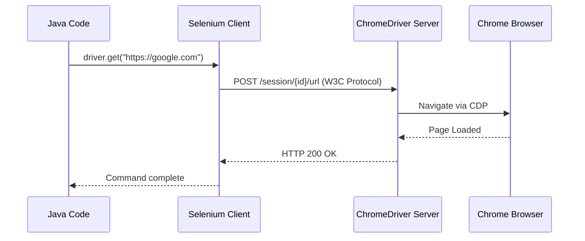

# Part 1C: First Program and Project Structure

Welcome to the **THIRD section of Part 1** of the Selenium Master Notes series. In this section, we transition from theoretical architecture to hands-on implementation. We will write our first Selenium script, structure a professional automation project, and learn how to run and debug our code like a true SDET.

---

## Topic 11: First Selenium Program (COMPLETE WALKTHROUGH)

### 1. What is it?
The first Selenium program is the foundational script where we initialize a WebDriver, command the browser to open a specific web page, interact with elements, perform basic validations (like checking the title or URL), and then gracefully close the browser. It proves that our local environment (Java, IDE, Maven, WebDriver) is correctly configured and can communicate with the browser.

### 2. Why do we need it?
Before building complex frameworks, we need to understand the basic lifecycle of a Selenium script. We need it to:
- Verify that our environment setup (JDK, Maven, IDE, Browser drivers) is working.
- Understand the sequence of operations (Initialize -> Navigate -> Interact -> Validate -> Close).
- Learn how Selenium commands are mapped to browser actions.

### 3. Where do we use it?
- **Proof of Concept (POC):** When evaluating a new tool or testing if a specific browser version works with our Selenium version.
- **Sanity Checks:** A quick script to verify environment stability after an update.
- **Learning & Training:** The starting point for every automation engineer.

### 4. How does it work internally?
When you write `WebDriver driver = new ChromeDriver();` and subsequent commands:
1. Java executes the code.
2. The Selenium Language Binding (Java client) translates the commands into W3C WebDriver Protocol (JSON over HTTP).
3. These HTTP requests are sent to the ChromeDriver server running locally.
4. ChromeDriver communicates with the actual Google Chrome browser via Chrome DevTools Protocol (CDP) to execute the actions.
5. The browser executes the action and sends the response back through the same chain.



### 5. Syntax
```java
// 1. Initialize Driver
WebDriver driver = new ChromeDriver();

// 2. Navigate
driver.get("https://example.com");

// 3. Find Element & Act
driver.findElement(By.id("search")).sendKeys("Selenium");

// 4. Verify
String title = driver.getTitle();
System.out.println(title);

// 5. Close
driver.quit();
```

### 6. Complete practical example

#### Prerequisites
1. **JDK 11+** installed and JAVA_HOME set.
2. **IDE** (IntelliJ IDEA or Eclipse).
3. **Maven** installed (or bundled with IDE).
4. **Google Chrome** browser installed.

#### Step 1: Create Maven project
Create a new Maven project in your IDE.

#### Step 2: Add dependencies to `pom.xml`
```xml
<dependencies>
    <!-- Selenium Java -->
    <dependency>
        <groupId>org.seleniumhq.selenium</groupId>
        <artifactId>selenium-java</artifactId>
        <version>4.15.0</version>
    </dependency>
    <!-- TestNG for assertions (Optional for very first program, but good practice) -->
    <dependency>
        <groupId>org.testng</groupId>
        <artifactId>testng</artifactId>
        <version>7.8.0</version>
        <scope>test</scope>
    </dependency>
</dependencies>
```

#### Complete Working Program 1: Basic Navigation
```java
package com.automation.tests;

import org.openqa.selenium.WebDriver;
import org.openqa.selenium.chrome.ChromeDriver;

public class FirstSeleniumScript {
    public static void main(String[] args) {
        // Step 1: Initialize the Chrome Driver
        // Note: Selenium Manager (Selenium 4.6+) automatically downloads the required chromedriver.exe!
        WebDriver driver = new ChromeDriver();
        
        try {
            // Step 2: Maximize the window
            driver.manage().window().maximize();
            
            // Step 3: Navigate to a URL
            System.out.println("Navigating to target URL...");
            driver.get("https://www.google.com");
            
            // Step 4: Get page details
            String pageTitle = driver.getTitle();
            String currentUrl = driver.getCurrentUrl();
            
            System.out.println("Page Title: " + pageTitle);
            System.out.println("Current URL: " + currentUrl);
            
            // Step 5: Verify results
            if(pageTitle.equals("Google")) {
                System.out.println("Test Passed: Title matches.");
            } else {
                System.out.println("Test Failed: Title mismatch.");
            }
            
        } catch (Exception e) {
            e.printStackTrace();
        } finally {
            // Step 6: Close browser
            // quit() closes all windows and ends the WebDriver session gracefully.
            System.out.println("Closing browser...");
            driver.quit();
        }
    }
}
```

#### Example 2: Basic Google Search
```java
package com.automation.tests;

import org.openqa.selenium.By;
import org.openqa.selenium.Keys;
import org.openqa.selenium.WebDriver;
import org.openqa.selenium.WebElement;
import org.openqa.selenium.chrome.ChromeDriver;

public class GoogleSearchScript {
    public static void main(String[] args) throws InterruptedException {
        WebDriver driver = new ChromeDriver();
        driver.manage().window().maximize();
        
        driver.get("https://www.google.com");
        
        // Find the search box by its 'name' attribute
        WebElement searchBox = driver.findElement(By.name("q"));
        
        // Type search term and hit Enter
        searchBox.sendKeys("Selenium WebDriver Master Notes");
        searchBox.sendKeys(Keys.ENTER);
        
        // Wait briefly just to see the result (Not recommended for real frameworks!)
        Thread.sleep(3000);
        
        System.out.println("Search results title: " + driver.getTitle());
        
        driver.quit();
    }
}
```

#### Example 3: Form Fill Automation
```java
package com.automation.tests;

import org.openqa.selenium.By;
import org.openqa.selenium.WebDriver;
import org.openqa.selenium.chrome.ChromeDriver;

public class FormFillScript {
    public static void main(String[] args) throws InterruptedException {
        WebDriver driver = new ChromeDriver();
        driver.get("https://practicetestautomation.com/practice-test-login/");
        
        // Find username field and enter text
        driver.findElement(By.id("username")).sendKeys("student");
        
        // Find password field and enter text
        driver.findElement(By.id("password")).sendKeys("Password123");
        
        // Click submit button
        driver.findElement(By.id("submit")).click();
        
        // Verify login success
        String successMessage = driver.findElement(By.tagName("h1")).getText();
        System.out.println("Login status: " + successMessage);
        
        driver.quit();
    }
}
```

### 7. Real-time project usage
In real enterprise projects, experienced SDETs **never** write tests inside a `main` method like the examples above. 
- We use testing frameworks like **TestNG** or **JUnit** to manage execution (`@Test`).
- WebDriver initialization is abstracted away into a `BaseTest` or a `DriverFactory` class.
- Locators and actions are moved into **Page Object classes**.
- The simple script evolves into a structured, maintainable architecture.

### 8. Important points ⭐
- ⭐ **Selenium Manager:** From Selenium 4.6.0 onwards, you DO NOT need `System.setProperty("webdriver.chrome.driver", "path/to/chromedriver.exe")` anymore. Selenium automatically manages drivers.
- ⭐ **get() vs navigate().to():** `driver.get()` waits for the page load event to fire, while `navigate().to()` is basically a synonym but allows forward/back navigation.
- ⭐ **driver.close() vs driver.quit():** `close()` closes the current focused window. `quit()` terminates the entire session and closes all windows. Always use `quit()` at the end to prevent memory leaks.

### 9. Common mistakes ❌
- ❌ **Forgetting `driver.quit()`:** Leaves ghost driver processes running in the background, eventually crashing your computer due to out-of-memory errors.
- ❌ **Using `Thread.sleep()`:** Beginners use this to wait for elements. It causes flaky tests and wastes time. Always use Explicit Waits (WebDriverWait).
- ❌ **Mismatching dependencies:** Using Selenium 3 syntax but Selenium 4 dependencies, or vice versa.

### 10. Interview questions & answers

**Q1: Walk me through the sequence of events that happen when you run your first Selenium script.**
*Answer:* When I execute a script, the Java client library translates my Selenium commands into HTTP requests using the W3C WebDriver protocol. These requests are sent to the local driver server (like ChromeDriver). The ChromeDriver server interprets these requests and uses the Chrome DevTools Protocol (CDP) to send native commands to the Chrome browser. The browser performs the action (e.g., clicking a button), and sends a response back to the ChromeDriver, which then forwards an HTTP response back to my Java script. If the action succeeds, the script proceeds; if not, an exception is thrown.

**Q2: Since Selenium 4.6, how has the initial setup of a WebDriver changed?**
*Answer:* Before Selenium 4.6, we had to manually download the executable driver (like `chromedriver.exe`), place it in our project, and set the system property `webdriver.chrome.driver` to point to it. Or we had to use third-party libraries like `WebDriverManager`. Since 4.6, Selenium introduced **Selenium Manager**, a built-in tool that automatically detects the installed browser version on the machine, downloads the exact matching driver executable into a local cache, and configures the path automatically. Now, `WebDriver driver = new ChromeDriver();` works out of the box.

**Q3: Explain the difference between `driver.close()` and `driver.quit()`. Which one should you use to end a test?**
*Answer:* `driver.close()` closes only the current window that the WebDriver has focus on. If it's the only window, it will close the browser, but the WebDriver session may still be active in the background. `driver.quit()` safely ends the entire WebDriver session, gracefully shuts down the ChromeDriver server process, and closes all associated browser windows. To end a test and ensure no memory leaks or orphan processes remain, we must always use `driver.quit()` inside a `finally` block or an `@AfterMethod` annotation.

**Q4: If your script fails at `driver.get("url")`, what could be the possible reasons?**
*Answer:* There are several possibilities. First, the URL string might be malformed (e.g., missing the `http://` or `https://` protocol). Second, the application server might be down or unreachable due to VPN or proxy restrictions. Third, the browser version might be completely incompatible with the instantiated driver, causing a crash before navigation even begins. Lastly, there could be a certificate error preventing the page from loading properly, which requires specific ChromeOptions to bypass.

**Q5: Why do we write `WebDriver driver = new ChromeDriver();` instead of `ChromeDriver driver = new ChromeDriver();`?**
*Answer:* We use `WebDriver driver` because of the Java OOP concept of **Upcasting** and coding to an interface. `WebDriver` is an interface, and `ChromeDriver` is its implementing class. By declaring the reference variable as `WebDriver`, we make our code highly flexible and decoupled. If we later decide to run the same test on Firefox, we only need to change the instantiation to `new FirefoxDriver()`, and all subsequent methods (like `get()`, `findElement()`) remain valid because they are defined in the `WebDriver` interface.

### 11. Scenario-based questions

**Scenario 1:** You run your script, the browser opens, but it's completely blank. The URL is not entered, and the console shows a `SessionNotCreatedException`.
*Answer:* This usually indicates a severe mismatch between the installed Browser version and the WebDriver binary version, or the browser binary is installed in a non-standard location that Selenium cannot find. To fix this, I would ensure my browser is updated, verify my Selenium version is 4.6+ (so Selenium Manager handles drivers), and if using a custom browser location, I would pass the binary path using `ChromeOptions.setBinary()`.

**Scenario 2:** You want to run a test but your company's firewall blocks downloading external executables, meaning Selenium Manager cannot download the ChromeDriver.
*Answer:* In a restricted environment, I must manually download the correct `chromedriver.exe` that matches the installed Chrome version. I will place it in my project directory (e.g., `src/test/resources/drivers/`), and explicitly set the system property in my code before initializing the driver: `System.setProperty("webdriver.chrome.driver", "path/to/chromedriver.exe");`. This bypasses the need for Selenium Manager to reach out to the internet.

**Scenario 3:** Your script runs perfectly on your machine, but when your colleague pulls the code and runs it, they get compilation errors on `import org.openqa.selenium...`.
*Answer:* This is a build tool configuration issue. The colleague's IDE has likely not downloaded the Maven dependencies. I would advise them to run `mvn clean install` or `mvn compile` from the terminal, or use the IDE's "Reload Maven Project" feature to fetch the `selenium-java` jar files specified in the `pom.xml` from the central repository.

### 12. Hands-on task
**Task:** Create a Maven project and write a script that does the following:
1. Open Google Chrome.
2. Navigate to `https://opensource-demo.orangehrmlive.com/`.
3. Wait for 3 seconds (`Thread.sleep(3000)` - just for this exercise).
4. Get and print the Page Title.
5. Enter "Admin" in the Username field (name = "username").
6. Enter "admin123" in the Password field (name = "password").
7. Click the Login button (tag = "button").
8. Verify that the URL changes to include "dashboard".
9. Close the browser safely.

### 13. Exam answer
**Write a simple Selenium script to launch Chrome, navigate to a site, and verify the title.**

```java
import org.openqa.selenium.WebDriver;
import org.openqa.selenium.chrome.ChromeDriver;

public class BasicTest {
    public static void main(String[] args) {
        // Initialize WebDriver (Selenium 4.6+ handles drivers automatically)
        WebDriver driver = new ChromeDriver();
        
        try {
            // Navigate to URL
            driver.get("https://www.example.com");
            
            // Get the title
            String title = driver.getTitle();
            
            // Verify title
            if(title.equals("Example Domain")) {
                System.out.println("Pass");
            } else {
                System.out.println("Fail");
            }
        } finally {
            // Safely close the browser session
            driver.quit();
        }
    }
}
```

---

## Topic 12: Project Structure Best Practices (REAL-WORLD)

### 1. What is it?
Project Structure refers to how files, folders, code, resources, and configurations are organized within an automation repository. A standard structure separates application models (Page Objects) from test logic, configurations, test data, and utilities.

### 2. Why do we need it?
A single test script is easy to manage. But an enterprise framework contains hundreds of tests, page classes, Excel files, and configuration properties. Without structure:
- Code becomes a spaghetti mess, impossible to maintain.
- Reusability drops to zero; code duplication skyrockets.
- Onboarding new automation engineers takes weeks.
- Running specific test suites becomes difficult.

### 3. Where do we use it?
Every professional automation project uses a structured architecture. Whether it's Data-Driven, Keyword-Driven, or a Hybrid Page Object Model (POM) framework, the directory structure dictates how the framework operates.

### 4. How does it work internally?
In Java ecosystems, we almost universally use **Maven** or **Gradle** directory standards.
Maven expects source code in `src/main/java` and test code in `src/test/java`.
When Maven runs `mvn test`, it automatically looks inside the `src/test/java` directory, compiles the classes, checks `src/test/resources` for configuration files, and executes the tests using the configured runner (like TestNG or Surefire).

### 5. Syntax (Directory Structure)
Standard Maven Structure:
```text
ProjectRoot/
├── pom.xml
├── src/
│   ├── main/
│   │   ├── java/         (Framework core, Pages, Utilities)
│   │   └── resources/    (Global configs, properties)
│   └── test/
│       ├── java/         (Test execution classes)
│       └── resources/    (Test data, testng.xml, runners)
```

### 6. Complete practical example & 7. Real-time project usage

Here is a **Real-World, Professional SDET Project Structure**:

```text
SeleniumMasterFramework/
├── pom.xml                     # Maven configuration & dependencies
├── README.md                   # Project documentation for onboarding
├── .gitignore                  # Files to ignore in Git (target/, logs/)
├── src/
│   ├── main/
│   │   ├── java/
│   │   │   └── com/company/automation/
│   │   │       ├── base/
│   │   │       │   ├── DriverFactory.java    # Handles WebDriver initialization (ThreadLocal for parallel)
│   │   │       │   └── ConfigReader.java     # Reads properties file
│   │   │       ├── pages/                    # Page Object Model classes
│   │   │       │   ├── LoginPage.java
│   │   │       │   ├── HomePage.java
│   │   │       │   └── CheckoutPage.java
│   │   │       └── utils/                    # Reusable helper methods
│   │   │           ├── WaitUtils.java        # Custom explicit waits
│   │   │           ├── ExcelUtils.java       # Apache POI logic for data reading
│   │   │           ├── JSWaiter.java         # JavaScript executor waits
│   │   │           └── ScreenshotUtil.java   # Captures screenshots on failure
│   │   └── resources/
│   │       └── config.properties             # Environment URLs, Browser choice, timeouts
│   │
│   └── test/
│       ├── java/
│       │   └── com/company/automation/tests/
│       │       ├── base/
│       │       │   └── BaseTest.java         # TestNG @BeforeMethod / @AfterMethod hooks
│       │       ├── login/
│       │       │   ├── ValidLoginTest.java
│       │       │   └── InvalidLoginTest.java
│       │       └── checkout/
│       │           └── GuestCheckoutTest.java
│       └── resources/
│           ├── testdata/
│           │   ├── login_data.xlsx           # Excel files for Data Providers
│           │   └── api_payloads.json
│           └── runners/
│               ├── testng_regression.xml     # Suite to run all tests
│               └── testng_smoke.xml          # Suite to run only critical tests
```

### 8. Important points ⭐
- ⭐ **Package Naming:** Standard convention is reverse domain: `com.companyname.projectname`. Everything should be lowercase.
- ⭐ **Separation of Concerns:** Test classes MUST NEVER contain locators (`By.id`). Page classes MUST NEVER contain assertions (`Assert.assertEquals`).
- ⭐ **src/main vs src/test:** Core logic that could theoretically be packaged into a library goes in `main`. The actual test cases executing assertions go in `test`.
- ⭐ **Avoid Hardcoding:** Never hardcode URLs, usernames, or passwords in Java files. Read them from `config.properties` or environment variables.

### 9. Common mistakes ❌
- ❌ **Putting tests in `src/main/java`:** Maven's `surefire-plugin` will not find or execute tests placed here by default.
- ❌ **Bloated BaseTest:** Dumping all utilities, driver initialization, and generic methods into one massive `BaseTest.java` class instead of separating them into utilities and factories.
- ❌ **Committing `target/` or `.class` files:** Forgetting to add a `.gitignore`, resulting in massive Git repositories full of compiled binaries.

### 10. Interview questions & answers

**Q1: How do you organize your automation framework? Walk me through your folder structure.**
*Answer:* I use a standard Maven structure. Under `src/main/java`, I have packages for `pages` (containing Page Object classes with locators and actions), `utils` (for reusable methods like wait helpers, excel readers, DB connectors), and `base` (for `DriverFactory` and configuration readers). Under `src/test/java`, I maintain the test classes organized by feature (e.g., `tests.login`, `tests.payment`), extending a `BaseTest` that handles setup and teardown hooks. Finally, `src/test/resources` holds my `config.properties`, `testng.xml` suite files, and any test data files like Excel or JSON.

**Q2: Why do we separate Page Objects from Test Classes?**
*Answer:* This is the core principle of the Page Object Model (POM). We separate them to achieve Separation of Concerns. Page classes handle the "How" (how to find elements, how to click them), while Test classes handle the "What" (what scenario are we testing, what are we asserting). If the UI changes, we only update the locators in one place (the Page class), and all 50 tests using that page remain untouched. This dramatically reduces maintenance effort and code duplication.

**Q3: Where do you store configuration data like environment URLs and browser types, and why?**
*Answer:* I store them in a `config.properties` file, usually located in `src/main/resources` or `src/test/resources`. Storing them outside of Java code prevents hardcoding. If we want to switch the execution from the QA environment to the UAT environment, or from Chrome to Firefox, we only change a single line in the text file without needing to modify, recompile, or push new Java code.

**Q4: Explain the role of the `BaseTest` class in your framework.**
*Answer:* The `BaseTest` acts as a parent class for all test execution classes. Its primary responsibility is managing the test lifecycle using testing framework annotations (like TestNG's `@BeforeMethod` and `@AfterMethod`). It invokes the `DriverFactory` to initialize the WebDriver before a test starts, sets up implicit waits or maximizes the window, and ensures `driver.quit()` is called after the test ends, regardless of whether the test passed or failed.

**Q5: What goes into the `utils` package? Give examples.**
*Answer:* The `utils` package contains generic, reusable helper classes that provide services to the framework but are not tied to any specific web page. Examples include `WaitUtils` (custom wrapper methods for explicit and fluent waits), `ExcelUtils` (methods to read/write data from Apache POI), `ScreenshotUtils` (logic to capture and save images on test failure), and `DBUtils` (JDBC logic to query databases for backend validation).

### 11. Scenario-based questions

**Scenario 1:** You are reviewing a junior SDET's PR. They have written `Assert.assertTrue(driver.findElement(By.id("msg")).isDisplayed());` inside `LoginPage.java`. What feedback do you give?
*Answer:* I would reject the PR and explain that Page classes should not contain assertions. The `LoginPage.java` should have a method returning a boolean: `public boolean isSuccessMessageDisplayed()`. The assertion itself `Assert.assertTrue(loginPage.isSuccessMessageDisplayed());` must be placed inside the `LoginTest.java` class. Mixing assertions into Page classes violates the Page Object Model design pattern.

**Scenario 2:** The team wants to run the same suite of tests across three different environments (DEV, QA, STAGING). Currently, the URL is hardcoded in `BaseTest.java`. How do you refactor this?
*Answer:* I would extract the URL into a `config.properties` file (e.g., `env=QA`, `qa.url=...`, `dev.url=...`). I would create a `ConfigReader` utility class to read these properties. In `BaseTest`, I would read the `env` property, fetch the corresponding URL, and navigate to it. For CI/CD, I would configure Maven to accept command-line arguments (`mvn test -Denv=STAGING`) that override the properties file.

**Scenario 3:** Your project has grown to 500 tests. Running them takes 2 hours. How does your framework structure help you implement Parallel Execution?
*Answer:* Because the framework separates Driver Initialization into a `DriverFactory`, I can refactor the factory to use `ThreadLocal<WebDriver>`. This ensures that each test thread gets its own isolated instance of WebDriver, preventing race conditions. The tests themselves remain unchanged. I would then update the `testng.xml` file located in `src/test/resources` to set `parallel="tests"` or `parallel="methods"` with a thread count of 4 or 5, reducing execution time significantly.

### 12. Hands-on task
**Task:** Refactor your previous single-file script into a structured project.
1. Create a `BaseTest` class with `@BeforeMethod` (setup driver) and `@AfterMethod` (quit driver).
2. Create a `LoginPage` class with locators and action methods.
3. Create a `LoginTest` class extending `BaseTest` with `@Test` annotations.
4. Move the URL to a `config.properties` file and read it in `BaseTest`.

### 13. Exam answer
**Describe the standard Maven project structure for a Selenium framework.**
*Answer:* A standard Maven Selenium framework is structured to separate application logic from test execution.
- `src/main/java`: Contains the framework engine. It includes Page Object classes (`com.pages`), utility classes for waits and data reading (`com.utils`), and core driver management logic (`com.base`).
- `src/main/resources`: Contains global configuration files like `config.properties`.
- `src/test/java`: Contains the actual TestNG/JUnit test classes (`com.tests`), usually extending a BaseTest class.
- `src/test/resources`: Contains test data files (Excel, JSON) and execution suite runners (`testng.xml`).
- `pom.xml`: At the root, manages all dependencies and build plugins.

---

## Topic 13: Running and Debugging Selenium Tests

### 1. What is it?
Running tests involves executing the code to perform automation, either via an IDE (Integrated Development Environment) or Command Line Interface (CLI) tools like Maven. Debugging is the process of pausing execution at specific points (breakpoints) to inspect variables, element states, and logic to identify why a test is failing.

### 2. Why do we need it?
- **Running:** To validate applications, generate reports, and integrate with CI/CD pipelines (Jenkins/GitHub Actions).
- **Debugging:** Tests rarely work perfectly the first time. Elements load slowly, locators change, or logic is flawed. Debugging allows us to see *exactly* what the framework sees at the millisecond it fails, saving hours of guesswork.

### 3. Where do we use it?
- **IDE Run/Debug:** Used daily during test script creation and local maintenance.
- **CLI Run (`mvn test`):** Used locally to verify suite stability before pushing code, and used heavily by CI/CD servers to trigger automated test runs.

### 4. How does it work internally?
- **Running in IDE:** The IDE compiles the Java code, builds the classpath, and invokes the testing framework runner (e.g., TestNG runner).
- **Running via Maven:** The `maven-surefire-plugin` scans `src/test/java` for classes matching `*Test.java`, or looks at the specified `testng.xml` suite, compiles them, and executes them in a separate JVM instance.
- **Debugging:** The JVM is started in "debug mode" (using JDWP - Java Debug Wire Protocol). When execution hits a line marked with a breakpoint, the JVM suspends that thread, allowing the IDE to query the JVM for memory states, variables, and object details.

### 5. Syntax / Commands
**Maven Execution Commands:**
```bash
# Clean target folder and compile
mvn clean compile

# Run all tests in the project
mvn test

# Run a specific Test class
mvn test -Dtest=LoginTest

# Run a specific method within a class
mvn test -Dtest=LoginTest#verifyValidLogin

# Run a specific TestNG suite file
mvn test -DsuiteXmlFile=src/test/resources/testng.xml
```

### 6. Complete practical example: Debugging in IntelliJ
Imagine this test is failing because the user isn't logged in:
```java
@Test
public void loginTest() {
    LoginPage loginPage = new LoginPage(driver);
    loginPage.enterUsername("admin");
    loginPage.enterPassword("wrongpass"); // Bug is here
    loginPage.clickLogin();
    
    // Test fails here because dashboard is not displayed
    Assert.assertTrue(new DashboardPage(driver).isDisplayed());
}
```
**Debugging Steps:**
1. Click the left gutter next to `loginPage.clickLogin();` to set a **Breakpoint** (a red dot appears).
2. Right-click the test method and select **Debug 'loginTest()'**.
3. The browser opens, navigates, enters credentials, and **freezes**.
4. The IDE highlights the paused line.
5. You can now use the **Evaluate Expression** tool (Alt+F8) in IntelliJ to run live Selenium commands!
   - Type `driver.getCurrentUrl()` and hit enter -> see the URL.
   - Type `driver.findElement(By.id("errorMsg")).getText()` -> see the live error on screen.
6. Use **Step Over (F8)** to execute the current line and move to the next.
7. Use **Resume Program (F9)** to let the script finish.

### 7. Real-time project usage
- **Local Dev:** SDETs run specific classes via the IDE green play button while developing. They heavily use the Debugger's "Evaluate Expression" to test complex XPaths live while the execution is paused, rather than restarting the test 50 times.
- **Pipeline:** Jenkins executes `mvn clean test -Denv=QA -DsuiteXmlFile=suites/regression.xml`. If it fails, SDETs look at the generated logs and screenshots to debug post-execution.

### 8. Important points ⭐
- ⭐ **Evaluate Expression:** The most powerful tool for an SDET. When paused in debug mode, you can test new locators or execute JS scripts dynamically without changing the code and restarting.
- ⭐ **Surefire Plugin:** Maven itself doesn't run tests. It uses the `maven-surefire-plugin`. If this is missing or misconfigured in `pom.xml`, `mvn test` will say "Tests run: 0".
- ⭐ **Exception Stack Trace:** Always read errors from top to bottom. The first line tells you *what* went wrong (e.g., `NoSuchElementException`), and further down, the first line containing *your package name* tells you exactly *where* in your code it happened.

### 9. Common mistakes ❌
- ❌ **Ignoring Stack Traces:** Staring at the code instead of reading the error message. The console tells you exactly which line failed and why.
- ❌ **Debugging timing issues with Debugger:** If a test fails normally but passes when you run it in Debug mode, it is a **Wait/Synchronization issue**! Debugging slows execution down, giving elements time to load, masking the missing Explicit Wait in your code.
- ❌ **Leaving breakpoints active:** Forgetting to remove breakpoints can cause frustration when you try to run (not debug) your code later, or if you accidentally commit IDE configs.

### 10. Interview questions & answers

**Q1: How do you run your Selenium TestNG suite from the command line?**
*Answer:* We use Maven to run tests from the command line. First, I ensure the `maven-surefire-plugin` is configured in the `pom.xml` to point to my `testng.xml` file. Then, I navigate to the project root directory in the terminal and execute `mvn clean test`. If I want to pass parameters dynamically, such as environment variables, I can run `mvn clean test -Denv=QA`.

**Q2: If a test fails in the CI pipeline but passes on your local machine, how do you debug it?**
*Answer:* This is commonly known as a "flaky test." First, I check the CI logs and the stack trace to identify the exact point of failure. I look at the screenshot captured on failure. Often, this happens due to differences in execution speed, screen resolution, or network latency between local and CI servers. I would check if there are proper Explicit Waits implemented. I might also run the local test in "Headless" mode and at the same resolution as the CI server to replicate the environment.

**Q3: Explain the difference between "Step Over" and "Step Into" while debugging.**
*Answer:* When paused at a breakpoint, "Step Over" (usually F8) executes the current line of code and moves to the next line in the current method. If the line contains a method call, it executes the entire method in the background and stops at the next line. "Step Into" (usually F7) goes *inside* the method being called on that line, opening that class, and allowing you to debug the internal logic of that specific method line by line.

**Q4: Why does `mvn test` execute nothing, showing "Tests run: 0, Failures: 0"?**
*Answer:* This happens for a few reasons. First, the `maven-surefire-plugin` might not be configured correctly in the `pom.xml`. Second, Maven by default only looks for test classes that start or end with the word "Test" (e.g., `LoginTest.java`). If the class is named `LoginValidation.java`, Surefire ignores it. Third, the test classes might be located in `src/main/java` instead of `src/test/java`, which Surefire does not scan by default.

**Q5: How do you test a complex XPath if you are not sure it works, without restarting the whole test?**
*Answer:* I start the test in Debug mode and set a breakpoint right before the element interaction. Once the execution pauses and the browser is open at the correct state, I open the IDE's "Evaluate Expression" window. There, I can type `driver.findElements(By.xpath("//my/complex/xpath")).size()` and execute it live. If it returns 0, I tweak the XPath in the evaluator and test again until it returns 1, saving me from having to restart the script repeatedly.

### 11. Scenario-based questions

**Scenario 1:** You are executing a suite via `mvn test`. You only want to run a specific test class named `PaymentTest` because it recently failed. What is the exact command?
*Answer:* I would open the terminal in the project root and execute: `mvn test -Dtest=PaymentTest`. This tells the Surefire plugin to override the default suite execution and only compile and run that specific class.

**Scenario 2:** You set a breakpoint at `driver.findElement(By.id("submit")).click();`. The debugger hits the breakpoint. You want to see what happens inside the `click()` method within the Selenium library. Which debug action do you use?
*Answer:* I would use "Step Into" (F7 in IntelliJ). This forces the debugger to dive into the internal implementation of the Selenium `WebElement.click()` method, opening the compiled `.class` files of the Selenium library so I can inspect the internal W3C protocol execution.

**Scenario 3:** A test fails randomly 2 out of 10 times with `StaleElementReferenceException`. You try to debug it by placing a breakpoint, but when debugging, it *never* fails. Why?
*Answer:* This is a race condition. The DOM is refreshing right when Selenium tries to interact with the element. When I use the debugger, execution pauses, giving the DOM plenty of time to finish refreshing and stabilizing before I step to the next line. Because the debugger alters the timing, the issue hides. To fix it, I must handle it in code by wrapping the action in a retry block or a Custom Wait condition (`ExpectedConditions.refreshed()`), rather than relying on the debugger.

### 12. Hands-on task
**Task:**
1. Write a script with a deliberate mistake (e.g., wrong XPath causing `NoSuchElementException`).
2. Run it normally and read the stack trace in the console. Identify the exact line number of the failure.
3. Place a breakpoint ONE line before the failure.
4. Run in Debug mode.
5. Use Evaluate Expression (`Alt+F8`) to test the correct XPath live while paused.
6. Fix the code and resume program.

### 13. Exam answer
**What are the primary ways to execute a Selenium test, and how does debugging assist in automation?**
*Answer:* Selenium tests can be executed via an IDE (using run configurations for individual classes/methods) or via the Command Line Interface using build tools like Maven (`mvn test`), which is essential for CI/CD integration. Debugging is a critical process where a developer pauses test execution using breakpoints. It allows the developer to inspect the live state of the application, verify variable values, and dynamically evaluate locators without restarting the session, making it the most efficient way to resolve locators issues, logic flaws, and synchronization problems.

---

## BONUS: Complete Starter Template

Below is a complete, copy-paste ready starter project structure and code. This represents a clean, professional starting point for any SDET interview assignment or new project.

### 1. `pom.xml` (Root directory)
```xml
<?xml version="1.0" encoding="UTF-8"?>
<project xmlns="http://maven.apache.org/POM/4.0.0"
         xmlns:xsi="http://www.w3.org/2001/XMLSchema-instance"
         xsi:schemaLocation="http://maven.apache.org/POM/4.0.0 http://maven.apache.org/xsd/maven-4.0.0.xsd">
    <modelVersion>4.0.0</modelVersion>

    <groupId>com.automation</groupId>
    <artifactId>SeleniumStarter</artifactId>
    <version>1.0-SNAPSHOT</version>

    <properties>
        <maven.compiler.source>11</maven.compiler.source>
        <maven.compiler.target>11</maven.compiler.target>
        <project.build.sourceEncoding>UTF-8</project.build.sourceEncoding>
        <selenium.version>4.15.0</selenium.version>
        <testng.version>7.8.0</testng.version>
    </properties>

    <dependencies>
        <!-- Selenium WebDriver -->
        <dependency>
            <groupId>org.seleniumhq.selenium</groupId>
            <artifactId>selenium-java</artifactId>
            <version>${selenium.version}</version>
        </dependency>
        
        <!-- TestNG -->
        <dependency>
            <groupId>org.testng</groupId>
            <artifactId>testng</artifactId>
            <version>${testng.version}</version>
            <scope>test</scope>
        </dependency>
    </dependencies>

    <build>
        <plugins>
            <!-- Maven Compiler Plugin -->
            <plugin>
                <groupId>org.apache.maven.plugins</groupId>
                <artifactId>maven-compiler-plugin</artifactId>
                <version>3.11.0</version>
            </plugin>
            
            <!-- Maven Surefire Plugin to execute tests -->
            <plugin>
                <groupId>org.apache.maven.plugins</groupId>
                <artifactId>maven-surefire-plugin</artifactId>
                <version>3.2.2</version>
                <configuration>
                    <suiteXmlFiles>
                        <suiteXmlFile>src/test/resources/testng.xml</suiteXmlFile>
                    </suiteXmlFiles>
                </configuration>
            </plugin>
        </plugins>
    </build>
</project>
```

### 2. `config.properties` (`src/test/resources/config.properties`)
```properties
# Environment Configurations
browser=chrome
url=https://practicetestautomation.com/practice-test-login/
timeout=10

# Test Data
username=student
password=Password123
```

### 3. `BaseTest.java` (`src/test/java/com/automation/base/BaseTest.java`)
```java
package com.automation.base;

import org.openqa.selenium.WebDriver;
import org.openqa.selenium.chrome.ChromeDriver;
import org.openqa.selenium.edge.EdgeDriver;
import org.openqa.selenium.firefox.FirefoxDriver;
import org.testng.annotations.AfterMethod;
import org.testng.annotations.BeforeMethod;

import java.io.FileInputStream;
import java.time.Duration;
import java.util.Properties;

public class BaseTest {
    
    // Protected so child classes can access the driver
    protected WebDriver driver;
    protected Properties prop;

    // Load properties before every test
    public BaseTest() {
        try {
            prop = new Properties();
            FileInputStream fis = new FileInputStream("src/test/resources/config.properties");
            prop.load(fis);
        } catch (Exception e) {
            e.printStackTrace();
            throw new RuntimeException("Config file not found!");
        }
    }

    @BeforeMethod
    public void setUp() {
        String browserName = prop.getProperty("browser").toLowerCase();

        // Initialize driver based on properties file
        switch (browserName) {
            case "chrome":
                driver = new ChromeDriver();
                break;
            case "firefox":
                driver = new FirefoxDriver();
                break;
            case "edge":
                driver = new EdgeDriver();
                break;
            default:
                throw new IllegalArgumentException("Unsupported browser: " + browserName);
        }

        // Global Configuration
        driver.manage().window().maximize();
        driver.manage().deleteAllCookies();
        
        // Implicit wait (Standard is to use Explicit wait, but keeping it simple here)
        int timeout = Integer.parseInt(prop.getProperty("timeout"));
        driver.manage().timeouts().implicitlyWait(Duration.ofSeconds(timeout));

        // Navigate to base URL
        driver.get(prop.getProperty("url"));
    }

    @AfterMethod
    public void tearDown() {
        // Always execute quit to prevent memory leaks
        if (driver != null) {
            driver.quit();
        }
    }
}
```

### 4. `SampleTest.java` (`src/test/java/com/automation/tests/SampleTest.java`)
```java
package com.automation.tests;

import com.automation.base.BaseTest;
import org.openqa.selenium.By;
import org.openqa.selenium.WebElement;
import org.testng.Assert;
import org.testng.annotations.Test;

public class SampleTest extends BaseTest {

    @Test
    public void verifyLoginSuccess() {
        // Step 1: Locate elements
        WebElement usernameField = driver.findElement(By.id("username"));
        WebElement passwordField = driver.findElement(By.id("password"));
        WebElement submitBtn = driver.findElement(By.id("submit"));

        // Step 2: Perform actions using properties data
        usernameField.sendKeys(prop.getProperty("username"));
        passwordField.sendKeys(prop.getProperty("password"));
        submitBtn.click();

        // Step 3: Validate success
        String expectedUrl = "practicetestautomation.com/logged-in-successfully/";
        String actualUrl = driver.getCurrentUrl();
        
        // Assertions halt the test if conditions fail
        Assert.assertTrue(actualUrl.contains(expectedUrl), "URL does not contain expected text");
        
        WebElement successMessage = driver.findElement(By.tagName("h1"));
        Assert.assertEquals(successMessage.getText(), "Logged In Successfully", "Login message mismatch!");
    }
}
```

### 5. `testng.xml` (`src/test/resources/testng.xml`)
```xml
<?xml version="1.0" encoding="UTF-8"?>
<!DOCTYPE suite SYSTEM "https://testng.org/testng-1.0.dtd">
<suite name="Selenium Starter Suite">
    <test name="Login Tests">
        <classes>
            <class name="com.automation.tests.SampleTest"/>
        </classes>
    </test>
</suite>
```

### 6. `.gitignore` (Root directory)
```text
# Compiled class files
*.class

# Log files
*.log

# Maven target folder
target/

# IDE specific files
.idea/
*.iml
.classpath
.project
.settings/

# OS generated files
.DS_Store
Thumbs.db
```

This completes **Part 1C: First Program and Project Structure**. You are now equipped with the practical knowledge to initialize, structure, run, and debug professional Selenium frameworks!
