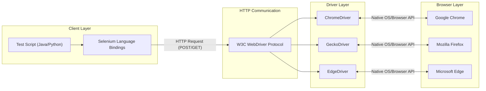
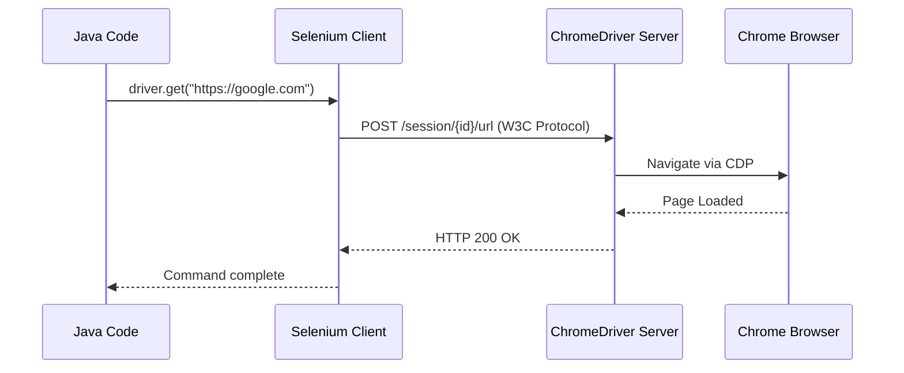

# 🚀 PART 1 — Selenium Fundamentals (Complete)

> **Selenium + Java Master Notes Series** | Part 1 of 25
>
> Topics 1–13 | ~1900 lines | Format: What → Why → Where → How → Code → Real-Time → ⭐Points → ❌Mistakes → 🎯Interview → Scenario → Hands-On → Exam

---

## 📑 Table of Contents

| # | Topic | Section |
|---|-------|---------|
| 1 | What is Selenium? | Part 1A |
| 2 | Why Selenium? | Part 1A |
| 3 | Selenium Components (IDE, RC, WebDriver, Grid) | Part 1A |
| 4 | Selenium Architecture (Deep Dive) | Part 1A |
| 5 | Selenium WebDriver (Deep Dive) | Part 1A |
| 6 | WebDriver Architecture (W3C Protocol) | Part 1A |
| 7 | Selenium 3 vs Selenium 4 | Part 1B |
| 8 | Browser Drivers (Deep Dive) | Part 1B |
| 9 | WebDriverManager (Boni Garcia) | Part 1B |
| 10 | Maven Selenium Project Setup | Part 1B |
| 11 | First Selenium Program (Complete Walkthrough) | Part 1C |
| 12 | Project Structure Best Practices | Part 1C |
| 13 | Running and Debugging Selenium Tests | Part 1C |
| ⭐ | Complete Starter Template (Bonus) | Part 1C |

---

# Section A: Selenium Fundamentals (Intro)

## Topic 1: What is Selenium?

### 1. What is it?
Selenium is an open-source, automated testing suite primarily designed to test web applications across different browsers and platforms. Created originally by Jason Huggins at ThoughtWorks in 2004, it is not just a single tool but rather a collection of tools (IDE, WebDriver, Grid) that each caters to different testing needs. It supports multiple programming languages (Java, Python, C#, Ruby, JavaScript) and works seamlessly on various operating systems (Windows, macOS, Linux) and browsers (Chrome, Firefox, Edge, Safari).

### 2. Why do we need it?
Before Selenium, testing web applications required an army of manual testers clicking through screens, filling out forms, and verifying results. This was slow, error-prone, and expensive. Alternatively, companies used expensive commercial tools like QTP/UFT, which were tied to specific languages (VBScript) and platforms (Windows). We need Selenium because it democratizes test automation. It allows developers and testers to write robust, repeatable scripts in their preferred programming language to simulate real user interactions in a browser, drastically reducing regression testing time and catching bugs early in the CI/CD pipeline.

### 3. Where do we use it?
Selenium is used almost everywhere a web application exists. E-commerce platforms use it to verify the checkout flow. Banking applications use it to ensure secure login and fund transfer functionalities work correctly. SaaS products use it to automate the testing of new feature deployments. Essentially, any project that involves a web browser (HTML/CSS/JS frontend) and requires repetitive regression testing is a prime candidate for Selenium automation.

### 4. How does it work internally?
At a high level, Selenium acts as a bridge between your code and the browser. When you run a script, Selenium translates your code (e.g., `click()`, `sendKeys()`) into HTTP requests. These requests are sent to a specific Browser Driver (like ChromeDriver). The Browser Driver receives the request, communicates natively with the actual web browser to perform the action, and then returns the response (success or failure) back through the HTTP protocol to your script.

### 5. Syntax
```java
// Core concept: Instantiating a browser and navigating
WebDriver driver = new ChromeDriver();
driver.get("https://www.example.com");
```

### 6. Complete practical example
```java
import org.openqa.selenium.By;
import org.openqa.selenium.WebDriver;
import org.openqa.selenium.WebElement;
import org.openqa.selenium.chrome.ChromeDriver;
import java.time.Duration;

public class BasicSeleniumTest {
    public static void main(String[] args) {
        // 1. Initialize the WebDriver (Chrome)
        WebDriver driver = new ChromeDriver();
        
        try {
            // 2. Configure timeouts
            driver.manage().timeouts().implicitlyWait(Duration.ofSeconds(10));
            driver.manage().window().maximize();
            
            // 3. Navigate to a web application
            driver.get("https://opensource-demo.orangehrmlive.com/");
            
            // 4. Interact with elements
            WebElement usernameInput = driver.findElement(By.name("username"));
            usernameInput.sendKeys("Admin");
            
            WebElement passwordInput = driver.findElement(By.name("password"));
            passwordInput.sendKeys("admin123");
            
            WebElement loginButton = driver.findElement(By.cssSelector("button[type='submit']"));
            loginButton.click();
            
            // 5. Verify the outcome
            String currentUrl = driver.getCurrentUrl();
            if (currentUrl.contains("dashboard")) {
                System.out.println("Login Test Passed!");
            } else {
                System.out.println("Login Test Failed!");
            }
        } finally {
            // 6. Clean up and close the browser
            driver.quit();
        }
    }
}
```

### 7. Real-time project usage
Experienced SDETs rarely write raw scripts in a `main` method like the example above. In real projects, Selenium is the "engine" hidden underneath layers of a custom framework. We use design patterns like Page Object Model (POM) to separate UI locators from test logic. We wrap Selenium commands in custom utility classes (e.g., `ElementUtil.java`) to handle synchronization (explicit waits), logging, and exception handling gracefully. Selenium is also integrated with build tools (Maven/Gradle), testing frameworks (TestNG/JUnit), and CI/CD pipelines (Jenkins, GitHub Actions) for nightly regression runs.

### 8. Important points ⭐
*   ⭐ Selenium is a **suite** (IDE, WebDriver, Grid), not a single tool.
*   ⭐ It only automates **web applications**. It cannot automate desktop apps (like Excel) or native mobile apps (without Appium).
*   ⭐ It supports **multiple languages**, which is its biggest advantage over Cypress (JS/TS only).
*   ⭐ Selenium does not have built-in reporting; it relies on TestNG, ExtentReports, or Allure.

### 9. Common mistakes ❌
*   ❌ Believing Selenium can test everything. People often try to automate Captcha, OTPs, or Desktop file upload dialogs using pure Selenium.
*   ❌ Confusing Selenium IDE with Selenium WebDriver. IDE is a record-and-playback tool, WebDriver is an API for programmatic automation.
*   ❌ Thinking Selenium is a testing framework. It's an automation library. TestNG/JUnit is the testing framework.

### 10. Interview questions & answers
**Q1: How does Selenium differ from Cypress or Playwright?**
*Answer:* Selenium is a mature, W3C-standardized tool that communicates with browsers out-of-process via HTTP drivers. It supports many languages (Java, Python, C#, etc.) and handles multi-tab/multi-window testing well. Cypress runs in-process (inside the browser itself), meaning it executes very fast and has native access to the DOM, but it's limited to JavaScript/TypeScript and has historical struggles with multiple tabs. Playwright is a modern tool by Microsoft that uses DevTools protocols directly to talk to browsers, offering faster execution than Selenium, built-in auto-waiting, and multi-language support, but Selenium still has the largest market share and community support.

**Q2: Can we automate Captcha or OTP using Selenium?**
*Answer:* No, and we shouldn't try. Captcha (Completely Automated Public Turing test to tell Computers and Humans Apart) is explicitly designed to block automation tools like Selenium. If Selenium could easily bypass it, the Captcha would be useless. In a test environment, the best practice is to ask the development team to disable Captcha for the staging/QA environment, or provide a static OTP/bypass token that the automation script can use.

**Q3: Why do we say Selenium is an API and not a tool?**
*Answer:* A tool usually implies a standalone application with a user interface (like Postman or SoapUI). Selenium WebDriver is a collection of libraries and interfaces (an Application Programming Interface). You add it as a dependency in your Java/Python project and call its methods via code. It doesn't have an executable UI for writing tests; your IDE (IntelliJ/Eclipse) is where you use the Selenium API.

**Q4: Who created Selenium and why?**
*Answer:* Jason Huggins created Selenium in 2004 at ThoughtWorks. He was working on a web application that required frequent testing and was tired of manually stepping through the same test cases. He created a JavaScript program called "JavaScriptTestRunner" to automatically execute tests on the browser. This evolved into Selenium Core and eventually the Selenium suite we know today. The name "Selenium" was a joke in an email mocking a competitor tool called Mercury (Mercury Interactive, which made QTP). Since selenium is a known cure for mercury poisoning, the name stuck.

**Q5: What are the main components of the Selenium Suite?**
*Answer:* The suite consists of Selenium IDE (a browser extension for simple record-and-playback, mainly for rapid prototyping), Selenium WebDriver (the core API that allows writing complex, logic-driven automation scripts in various languages), and Selenium Grid (a tool for distributing and executing tests concurrently across multiple machines and browser versions to reduce execution time). Selenium RC (Remote Control) was the predecessor to WebDriver but is now deprecated.

### 11. Scenario-based questions
**Scenario 1:** Your manager asks you to automate a newly developed Windows desktop application using Selenium. How do you respond?
*Answer:* I would explain to my manager that Selenium is strictly designed for web application testing (applications that run inside a web browser and render HTML/DOM). It cannot interact with native Windows OS components. I would propose using an appropriate tool for desktop automation, such as WinAppDriver (which uses the WebDriver protocol but for Windows apps), AutoIt, or a commercial tool like UFT.

**Scenario 2:** A client wants to migrate their legacy automation suite written in VBScript (QTP/UFT) to Selenium. They want to know the major challenges they will face.
*Answer:* The main challenges include: 1. Language shift (VBScript to Java/Python/C#), requiring team upskilling. 2. Loss of built-in object repository (we must implement our own using Page Object Model). 3. Lack of built-in reporting (we must integrate TestNG and ExtentReports). 4. Inability to interact with desktop pop-ups natively (might require AutoIt integration). However, the benefits (no licensing cost, cross-browser, cross-OS) far outweigh these challenges.

**Scenario 3:** Your team is evaluating between Playwright and Selenium for a new Java-based automation project. What factors do you consider?
*Answer:* I would consider team expertise, community support, and specific feature needs. Selenium has a massive community, meaning any issue we face has likely been solved and documented on StackOverflow. It also supports older browsers if needed. Playwright offers faster execution, native auto-waiting (reducing flaky tests), and built-in API testing capabilities. If the application is highly dynamic and we want fast, modern execution, Playwright is tempting. If we need guaranteed stability, a huge talent pool for hiring, and integration with legacy grids, Selenium is the safer bet.

### 12. Hands-on task
**Task:** Create a Maven project in IntelliJ. Add the latest Selenium Java dependency to your `pom.xml`. Write a simple class with a `main` method that opens your favorite website (e.g., Wikipedia), prints the page title to the console, and then closes the browser.

### 13. Exam answer
**Define Selenium and its core advantages.**
Selenium is an open-source suite of tools designed for the automated testing of web applications. Its core advantages include:
1. **Open Source:** Free to use, with no licensing costs.
2. **Language Agnostic:** Supports Java, Python, C#, Ruby, and JavaScript.
3. **Cross-Browser:** Compatible with Chrome, Firefox, Edge, Safari.
4. **Cross-Platform:** Runs on Windows, Linux, and macOS.
5. **Community:** Has a vast community and comprehensive documentation.

---

## Topic 2: Why Selenium?

### 1. What is it?
"Why Selenium" addresses the specific pain points of software testing that Selenium resolves. It highlights the transition from manual testing and expensive proprietary tools to an open-source, flexible, and scalable automation solution.

### 2. Why do we need it?
Before Selenium, manual testing was the norm. Imagine checking 100 links on a website manually every time a new version is released—it's exhausting and you might miss something. Automated tools existed (like Mercury QTP), but they cost thousands of dollars per license and only worked on Windows with VBScript. We need Selenium because it breaks these barriers: it's free, it works on a Mac or Linux machine, you can code in Java or Python, and you can run your tests on 50 browsers at the same time using Grid.

### 3. Where do we use it?
We use it whenever an organization adopts Agile or DevOps practices. In these environments, code is deployed daily or weekly. Manual regression testing cannot keep up with this pace. Selenium scripts are integrated into CI/CD pipelines (like Jenkins) to run automatically on every code commit, acting as a quality gatekeeper before code reaches production.

### 4. How does it work internally?
(Covered broadly in Topic 1, but specifically regarding *why* it works well): Selenium's architecture allows it to decouple the test script from the browser. Because it uses a standardized protocol (W3C WebDriver) to talk to browser drivers, Selenium itself doesn't need to be updated every time Chrome releases a new version—only the ChromeDriver needs an update. This decoupled nature makes it highly maintainable and adaptable to the ever-changing browser landscape.

### 5. Syntax
*N/A - This is a conceptual topic.*

### 6. Complete practical example
*N/A - This is a conceptual topic, but the impact is seen in POM frameworks.*

### 7. Real-time project usage
In real projects, "Why Selenium" translates to cost savings and speed. A company might have a suite of 2,000 regression test cases. Manually, this takes a team of 5 people two weeks to execute. Using Selenium Grid and cloud providers like BrowserStack or SauceLabs, an SDET configures these 2,000 tests to run in parallel. The entire suite finishes in 30 minutes, providing instant feedback to developers. This is the true "Why" of Selenium.

### 8. Important points ⭐
*   ⭐ **Open Source:** Zero licensing cost.
*   ⭐ **Platform Agnostic:** Write on Mac, run on Linux.
*   ⭐ **Language Flexibility:** Fits into the tech stack the company already uses.
*   ⭐ **Hardware Resource Efficiency:** Tests can run in headless mode (no UI), saving CPU/RAM on CI servers.

### 9. Common mistakes ❌
*   ❌ Thinking Selenium is the *only* solution. Sometimes API testing (using RestAssured) is faster and more reliable than UI testing with Selenium.
*   ❌ Using Selenium for performance testing. Selenium is functional testing tool. It should not be used to simulate 10,000 users hitting a website (use JMeter instead).

### 10. Interview questions & answers
**Q1: What are the primary limitations of Selenium?**
*Answer:* Selenium has several limitations. It can only test web applications, not desktop or native mobile apps. It lacks built-in reporting mechanisms and relies on third-party libraries like ExtentReports. It does not natively handle image-based testing (like verifying a graph or chart). It requires significant programming knowledge compared to record-and-playback tools. Finally, it cannot handle OS-level dialogs like file upload/download windows natively without workarounds like Robot class or AutoIt.

**Q2: When should you NOT use Selenium?**
*Answer:* You should not use Selenium if you are testing a desktop application or a standalone mobile app. You should also avoid it for performance or load testing, as creating hundreds of browser instances is incredibly resource-intensive and inaccurate for load metrics. Additionally, if the tests are simple data validations that can be done via an API call, you should use API testing instead, as Selenium UI tests are slower and more prone to flakiness.

**Q3: How did Selenium solve the problems of older tools like QTP?**
*Answer:* QTP (Quick Test Professional, now UFT) was the industry standard but had major drawbacks: it was incredibly expensive, tied strictly to the Windows OS, only supported VBScript, and predominantly focused on Internet Explorer. Selenium solved this by being free and open-source, supporting multiple operating systems (Windows, Mac, Linux), multiple languages (Java, Python, C#, etc.), and driving all major browsers (Chrome, Firefox, Safari).

**Q4: Why is language support an important feature of Selenium?**
*Answer:* Language support is crucial because it allows the testing team to work in the same ecosystem as the development team. If a company builds its backend in Java, the SDETs can write Selenium tests in Java. This allows for code sharing, easier code reviews by developers, and better integration into the existing build tools (like Maven/Gradle) and CI/CD pipelines.

**Q5: What is the benefit of cross-browser testing with Selenium?**
*Answer:* Users access web applications using a wide variety of browsers (Chrome, Safari, Firefox, Edge) and devices. HTML, CSS, and JavaScript can render or behave differently across these engines (WebKit, Blink, Gecko). Cross-browser testing ensures that the application delivers a consistent and bug-free experience for all users, regardless of their browser choice. Selenium automates this tedious process.

### 11. Scenario-based questions
**Scenario 1:** Your company is deciding between purchasing an expensive proprietary automation tool (which has great reporting and object repositories) vs using Selenium. How do you argue for Selenium?
*Answer:* I would highlight the Total Cost of Ownership (TCO). While the proprietary tool has upfront features, the licensing costs scale poorly as the team grows or as we need to run more tests in parallel. With Selenium, we pay zero licensing. Although we have to build the framework, reporting (ExtentReports), and object repository (POM) ourselves, this is a one-time engineering effort. Furthermore, Selenium's flexibility allows us to integrate it perfectly with our custom CI/CD pipeline, and finding engineers skilled in Selenium Java is much easier than finding specialists for niche proprietary tools.

**Scenario 2:** A developer tells you, "We should use Selenium to verify the API response payload when a user clicks submit." Is this a good approach?
*Answer:* No. While Selenium can trigger the API call by clicking the UI, parsing network responses through Selenium is complex and slow. It violates the test pyramid. If the goal is to verify the API payload, we should write an API test using tools like RestAssured or Postman. We should use Selenium only to verify that the UI correctly displays the success message or navigates to the next page after the click.

**Scenario 3:** You need to automate the verification of a PDF document generated and downloaded by your web application. Can Selenium do this alone?
*Answer:* No, Selenium alone cannot do this. Selenium can click the download button, but it cannot parse or read the contents of a PDF file. I would use Selenium to trigger the download, configure Chrome preferences to download the file to a specific directory without an OS prompt, and then use a Java library like Apache PDFBox to open the downloaded file and assert its text contents.

### 12. Hands-on task
**Task:** Research and write a brief comparison table between Selenium and Cypress. Focus on: Architecture (Out-of-process vs In-process), Language Support, Browser Support, and Handling of Multiple Tabs.

### 13. Exam answer
**Discuss the main limitations of the Selenium framework.**
While powerful, Selenium has notable limitations:
1. **Scope:** Restricted strictly to web applications.
2. **OS Dialogs:** Cannot interact with native OS elements (e.g., file upload windows, Captchas).
3. **Reporting:** Lacks built-in reporting; requires integration with TestNG/ExtentReports.
4. **Learning Curve:** Requires strong programming skills in languages like Java or Python to build robust frameworks, unlike purely codeless tools.
5. **Image Verification:** Cannot perform pixel-by-pixel image comparisons out of the box.

---

## Topic 3: Selenium Components

### 1. What is it?
Selenium is a suite consisting of different components, each serving a specific testing need. Historically, it included Selenium IDE, Selenium RC (Remote Control), Selenium WebDriver, and Selenium Grid. Today, RC is deprecated, and the active components are IDE, WebDriver, and Grid.

### 2. Why do we need it?
Different users and scenarios require different tools. A business analyst who doesn't know how to code but wants to quickly record a workflow needs **Selenium IDE**. An SDET building a robust, maintainable test framework needs **Selenium WebDriver**. A DevOps engineer who wants to run 500 tests in parallel across different operating systems and browsers needs **Selenium Grid**. The components provide a complete ecosystem.

### 3. Where do we use it?
*   **Selenium IDE:** Used for rapid prototyping, bug reproduction scripts, or by non-technical team members.
*   **Selenium WebDriver:** Used in the core automation framework repository by SDETs to write complex test scripts.
*   **Selenium Grid:** Deployed on cloud servers (AWS/Azure) or managed services (BrowserStack) to execute WebDriver scripts in parallel.

### 4. How does it work internally?
*   **IDE:** An extension/add-on in Chrome/Firefox that monitors user interactions with the DOM and records them as commands (like `click target=id=btn`).
*   **RC (Deprecated):** Injected JavaScript into the browser to automate actions. It suffered from the Same-Origin Policy, requiring a proxy server to trick the browser.
*   **WebDriver:** Uses native OS and browser-specific APIs to control the browser directly, acting exactly like a real user.
*   **Grid:** Follows a Hub-and-Node architecture. The test script points to the Hub. The Hub routes the JSON/W3C commands to an available Node (a machine with a specific OS/Browser combo) which executes the test using WebDriver.

### 5. Syntax
*N/A - Architecture/Component overview.*

### 6. Complete practical example
While there isn't code for all components at once, here is how a WebDriver script connects to a Grid Hub:
```java
import org.openqa.selenium.Platform;
import org.openqa.selenium.WebDriver;
import org.openqa.selenium.remote.DesiredCapabilities;
import org.openqa.selenium.remote.RemoteWebDriver;
import java.net.URL;

public class GridExample {
    public static void main(String[] args) throws Exception {
        // Define what environment we want on the Grid
        DesiredCapabilities cap = new DesiredCapabilities();
        cap.setBrowserName("chrome");
        cap.setPlatform(Platform.LINUX);

        // Point WebDriver to the Hub URL instead of local ChromeDriver
        URL hubUrl = new URL("http://localhost:4444/wd/hub");
        WebDriver driver = new RemoteWebDriver(hubUrl, cap);

        driver.get("https://www.google.com");
        System.out.println(driver.getTitle());
        driver.quit();
    }
}
```

### 7. Real-time project usage
In a mature setup, an SDET never runs the full test suite locally. They write tests using **WebDriver** on their laptop. When they push code to Git, a Jenkins pipeline triggers. The pipeline compiles the tests and sends them to a **Selenium Grid** hub. The Hub distributes the tests across 20 different Docker containers (Nodes) running various browsers. This reduces test execution time from hours to minutes.

### 8. Important points ⭐
*   ⭐ **Selenium RC is dead.** It was officially deprecated in Selenium 3.
*   ⭐ **WebDriver is an API.** It's the core engine of modern Selenium automation.
*   ⭐ **Grid enables Parallel Execution.** It does not *write* tests; it *distributes* tests.

### 9. Common mistakes ❌
*   ❌ Thinking Selenium IDE generates production-ready code. While IDE can export scripts to Java, the exported code is brittle, lacks POM structure, and shouldn't be used in enterprise frameworks.
*   ❌ Confusing WebDriver with Grid. WebDriver drives the browser; Grid manages multiple machines running WebDriver.

### 10. Interview questions & answers
**Q1: What is the difference between Selenium RC and Selenium WebDriver?**
*Answer:* Selenium RC (Selenium 1) worked by injecting JavaScript programs (Selenium Core) into the browser to simulate actions. Because of browser security restrictions (Same-Origin Policy), it required a complex proxy server setup. It was slow and simulated user actions rather than acting natively. Selenium WebDriver (Selenium 2+) interacts directly with the browser using native OS and browser-level APIs. It is faster, more realistic, doesn't require a proxy server, and can interact with elements exactly as a real user would.

**Q2: What is Selenium Grid and when do you use it?**
*Answer:* Selenium Grid is a tool used for parallel and distributed testing. It consists of a Hub (a central server) and multiple Nodes (machines registered to the hub with different OS and browser configurations). You use it when you have a large test suite that takes too long to run sequentially on a single machine, or when you need to verify cross-browser compatibility across multiple platforms simultaneously without maintaining separate physical hardware on your desk.

**Q3: Can Selenium IDE be used for complex data-driven testing?**
*Answer:* No, Selenium IDE is not suited for complex data-driven testing. It is a simple record-and-playback browser extension. While modern versions have added some basic flow control (like loops and if-statements), it lacks the power of a full programming language. For data-driven testing (e.g., reading from Excel or a Database), Selenium WebDriver combined with a framework like TestNG or JUnit is required.

**Q4: Why was Selenium RC deprecated?**
*Answer:* Selenium RC was deprecated because its architecture was inherently flawed for modern web testing. Injecting JavaScript to control a browser was slow and constantly fought against the browser's built-in security mechanisms. WebDriver's approach of natively driving the browser was fundamentally superior. Maintaining both codebases became impractical, so the Selenium project merged RC and WebDriver into Selenium 2, and eventually removed RC completely in Selenium 3.

**Q5: What are DesiredCapabilities in the context of Grid?**
*Answer:* DesiredCapabilities (or `Options` classes in newer Selenium versions) are key-value pairs used to instruct the Selenium Grid Hub about the specific environment you need. For example, your script might request `browserName="firefox"` and `platform="WINDOWS"`. The Hub reads these capabilities and searches its registered Nodes. If it finds a Node matching those exact requirements, it routes the test execution to that specific machine.

### 11. Scenario-based questions
**Scenario 1:** A QA manager wants to speed up test creation and suggests the team completely drop Java/WebDriver and just use Selenium IDE to record all 500 test cases. How do you respond?
*Answer:* I would strongly advise against this. While IDE speeds up initial test creation, the maintenance cost is catastrophic. Recorded tests are brittle—if an element's ID changes, the IDE script breaks, and you have to re-record or manually edit it. IDE doesn't support Page Object Model, meaning there is no centralized locators management. For 500 test cases, a code-based WebDriver framework is mandatory for long-term maintainability, reusability, and stability.

**Scenario 2:** You need to run a test script on Safari on macOS, but your development laptop is a Windows machine. How do you achieve this?
*Answer:* I cannot run Safari locally on a Windows machine. I would use Selenium Grid. I would write the test using WebDriver on my Windows machine. Then, I would configure a Mac machine on the network as a Node registered to a Selenium Grid Hub. I would update my test script to use `RemoteWebDriver`, pointing to the Hub, and pass `DesiredCapabilities` requesting Safari and Mac. The Hub will execute the test on the Mac Node. Alternatively, I could use a cloud Grid provider like BrowserStack.

**Scenario 3:** During an interview, you are asked: "We have an old project using Selenium 2 (RC). We are upgrading to Selenium 4. What is the major breaking change?"
*Answer:* The most significant breaking change is that the `DefaultSelenium` class and the entire Selenium RC API have been completely removed. Any test scripts written using the old RC syntax will simply not compile. The team must rewrite the interaction layers using the WebDriver API (e.g., changing `selenium.click("locator")` to `driver.findElement(By...).click()`).

### 12. Hands-on task
**Task:** Download the Selenium IDE extension for Chrome. Record a simple flow: Go to Google, search for "Selenium WebDriver", and click the first result. Export the recorded script to "Java JUnit" format. Open the exported Java file and inspect how the IDE generated the `WebDriver` code. Note how hardcoded and unstructured the locators are compared to a POM approach.

### 13. Exam answer
**Describe the architecture of Selenium Grid.**
Selenium Grid operates on a Hub-and-Node architecture:
*   **The Hub:** The central server that receives test execution requests from the test scripts (via `RemoteWebDriver`). It parses the requested capabilities (e.g., Chrome on Linux).
*   **The Nodes:** Multiple machines (or containers) registered to the Hub. Each node has a specific OS, Browser, and WebDriver version.
*   **Flow:** The Hub finds a Node that matches the requested capabilities and routes the WebDriver commands to that Node. The Node executes the browser automation and sends the results back to the Hub, which forwards it to the test script. This enables massive parallel execution.

---

## Topic 4: Selenium Architecture (DEEP DIVE)

### 1. What is it?
Selenium Architecture is the internal mechanism that explains exactly how a line of code written in an IDE (like Java) results in a physical click inside a web browser. It details the communication protocols and the intermediaries involved in translating code into browser actions.

### 2. Why do we need it?
As an SDET, you cannot debug flaky tests or connection issues if you don't understand the architecture. Knowing the architecture helps you understand why you get a `SessionNotCreatedException`, why version mismatch between ChromeDriver and Chrome Browser causes failures, and how Selenium is fundamentally different from tools that inject JavaScript.

### 3. Where do we use it?
This knowledge is used daily when setting up infrastructure, debugging pipeline failures, configuring remote execution (Grid/Docker), and during senior-level architectural discussions and interviews.

### 4. How does it work internally?
The architecture consists of four main layers:
1.  **Client Libraries (Language Bindings):** Your Java code. It doesn't know anything about browsers. It just provides methods like `.click()`.
2.  **The Protocol:** When you call `.click()`, the Java library converts this command into an HTTP request.
    *   *Selenium 3:* Used JSON Wire Protocol (sending JSON over HTTP).
    *   *Selenium 4:* Uses the W3C WebDriver Protocol standard directly.
3.  **Browser Drivers:** Executable files (like `chromedriver.exe`, `geckodriver.exe`). These run as local servers. They receive the HTTP request from your code, interpret it, and talk to the actual browser.
4.  **Real Browsers:** The actual application (Chrome, Firefox). It receives native commands from the Browser Driver, performs the action, and sends the response back down the chain.

> [!NOTE]
> **Mermaid Architecture Diagram**



### 5. Syntax
*N/A - Conceptual architecture.*

### 6. Complete practical example
Let's look at what happens behind the scenes of one line of code:
```java
driver.get("https://google.com");
```
1.  **Java Client:** The Selenium Java binding creates an HTTP POST request.
2.  **HTTP Request:** It sends this request to the local ChromeDriver server running on your machine (e.g., `http://localhost:9515/session/{session_id}/url` with a JSON payload `{"url": "https://google.com"}`).
3.  **ChromeDriver:** Receives the request, parses the URL, and uses Chrome's DevTools Protocol to instruct the Chrome browser to navigate.
4.  **Chrome Browser:** Loads the page. Once fully loaded, it tells ChromeDriver.
5.  **Response:** ChromeDriver sends an HTTP 200 OK response back to the Java code.
6.  **Java Client:** The Java execution unblocks and moves to the next line of code.

### 7. Real-time project usage
Understanding this architecture is crucial when deploying tests to CI/CD. Often, a test runs fine locally but fails on Jenkins with `Connection Refused` or `SessionNotCreated`. An architect knows this means the Java binding (Layer 1) cannot establish HTTP communication (Layer 2) with the Driver (Layer 3). They will immediately check if the driver server is running, if the ports are open, or if the driver version matches the installed browser version.

### 8. Important points ⭐
*   ⭐ The Java code **never** communicates directly with the browser. It communicates with the driver.
*   ⭐ The Driver acts as an **HTTP Server**. Your script acts as an **HTTP Client**.
*   ⭐ In Selenium 4, the JSON Wire Protocol was retired. Communication is strictly W3C standardized.

### 9. Common mistakes ❌
*   ❌ Thinking Selenium is a desktop application. It's an API that generates HTTP calls.
*   ❌ Getting stuck on version mismatch. If Chrome updates to v120, but your `chromedriver.exe` is v118, the architecture breaks at the Driver-Browser link. (Note: Selenium Manager in v4.6+ now handles this automatically!).

### 10. Interview questions & answers
**Q1: Explain the detailed flow when `driver.click()` is executed.**
*Answer:* When `element.click()` is called in Java, the Selenium language bindings construct a W3C-compliant HTTP POST request. The URL looks something like `/session/{sessionId}/element/{elementId}/click`. This request is sent over the local network to the Browser Driver (like ChromeDriver), which is running as a background HTTP server. The driver receives the HTTP request, translates it into the browser's native API (like DevTools Protocol for Chrome), and triggers the physical click event in the browser. The browser confirms the action to the driver, and the driver sends an HTTP 200 Response back to the Java script, allowing code execution to proceed.

**Q2: What is the difference between JSON Wire Protocol and W3C Protocol?**
*Answer:* JSON Wire Protocol was the communication standard used in Selenium 3. It required encoding and decoding API requests and often resulted in slight discrepancies between how different browsers interpreted commands, leading to flaky tests. The W3C WebDriver Protocol is an official web standard. In Selenium 4, Selenium natively uses W3C. This means the browser drivers (which are built by Apple, Google, Mozilla) and Selenium scripts speak the exact same standardized language. There is no longer a need for JSON payload encoding/decoding at the driver level, resulting in faster and inherently more stable execution.

**Q3: Why do we need a separate Browser Driver (ChromeDriver, GeckoDriver)? Why can't Selenium talk to the browser directly?**
*Answer:* Browsers are complex, secure applications built by different companies (Google, Mozilla, Apple) using different rendering engines. Their internal native APIs are proprietary and strictly secured to prevent malicious code from controlling the browser. Selenium cannot know the internal workings of every browser. Therefore, the browser vendors themselves build the Drivers (e.g., Google builds ChromeDriver). The Driver exposes a standardized API (W3C) to Selenium on the outside, and on the inside, it holds the proprietary "keys" to control the specific browser natively.

**Q4: If the architecture relies on HTTP, does that mean Selenium needs an internet connection to run tests locally?**
*Answer:* No. While the architecture uses the HTTP protocol, it operates on `localhost` (the loopback network interface). When you start a WebDriver session, the driver server spins up on your local machine on a specific port (e.g., `http://localhost:9515`). The HTTP requests are sent internally within your machine's network stack. Internet is only required if the application you are testing requires it, or if you are pointing to a remote Grid Hub.

**Q5: What happens at the architectural level when you get a `SessionNotCreatedException`?**
*Answer:* This exception occurs at the very beginning of the architectural flow during the handshake. The Client Library sends an HTTP POST request to the Driver's `/session` endpoint requesting a new browser instance. If the Driver cannot fulfill this—usually because the installed Browser version is incompatible with the Driver version, or the Driver binary is corrupted/missing—it rejects the HTTP request and returns an error. The Java binding interprets this error and throws the `SessionNotCreatedException`.

### 11. Scenario-based questions
**Scenario 1:** Your test fails with an error stating that the ChromeDriver executable must be set in `webdriver.chrome.driver` system property. You explain the architecture to a junior. How do you resolve this modernly?
*Answer:* I would explain that historically, we had to manually download the `chromedriver.exe` (Layer 3) and link it to our code using `System.setProperty()`. However, I would tell them that as of Selenium 4.6+, Selenium Manager is integrated into the architecture. It automatically detects the browser version, downloads the exact matching driver executable into a cache, and links it. We simply delete the `System.setProperty()` line and just write `WebDriver driver = new ChromeDriver()`.

**Scenario 2:** You are running tests, and suddenly the Chrome browser window opens, but the test hangs indefinitely without navigating to the URL, eventually throwing a Timeout exception. Architecturally, what is failing?
*Answer:* Architecturally, the Client Library successfully requested a session, the Driver started the Chrome Browser, but the communication link between the Driver and the Java code has broken down. The driver might be waiting for the browser to report that the page loaded, but a firewall or an aggressive antivirus on the machine is blocking the HTTP responses on localhost ports from the Driver back to the Java execution. I would check local network policies.

**Scenario 3:** You want to implement a custom logging mechanism that logs every single HTTP request and response payload sent between Selenium and ChromeDriver. Is this possible?
*Answer:* Yes. Because the communication is standard HTTP, we can enable verbose logging. We can configure the `ChromeDriverService` in our Java code to write driver logs to a text file. Furthermore, we can use tools like a proxy server (e.g., BrowserMob Proxy or Charles) or enable Selenium's internal tracing/logging capabilities to capture the raw W3C JSON payloads being transmitted.

### 12. Hands-on task
**Task:** Create a script that initializes ChromeDriver. Instead of just creating it, use `ChromeDriverService` to enable verbose logging and route the logs to a file named `driver_logs.txt`. Run a simple test, then open `driver_logs.txt`. Observe the raw HTTP POST and GET requests sent to the `/session` and `/element` endpoints.

### 13. Exam answer
**Explain the four layers of the Selenium Architecture.**
1.  **Client Bindings:** The programming language library (e.g., Java, Python) used to write test scripts. It converts code commands into HTTP requests.
2.  **W3C Protocol:** The standardized communication protocol. It dictates the exact HTTP endpoint structure and JSON payload formats used to send commands.
3.  **Browser Drivers:** Executable servers (e.g., ChromeDriver) built by browser vendors. They receive the W3C HTTP requests, translate them into native browser commands, and execute them.
4.  **Real Browser:** The application itself (e.g., Chrome). It physically executes the action (clicking, typing) and reports the status back to the driver.

---

## Topic 5: Selenium WebDriver (DEEP DIVE)

### 1. What is it?
WebDriver is an interface in the Selenium Java API. It represents an idealized web browser. It is the core component that allows you to execute cross-browser tests. By defining an interface, Selenium ensures that no matter which browser you are automating (Chrome, Firefox, Safari), the methods you call (`get()`, `findElement()`, `quit()`) remain exactly the same.

### 2. Why do we need it?
Without the WebDriver interface, you would have to write completely different scripts for different browsers. You might have to write `chrome.navigateURL()` for Chrome and `firefox.openPage()` for Firefox. The WebDriver interface enforces a strict contract. It provides abstraction and enables polymorphism, allowing SDETs to write a single test script that can execute on any browser just by changing the driver instantiation.

### 3. Where do we use it?
It is the absolute core of any Selenium automation framework. Every single test class or Page Object class will require a WebDriver instance to interact with the web elements.

### 4. How does it work internally?
In Java, `WebDriver` is merely an interface—it has no method bodies. The actual implementation of how a `click()` works is written inside the driver-specific classes like `ChromeDriver` and `FirefoxDriver`.
The hierarchy is crucial:
*   `SearchContext` (Interface: declares `findElement` and `findElements`)
    *   `WebDriver` (Interface: extends SearchContext, adds `get`, `quit`, `manage`, etc.)
        *   `RemoteWebDriver` (Class: implements WebDriver, handles the HTTP communication logic)
            *   `ChromeDriver` (Class: extends RemoteWebDriver, Chrome-specific implementation)
            *   `FirefoxDriver` (Class: extends RemoteWebDriver, Firefox-specific implementation)

### 5. Syntax
```java
// Topcasting (Polymorphism) - THIS IS THE STANDARD
WebDriver driver = new ChromeDriver(); 

// Interacting via the interface
driver.get("https://example.com");
driver.findElement(By.id("login"));
```

### 6. Complete practical example
```java
import org.openqa.selenium.WebDriver;
import org.openqa.selenium.chrome.ChromeDriver;
import org.openqa.selenium.firefox.FirefoxDriver;

public class CrossBrowserTest {

    // A method that accepts the WebDriver interface
    // It doesn't care if it's Chrome or Firefox!
    public static void executeTest(WebDriver driver) {
        System.out.println("Running test on: " + driver.getClass().getSimpleName());
        driver.get("https://www.google.com");
        String title = driver.getTitle();
        System.out.println("Page Title: " + title);
        driver.quit();
    }

    public static void main(String[] args) {
        // Instantiate Chrome and pass it
        WebDriver chrome = new ChromeDriver();
        executeTest(chrome);

        // Instantiate Firefox and pass it
        WebDriver firefox = new FirefoxDriver();
        executeTest(firefox);
    }
}
```

### 7. Real-time project usage
In a real framework, you will have a `DriverFactory` or `BaseTest` class. It reads a property file (e.g., `browser=chrome`). Based on that string, it initializes the specific driver class but assigns it to a `ThreadLocal<WebDriver>` interface reference. The rest of the thousands of tests and Page Object classes only ever see the `WebDriver` interface. They never know or care which physical browser is running.

### 8. Important points ⭐
*   ⭐ `WebDriver` is an **Interface**, not a class.
*   ⭐ We write `WebDriver driver = new ChromeDriver();` to achieve **Run-time Polymorphism** (Topcasting).
*   ⭐ `RemoteWebDriver` is the fully implemented class that does the heavy lifting of sending HTTP requests. `ChromeDriver` just inherits from it and provides Chrome-specific configurations.

### 9. Common mistakes ❌
*   ❌ Writing `ChromeDriver driver = new ChromeDriver();`. If you do this, your script is hardcoded to Chrome. You cannot reassign this variable to a `FirefoxDriver` later.
*   ❌ Not understanding the `SearchContext` interface. `SearchContext` is the super-interface of both `WebDriver` and `WebElement`. That's why you can call `findElement()` on both the `driver` and a specific `element`.

### 10. Interview questions & answers
**Q1: Why do we write `WebDriver driver = new ChromeDriver();` instead of `ChromeDriver driver = new ChromeDriver();`?**
*Answer:* We do this to achieve polymorphism and code reusability. `WebDriver` is an interface. By assigning the `ChromeDriver` object to a `WebDriver` reference variable (upcasting/topcasting), we ensure that the script is not tightly coupled to Chrome. If we need to run the same script on Firefox tomorrow, we only change one line: `driver = new FirefoxDriver();`. The rest of the script remains untouched because it relies on the methods defined in the `WebDriver` interface. If we used `ChromeDriver driver`, we would have to change the variable type everywhere in our framework.

**Q2: Explain the WebDriver hierarchy in Java.**
*Answer:* At the top is the `SearchContext` interface, which declares `findElement()` and `findElements()`. The `WebDriver` interface extends `SearchContext` and adds methods like `get()`, `quit()`, and nested interfaces like `Options` and `Navigation`. The `RemoteWebDriver` class implements the `WebDriver` interface and contains the core logic for communicating with the W3C protocol over HTTP. Finally, browser-specific classes like `ChromeDriver`, `FirefoxDriver`, and `EdgeDriver` extend the `RemoteWebDriver` class.

**Q3: Is `WebElement` an interface or a class? How does it relate to `WebDriver`?**
*Answer:* `WebElement` is an interface. Both `WebDriver` and `WebElement` extend the `SearchContext` interface. This is a brilliant design choice because it allows both the driver (representing the whole page) and a specific element (representing a small part of the page) to search for elements using `findElement()`. When called on `driver`, it searches the entire DOM. When called on a `WebElement`, it only searches within the children of that specific element.

**Q4: What are the main nested interfaces inside the WebDriver interface?**
*Answer:* WebDriver contains several inner interfaces to categorize operations cleanly. 
1. `WebDriver.Options`: Accessed via `driver.manage()`, handles cookies, timeouts, and window management.
2. `WebDriver.Navigation`: Accessed via `driver.navigate()`, handles history (back, forward, refresh) and navigation.
3. `WebDriver.TargetLocator`: Accessed via `driver.switchTo()`, handles switching context to frames, alerts, or different windows/tabs.

**Q5: Can we instantiate the WebDriver interface directly?**
*Answer:* No. In Java, you cannot create an object of an interface. You cannot write `WebDriver driver = new WebDriver();`. You must instantiate a concrete class that implements the interface, such as `ChromeDriver` or `FirefoxDriver`.

### 11. Scenario-based questions
**Scenario 1:** You are reviewing a junior's pull request. They have a method: `public void login(ChromeDriver driver) { ... }`. What feedback do you give them?
*Answer:* I would reject the PR and instruct them to change the parameter to `public void login(WebDriver driver) { ... }`. By hardcoding `ChromeDriver` as the parameter type, they have made the `login` method completely useless for cross-browser testing. If we run a test suite using Firefox, passing `FirefoxDriver` to this method will cause a compile-time error. Changing it to `WebDriver` fixes this via polymorphism.

**Scenario 2:** You need to execute some specialized DevTools Protocol commands that are specific only to Chrome. Your driver is initialized as `WebDriver driver = new ChromeDriver();`. You can't find the DevTools methods on the `driver` object. Why, and how do you fix it?
*Answer:* The DevTools methods are specific to Chromium-based browsers and are not defined in the generic `WebDriver` interface. Because we upcasted to `WebDriver`, we can only access methods defined in that interface. To access Chrome-specific methods, we must downcast the driver back to its specific type: `((ChromeDriver) driver).getDevTools();` or initialize it specifically if that entire test class is highly specific to Chrome.

**Scenario 3:** Your team wants to implement an implicit wait that applies globally to all element searches. Which nested interface of WebDriver do you use?
*Answer:* We use the `Options.Timeouts` interface. The command is `driver.manage().timeouts().implicitlyWait(Duration.ofSeconds(10));`. The `manage()` method returns the `Options` interface, `timeouts()` returns the `Timeouts` interface, where the method resides.

### 12. Hands-on task
**Task:** Create a Java program that demonstrates the difference between `SearchContext` on a Driver vs a WebElement. 
1. Navigate to a page with multiple tables.
2. Use `driver.findElements(By.tagName("tr"))` to count all rows on the page.
3. Locate a specific table as a `WebElement`.
4. Call `tableElement.findElements(By.tagName("tr"))` to count rows ONLY inside that table. Print both counts.

### 13. Exam answer
**Explain the concept of Polymorphism in Selenium WebDriver with an example.**
Polymorphism in Selenium is achieved by utilizing the `WebDriver` interface. Since `WebDriver` is an interface, it acts as a contract that defines how browser automation methods (like `get()`, `click()`) should look.
Concrete classes like `ChromeDriver` and `FirefoxDriver` provide the actual implementations.
By using "Upcasting" (assigning a child class object to a parent interface reference), we write:
`WebDriver driver = new ChromeDriver();`
This allows our test framework to be browser-agnostic. We can pass the `driver` variable to hundreds of methods. If we want to switch to Firefox, we only change the instantiation line to `driver = new FirefoxDriver();`, and the rest of the application functions perfectly because the interface contract remains intact.

---

## Topic 6: WebDriver Architecture (W3C Protocol)

### 1. What is it?
The W3C (World Wide Web Consortium) WebDriver Protocol is the official internet standard for browser automation. It defines a strict RESTful API architecture. It dictates exactly what HTTP methods (GET, POST, DELETE) and what JSON payload structures must be used to perform actions like clicking an element or starting a session.

### 2. Why do we need it?
Before W3C, Selenium used the "JSON Wire Protocol". Because it wasn't an official standard, different browsers (Chrome vs Safari) interpreted commands slightly differently, leading to flaky tests (e.g., a test passes on Chrome but fails on Safari for no obvious reason). By making WebDriver a W3C standard, all browser vendors agreed to a single, universal set of rules. This guarantees consistency and stability across all modern browsers.

### 3. Where do we use it?
It operates entirely under the hood. As an SDET writing Java code, you don't interact with W3C directly. However, when Selenium 4 was released, it removed the old JSON Wire Protocol entirely. Every Selenium 4 script natively uses the W3C protocol to communicate with the browser drivers.

### 4. How does it work internally?
It maps Java methods to specific REST API endpoints.
For example, the W3C standard defines that to find an element, the client must send an HTTP POST request to:
`/session/{session id}/element`
With a JSON body specifying the locator strategy:
`{"using": "css selector", "value": "#login-btn"}`

When you write `driver.findElement(By.cssSelector("#login-btn"))` in Java, the `RemoteWebDriver` class constructs this exact HTTP request and fires it at the Driver Server. The Driver Server responds with a JSON payload containing an internal Element ID, which Java wraps into a `WebElement` object.

### 5. Syntax
*N/A - This is a network protocol, not Java code.*

### 6. Complete practical example
Here is a conceptual representation of the W3C HTTP transaction that happens when you execute:
`WebElement btn = driver.findElement(By.id("submit"));`
`btn.click();`

**Step 1: Find Element**
*   **Request (Java to Driver):** `POST http://localhost:9515/session/abc-123/element`
    Payload: `{"using": "css selector", "value": "*[id="submit"]"}`
*   **Response (Driver to Java):** `HTTP 200 OK`
    Payload: `{"value": {"element-6066-11e4-a52e-4f735466cecf": "element-id-xyz"}}`

**Step 2: Click Element**
*   **Request (Java to Driver):** `POST http://localhost:9515/session/abc-123/element/element-id-xyz/click`
    Payload: `{}`
*   **Response (Driver to Java):** `HTTP 200 OK`
    Payload: `{"value": null}` (indicates success)

### 7. Real-time project usage
Advanced SDETs use knowledge of the W3C protocol to build custom Selenium grids, or to create lightweight custom automation frameworks in languages that don't have official Selenium bindings. Furthermore, when integrating with cloud providers (BrowserStack/SauceLabs), understanding W3C capabilities (the JSON payload sent during session creation) is crucial for configuring test environments.

### 8. Important points ⭐
*   ⭐ **W3C Standardization** is the biggest architectural change introduced in Selenium 4.
*   ⭐ Because of W3C, there is no longer a need for JSON payload encoding/decoding, making Selenium 4 slightly faster and much more stable.
*   ⭐ The W3C protocol operates as a **REST API**.

### 9. Common mistakes ❌
*   ❌ Mixing Selenium 3 (JSON Wire) capabilities with Selenium 4 (W3C). In Selenium 3, we used `DesiredCapabilities`. In Selenium 4 (W3C), we use `ChromeOptions`, `FirefoxOptions`, etc. Mixing them can cause session creation failures on modern Grids.
*   ❌ Believing Selenium 4 uses Chrome DevTools Protocol (CDP) *instead* of W3C. Selenium 4 *added* support for CDP, but the core driving mechanism remains the W3C standard.

### 10. Interview questions & answers
**Q1: What was the primary motivation for making WebDriver a W3C standard?**
*Answer:* The primary motivation was consistency and stability. Under the old JSON Wire Protocol, Selenium developers had to maintain the API and hope browser vendors interpreted the commands correctly. By making it a W3C standard, browser automation became an official web specification, just like HTML or CSS. This forced browser vendors (Apple, Google, Mozilla) to take ownership of implementing the WebDriver standard directly into their browser architectures, ensuring uniform behavior across all platforms.

**Q2: How does the removal of the JSON Wire Protocol in Selenium 4 affect execution?**
*Answer:* In Selenium 3, the communication often required encoding and decoding of the JSON payloads at the driver level to translate between the JSON Wire Protocol and the browser's native language. In Selenium 4, because the browsers natively understand the W3C standard, the commands are sent directly without this translation layer. This direct communication results in faster execution speeds and significantly reduces flakiness caused by translation errors.

**Q3: Can you explain the RESTful nature of the W3C WebDriver Protocol?**
*Answer:* The protocol treats the browser and its elements as REST resources. Every command is an HTTP request.
*   To create a session, you `POST` to `/session`.
*   To navigate, you `POST` to `/session/{id}/url`.
*   To get the page title, you `GET` from `/session/{id}/title`.
*   To close the browser, you `DELETE` the `/session/{id}`.
It follows standard REST principles where the HTTP method (GET/POST/DELETE) defines the action, and the URL defines the target resource.

**Q4: In Selenium 4, what replaced `DesiredCapabilities` for session creation?**
*Answer:* Under the strict W3C protocol, `DesiredCapabilities` has been deprecated. It was replaced by browser-specific "Options" classes, such as `ChromeOptions`, `FirefoxOptions`, and `EdgeOptions`. These classes strictly format the session request payloads to comply with the W3C standard, ensuring the Grid or Driver correctly understands the requested environment configurations.

**Q5: Briefly mention how Chrome DevTools Protocol (CDP) fits into Selenium 4 alongside W3C.**
*Answer:* While W3C is the standard for generic browser automation (clicking, typing), it doesn't cover advanced browser debugging features. Selenium 4 introduced bidirectional support for the Chrome DevTools Protocol (CDP). CDP allows Selenium to access deep browser internals (like intercepting network requests, mocking geolocation, or simulating network speed) that W3C cannot reach. So, Selenium 4 uses W3C for standard driving, and CDP for advanced Chromium-specific debugging and manipulation.

### 11. Scenario-based questions
**Scenario 1:** You are upgrading a massive legacy framework from Selenium 3 to Selenium 4. You notice all the tests using `DesiredCapabilities` to connect to a cloud Grid are failing to start sessions. Why?
*Answer:* The cloud Grid has likely upgraded to strict W3C compliance. `DesiredCapabilities` often generates JSON payloads formatted for the old JSON Wire Protocol. The Grid rejects this. I must refactor the framework to use `ChromeOptions` (or respective browser options) and pass the cloud vendor-specific settings inside a `HashMap` compliant with W3C extension capability standards.

**Scenario 2:** You want to write a tiny automation script in a very obscure programming language that doesn't have a Selenium binding. How can you automate Chrome?
*Answer:* Because the W3C WebDriver is a standard REST API, I don't need a Selenium library. I can manually start `chromedriver.exe` on port 9515. Then, in my obscure language, I can simply use its built-in HTTP client to send manual HTTP POST/GET requests (formatted as W3C JSON) directly to `http://localhost:9515/session`. This demonstrates the power of a protocol-based architecture.

**Scenario 3:** During an interview, the interviewer says, "Since Selenium 4 uses W3C, tests are 10x faster." Is this true?
*Answer:* No, that is an exaggeration. While Selenium 4 is more stable and slightly faster because it removes the payload translation layer (JSON Wire Protocol overhead), the actual speed of a UI test is overwhelmingly bottlenecked by the application itself—waiting for the DOM to render, JavaScript to execute, and network latency. The W3C upgrade improves architectural efficiency, but does not magically make the browser render pages 10x faster.

### 12. Hands-on task
**Task:** Read the official W3C WebDriver specification document (just the table of contents and a few endpoints like "Find Element"). Note how it defines specific HTTP methods (POST) and URI templates for every action you commonly use in Java.

### 13. Exam answer
**What is the W3C WebDriver Protocol and what is its significance in Selenium 4?**
The W3C WebDriver Protocol is an official, internationally recognized RESTful standard for remote control of web browsers.
**Significance in Selenium 4:**
1.  **Replaced JSON Wire Protocol:** Selenium 4 completely dropped the older, non-standardized JSON Wire Protocol.
2.  **Native Browser Support:** Browser vendors (Google, Apple, Mozilla) now build their browsers and drivers to natively understand W3C commands.
3.  **Stability & Speed:** By removing the need to encode/decode commands between the client and the browser, communication is direct, resulting in enhanced execution stability and slightly improved speed.
4.  **Standardization:** Ensures uniform behavior across all browsers, drastically reducing cross-browser inconsistencies.

---
*End of Part 1A*
# Selenium Master Notes - Part 1B: Versions, Drivers, and Setup

Welcome to Part 1B of the Selenium Master Notes series. This document covers the evolution from Selenium 3 to 4, the critical role of browser drivers, the history and utility of WebDriverManager, and the foundational setup of a Maven Selenium project.

---

## Topic 7: Selenium 3 vs Selenium 4 (COMPREHENSIVE)

### 1. What is it?
Selenium 4 is the latest major release of the Selenium WebDriver suite, introducing a fundamental architectural shift from its predecessor, Selenium 3. The biggest change is the adoption of the W3C (World Wide Web Consortium) standard, retiring the older JSON Wire Protocol. It also introduces modern APIs like Relative Locators, enhanced Window/Tab management, and Chrome DevTools Protocol (CDP) support.

### 2. Why do we need it?
In Selenium 3, the browser and the driver communicated via the JSON Wire Protocol, which required encoding and decoding of API requests. Browsers, however, natively understand W3C standards. This mismatch led to occasional flakiness, performance overhead, and compatibility issues. Selenium 4 eliminates this middle layer by standardizing on W3C, ensuring that tests run faster, more consistently, and are natively understood by modern browsers.

### 3. Where do we use it?
Selenium 4 is used as the default automation framework in modern software testing projects (2024-2026). If you are testing modern web applications that require intercepting network requests, mocking geolocation, or asserting relative positioning of elements (like a "Login" button next to a "Username" field), Selenium 4 provides the necessary tools out of the box.

### 4. How does it work internally?
- **Selenium 3 Architecture**: 
  `Code -> JSON Wire Protocol (Encoding/Decoding) -> Browser Driver -> Browser`
- **Selenium 4 Architecture**:
  `Code -> W3C WebDriver Protocol -> Browser Driver -> Browser`
Because the browser drivers (like ChromeDriver) and Selenium WebDriver now speak the exact same W3C language, there is no need to encode/decode the JSON payloads. This direct communication reduces latency and increases stability.

### 5. Syntax
**Relative Locators Syntax (Selenium 4):**
```java
import static org.openqa.selenium.support.locators.RelativeLocator.with;

WebElement passwordField = driver.findElement(By.id("password"));
WebElement emailField = driver.findElement(with(By.tagName("input")).above(passwordField));
```

**New Window/Tab API:**
```java
// Opens a new tab and switches to it automatically
driver.switchTo().newWindow(WindowType.TAB);

// Opens a new window and switches to it
driver.switchTo().newWindow(WindowType.WINDOW);
```

### 6. Complete practical example
```java
package com.sdet.automation;

import org.openqa.selenium.By;
import org.openqa.selenium.WebDriver;
import org.openqa.selenium.WebElement;
import org.openqa.selenium.WindowType;
import org.openqa.selenium.chrome.ChromeDriver;
import static org.openqa.selenium.support.locators.RelativeLocator.with;

public class Selenium4FeaturesTest {
    public static void main(String[] args) {
        WebDriver driver = new ChromeDriver();
        try {
            driver.manage().window().maximize();
            driver.get("https://the-internet.herokuapp.com/login");
            
            // 1. Relative Locators Example
            WebElement passwordField = driver.findElement(By.id("password"));
            WebElement usernameField = driver.findElement(with(By.tagName("input")).above(passwordField));
            usernameField.sendKeys("tomsmith");
            passwordField.sendKeys("SuperSecretPassword!");
            
            WebElement loginBtn = driver.findElement(with(By.tagName("button")).below(passwordField));
            loginBtn.click();
            
            // 2. New Tab Example
            driver.switchTo().newWindow(WindowType.TAB);
            driver.get("https://the-internet.herokuapp.com/windows");
            
            System.out.println("Test executed successfully using Selenium 4 features!");
        } finally {
            driver.quit();
        }
    }
}
```

### 7. Real-time project usage
In enterprise projects, SDETs leverage Selenium 4's CDP support to mock backend API responses, throttle network speed to test application behavior on 3G connections, and capture console logs directly from the browser during test execution. Relative locators are heavily used for dynamic elements where traditional XPaths become brittle (e.g., dynamic charts or react-grid tables).

### 8. Important points ⭐
- **Native W3C Support**: JSON Wire Protocol is entirely dead in Selenium 4.
- **Selenium Grid**: Completely revamped. It now supports Docker out of the box, IPv6, and has a more modern UI.
- **Action Class**: Actions class methods like `clickAndHold` have been streamlined to meet W3C standards.
- **Element Screenshots**: You can now take screenshots of specific WebElements natively (`element.getScreenshotAs(OutputType.FILE)`).

### 9. Common mistakes ❌
- **Assuming old capabilities still work**: `DesiredCapabilities` are largely replaced by `Options` classes (e.g., `ChromeOptions`).
- **Overusing Relative Locators**: While powerful, relative locators calculate the bounding client rect of elements. If the UI shifts drastically on different screen sizes, your tests might fail. Prefer ID/CSS where possible.
- **Mixing Selenium 3 and 4 dependencies**: Having older transitive dependencies can break the W3C handshake.

### 10. Interview questions & answers
**Q1: What is the main architectural difference between Selenium 3 and Selenium 4?**
*Answer:* The primary difference is the protocol used for communication. Selenium 3 relied on the JSON Wire Protocol, which required the encoding and decoding of API requests into JSON payloads before they were sent to the browser driver. This added overhead and potential for misinterpretation. Selenium 4 adopts the W3C WebDriver Protocol natively. Since modern browsers also strictly follow the W3C standard, Selenium and the browser now speak the same language directly. This results in faster execution, fewer flakiness issues, and standardizes behavior across different browsers.

**Q2: Can you explain Relative Locators in Selenium 4?**
*Answer:* Relative Locators (formerly known as Friendly Locators) allow you to find elements based on their visual position relative to other elements on the screen. The supported methods are `above()`, `below()`, `toLeftOf()`, `toRightOf()`, and `near()`. Internally, Selenium uses JavaScript to get the bounding client rectangle of the elements and calculates their physical coordinates to determine the relationship. They are highly beneficial when elements lack unique attributes (like dynamic IDs) but have a consistent visual layout.

**Q3: How has Window/Tab management improved in Selenium 4?**
*Answer:* In Selenium 3, opening a new tab required executing JavaScript (e.g., `window.open()`), getting the set of window handles, and iterating through them to switch context. Selenium 4 introduces a much cleaner API: `driver.switchTo().newWindow(WindowType.TAB)` or `driver.switchTo().newWindow(WindowType.WINDOW)`. This single command opens the new tab/window and immediately switches the WebDriver focus to it, drastically reducing boilerplate code and execution time.

**Q4: What is CDP and why is its support in Selenium 4 important?**
*Answer:* CDP stands for Chrome DevTools Protocol. It is the underlying protocol that powers Chrome's Developer Tools. Selenium 4 provides wrappers around CDP, allowing SDETs to perform low-level browser operations that were previously impossible. This includes capturing performance metrics, mocking geolocation, intercepting network requests, overriding user agents, and simulating network throttling (e.g., testing how the app behaves offline or on slow 3G).

**Q5: What are the major changes to Selenium Grid in version 4?**
*Answer:* Selenium 4 Grid was rewritten from scratch. It removed the old Hub-Node architecture dependency and now offers standalone, hub-node, and fully distributed modes. It natively supports Docker, meaning you don't need external setups like Zalenium or Selenoid for basic containerized execution. It also provides a modern GraphQL-based UI, supports IPv6, and handles session queues much more efficiently.

### 11. Scenario-based questions
**Scenario 1: You have a legacy project on Selenium 3 that frequently fails with `StaleElementReferenceException` and timeout issues. Management wants to upgrade to Selenium 4. What challenges do you anticipate?**
*Answer:* During migration, the primary challenge will be updating deprecated classes. `DesiredCapabilities` must be replaced with `Options` (like `ChromeOptions`). Any explicit waits using the old `FluentWait` syntax with `TimeUnit` (which is deprecated in newer Java versions) will need to be updated to `Duration.ofSeconds()`. If the project used custom JSON Wire Protocol commands, they will break and must be rewritten to W3C standards. However, the `StaleElementReferenceException` might actually improve because W3C protocols are inherently more stable, but we still need to implement proper explicit waits.

**Scenario 2: The application you test relies heavily on user location (e.g., a food delivery app). How would you automate this in Selenium 4?**
*Answer:* I would use the new CDP integration in Selenium 4. By casting the driver to `HasCdpParameters` or utilizing the `DevTools` interface, I can send the `Emulation.setGeolocationOverride` command. I would pass the exact latitude, longitude, and accuracy of the target location. This allows the test to seamlessly verify how the application renders localized content without needing external proxies or complicated setups.

**Scenario 3: The UI design changed, and a button no longer has any identifiable attributes, but it is always directly to the right of a specific text label. How do you click it?**
*Answer:* I would leverage Selenium 4's Relative Locators. I'd first locate the text label using an XPath or CSS selector. Then, I would locate the button using `driver.findElement(with(By.tagName("button")).toRightOf(textLabelElement))`. This avoids creating a complex, brittle XPath that traverses the DOM tree, and instead relies on the stable visual layout of the application.

### 12. Hands-on task
**Task:** Create a Selenium 4 script that navigates to an e-commerce site, uses CDP to set the browser's geolocation to London (Lat: 51.5074, Long: -0.1278), and verifies that the currency displayed on the page updates to GBP (£). Also, use a Relative Locator to find the "Add to Cart" button situated below a specific product image.

### 13. Exam answer
Selenium 4 represents a major architectural upgrade from Selenium 3. Its defining feature is the native implementation of the W3C WebDriver Protocol, fully replacing the JSON Wire Protocol, which results in faster and more reliable browser interactions. Key new features include Relative Locators (above, below, near, etc.) for spatial element finding, a streamlined Window/Tab management API, and direct integration with Chrome DevTools Protocol (CDP) for advanced tasks like network mocking and geolocation emulation. Selenium Grid was also rebuilt with native Docker support. Deprecated features like `DesiredCapabilities` have been replaced by browser-specific `Options` classes. For modern automation projects, upgrading to Selenium 4 is essential for stability and access to advanced browser manipulation.

---

## Topic 8: Browser Drivers (DEEP DIVE)

### 1. What is it?
A browser driver is an executable program that acts as a bridge between your Selenium WebDriver script and the actual web browser. It receives commands from the script, translates them into actions the browser can perform, executes them, and returns the results. Examples include `chromedriver.exe` for Chrome and `geckodriver.exe` for Firefox.

### 2. Why do we need it?
Selenium scripts are written in programming languages (Java, Python) that browsers do not natively understand. Furthermore, browsers are heavily sandboxed for security reasons; you cannot just inject arbitrary code into them from the outside. Browser drivers are created by the browser vendors themselves (Google, Mozilla, Apple). They have special, privileged access to the internal APIs of their respective browsers, allowing them to automate actions securely.

### 3. Where do we use it?
Every single Selenium automation script requires a browser driver. Whether you are running a simple login test on your local Windows machine (using `chromedriver.exe`) or running massive parallel suites in a Linux Docker container on AWS (using Linux binaries of the drivers), the driver is the mandatory middleman.

### 4. How does it work internally?
When you instantiate a WebDriver (e.g., `new ChromeDriver()`), the Selenium bindings start the `chromedriver` executable in the background. This executable spins up a local HTTP server (usually on a random port). 
1. Your Java script sends HTTP requests (following the W3C standard) to this local server.
2. The driver server receives the request (e.g., "click this element").
3. The driver uses native browser APIs (like CDP for Chrome) to physically execute the click in the browser.
4. The browser reports success or failure back to the driver.
5. The driver sends an HTTP response back to your Java script.

### 5. Syntax
**The Old Way (Pre-Selenium 4.6):**
```java
System.setProperty("webdriver.chrome.driver", "C:\\drivers\\chromedriver.exe");
WebDriver driver = new ChromeDriver();
```

**The Modern Way (Selenium 4.6+ with Selenium Manager):**
```java
// No System.setProperty needed!
WebDriver driver = new ChromeDriver();
```

### 6. Complete practical example
```java
package com.sdet.automation;

import org.openqa.selenium.WebDriver;
import org.openqa.selenium.chrome.ChromeDriver;
import org.openqa.selenium.edge.EdgeDriver;

public class BrowserDriverTest {
    public static void main(String[] args) {
        // Selenium Manager automatically detects the installed Chrome browser version,
        // downloads the exact matching chromedriver to ~/.cache/selenium, and sets the path.
        System.out.println("Starting Chrome Test...");
        WebDriver chromeDriver = new ChromeDriver();
        chromeDriver.get("https://www.google.com");
        System.out.println("Chrome Title: " + chromeDriver.getTitle());
        chromeDriver.quit();

        // Same for Edge browser (msedgedriver)
        System.out.println("Starting Edge Test...");
        WebDriver edgeDriver = new EdgeDriver();
        edgeDriver.get("https://www.microsoft.com");
        System.out.println("Edge Title: " + edgeDriver.getTitle());
        edgeDriver.quit();
    }
}
```

### 7. Real-time project usage
In older projects, SDETs spent hours debugging CI/CD pipeline failures caused by "Driver version mismatch" when the build agent's Chrome browser auto-updated but the driver in the repository did not. Today, experienced SDETs rely completely on Selenium Manager (built into Selenium 4.6+) to dynamically resolve, download, and configure the correct drivers at runtime, ensuring tests never fail due to driver incompatibilities.

### 8. Important points ⭐
- **Vendor Responsibility**: Drivers are NOT built by Selenium. Google builds ChromeDriver, Mozilla builds GeckoDriver. Selenium just communicates with them.
- **SessionNotCreatedException**: The most common error indicating that your browser version and driver version are incompatible.
- **Headless Execution**: The driver is responsible for launching the browser. You can tell the driver to launch the browser without a GUI (headless) via Options classes.
- **Selenium Manager**: Introduced in Selenium 4.6.0. It completely removes the need to manually download `.exe` files or use third-party libraries like WebDriverManager.

### 9. Common mistakes ❌
- **Checking drivers into Git**: Committing a 15MB `chromedriver.exe` into your source code repository bloats the repo and guarantees future failures when the browser updates.
- **Ignoring the PATH**: If using older setups, placing the driver in a random folder without setting `System.setProperty` correctly leads to `IllegalStateException`.
- **Not quitting the driver**: Failing to call `driver.quit()` leaves the driver executable and the HTTP server running in the background, eventually consuming all system RAM.

### 10. Interview questions & answers
**Q1: What exactly is ChromeDriver and why does Selenium need it?**
*Answer:* ChromeDriver is a standalone executable developed by Google. Selenium needs it because browsers have strict security sandboxes that prevent external scripts from directly controlling them. ChromeDriver acts as an HTTP server and a proxy. It receives W3C-standard HTTP commands from the Selenium script, translates them into native browser commands using Chrome's internal APIs, executes the action in the browser, and returns the W3C-compliant HTTP response back to the script.

**Q2: What causes a `SessionNotCreatedException` and how do you resolve it?**
*Answer:* `SessionNotCreatedException` almost exclusively occurs when there is a mismatch between the version of the web browser installed on the machine and the version of the browser driver being used. For example, using Chrome Browser version 120 with ChromeDriver version 114. To resolve it in older Selenium versions, you manually download the matching driver. In modern frameworks, the resolution is simply to upgrade to Selenium 4.6+, which uses Selenium Manager to automatically download the correct driver version dynamically.

**Q3: How did we manage driver paths before Selenium 4.6, and what were the drawbacks?**
*Answer:* Before 4.6, we used `System.setProperty("webdriver.chrome.driver", "path/to/driver.exe")` or added the driver executable to the system's Environment Variables PATH. The major drawbacks were maintenance overhead and platform dependency. Every time the browser auto-updated, scripts would fail. Furthermore, hardcoding paths (like `C:\\drivers`) made the code un-runnable on Mac/Linux machines or CI/CD pipelines without complex conditional logic.

**Q4: Explain the role of the W3C WebDriver specification in relation to browser drivers.**
*Answer:* The W3C WebDriver specification acts as a universal contract between automation tools (like Selenium) and browser vendors. Instead of Selenium having to maintain custom code for Chrome, Firefox, and Edge, the W3C spec defines a standard set of RESTful API endpoints (e.g., POST `/session/{session id}/element`). Selenium sends requests to these standard endpoints, and the browser vendors ensure their drivers (ChromeDriver, GeckoDriver) expose these exact endpoints and handle the internal browser logic.

**Q5: What is GeckoDriver and how does it differ from ChromeDriver?**
*Answer:* GeckoDriver is the W3C WebDriver-compatible proxy for Mozilla Firefox, maintained by Mozilla. It bridges the gap between Selenium scripts and Firefox's internal engine (Gecko) using the Marionette protocol. While architecturally similar to ChromeDriver (both act as HTTP servers), it is specific to Firefox's engine. A common difference encountered in automation is that GeckoDriver handles certain actions (like page load strategies or certificate handling) slightly differently under the hood compared to Chrome.

### 11. Scenario-based questions
**Scenario 1: Your automated tests run perfectly on your local Windows machine, but when pushed to Jenkins (running on an Ubuntu Linux agent), they immediately throw an `IllegalStateException: The driver executable does not exist`. Why?**
*Answer:* This happens because the framework is likely using `System.setProperty` pointing to a Windows-specific `.exe` file (e.g., `chromedriver.exe`). Linux cannot execute `.exe` files, and the file path syntax (using backslashes or `C:\`) is invalid on Linux. The solution is to remove `System.setProperty` entirely and upgrade the project to use Selenium 4.6+ so Selenium Manager handles Linux binary downloads automatically, or use WebDriverManager.

**Scenario 2: You execute a script, and the Chrome browser opens, but the URL is never navigated to, and the script hangs for 60 seconds before throwing a timeout. What is happening?**
*Answer:* This is a classic symptom of a severe version mismatch where the driver can launch the browser binary but cannot establish the websocket/debugging connection to send commands. The browser opens as a blank screen ("data:,") but hangs. Checking the console logs will reveal a driver incompatibility. Upgrading the driver or utilizing Selenium Manager will fix the connection bridge.

**Scenario 3: After running a suite of 500 tests overnight, your CI server crashes due to "Out of Memory" errors. Investigation shows 500 `chromedriver.exe` processes running in the Task Manager. What went wrong?**
*Answer:* The test framework failed to properly call `driver.quit()` in the `finally` block or `@AfterMethod` annotation. While `driver.close()` only closes the current browser window, `driver.quit()` securely terminates the browser, closes all windows, and gracefully shuts down the `chromedriver.exe` HTTP server. Without it, zombie processes accumulate and exhaust system memory.

### 12. Hands-on task
**Task:** Open task manager/activity monitor. Run a Selenium script that instantiates `new ChromeDriver()` but uses `Thread.sleep(20000)` and DOES NOT call `driver.quit()`. Observe the background processes to see the `chromedriver.exe` process lingering. Then, update the script to include `driver.quit()` inside a `finally` block and observe the process properly terminating.

### 13. Exam answer
Browser drivers are executable proxies (e.g., ChromeDriver, GeckoDriver) built by browser vendors that allow Selenium to communicate with and control web browsers. Because browsers are sandboxed for security, direct code injection is impossible. Instead, Selenium instantiates the driver, which spins up a local W3C-compliant HTTP server. Selenium sends standard HTTP requests to this server, which the driver translates into native, browser-specific commands to perform actions. Historically, managing driver versions was a massive pain point requiring `System.setProperty`, leading to frequent `SessionNotCreatedException` failures when browsers auto-updated. Today, Selenium Manager (Selenium 4.6+) automatically resolves, downloads, and caches the exact matching driver for the browser installed on the system, eliminating manual driver management entirely.

---

## Topic 9: WebDriverManager (Boni Garcia) — DETAILED

### 1. What is it?
WebDriverManager is an open-source Java library developed by Boni Garcia. It completely automates the management of browser drivers (chromedriver, geckodriver, etc.). By adding a single line of code, it checks the version of the browser installed on the machine, downloads the corresponding driver binary from the internet, and exports the proper Java environment variables.

### 2. Why do we need it?
Before Selenium 4.6, SDETs had to manually download driver `.exe` files, store them in their projects, and manage paths via `System.setProperty`. When Chrome auto-updated (which happens frequently), tests would fail overnight. You'd have to stop work, figure out the new Chrome version, go to the ChromeDriver download page, download the zip, extract it, and replace the old file. WebDriverManager solved this massive headache by automating the entire lifecycle.

### 3. Where do we use it?
It was the industry standard for all Java-based Selenium projects built between 2017 and 2022 (Selenium 3 and early Selenium 4). It is still widely used in legacy projects that have not yet fully migrated to leveraging the native Selenium Manager.

### 4. How does it work internally?
When you call `WebDriverManager.chromedriver().setup()`, the library performs a sequence of operations:
1. **Resolution**: It checks the local operating system (Windows/Mac/Linux) and architecture (32/64/arm).
2. **Browser Version Check**: It runs a command-line query to find the exact version of the installed Chrome browser.
3. **API Query**: It queries the official ChromeDriver API/repository to find the exact matching driver version for the installed browser.
4. **Cache Check**: It checks if that specific driver version is already downloaded in the local cache (usually `~/.cache/selenium` or `~/.m2/repository/webdriver`).
5. **Download & Setup**: If not cached, it downloads the binary, extracts it, and dynamically executes the equivalent of `System.setProperty` at runtime.

### 5. Syntax
**Maven Dependency:**
```xml
<dependency>
    <groupId>io.github.bonigarcia</groupId>
    <artifactId>webdrivermanager</artifactId>
    <version>5.8.0</version> <!-- Use latest version -->
    <scope>test</scope>
</dependency>
```

**Code Syntax:**
```java
// Setup the driver dynamically
WebDriverManager.chromedriver().setup();
WebDriver driver = new ChromeDriver();

// For Firefox
WebDriverManager.firefoxdriver().setup();
WebDriver driver = new FirefoxDriver();
```

### 6. Complete practical example
```java
package com.sdet.automation;

import io.github.bonigarcia.wdm.WebDriverManager;
import org.openqa.selenium.WebDriver;
import org.openqa.selenium.chrome.ChromeDriver;

public class WDMExampleTest {
    public static void main(String[] args) {
        // Step 1: Tell WebDriverManager to handle the driver
        System.out.println("Invoking WebDriverManager...");
        WebDriverManager.chromedriver().setup();
        
        // Step 2: Initialize WebDriver normally
        System.out.println("Launching Browser...");
        WebDriver driver = new ChromeDriver();
        
        try {
            driver.manage().window().maximize();
            driver.get("https://opensource-demo.orangehrmlive.com/");
            System.out.println("Page Title: " + driver.getTitle());
            
            // Prove that the path was set dynamically
            String driverPath = System.getProperty("webdriver.chrome.driver");
            System.out.println("Driver was automatically downloaded to: " + driverPath);
            
        } finally {
            driver.quit();
            System.out.println("Browser closed safely.");
        }
    }
}
```

### 7. Real-time project usage
In older frameworks, WebDriverManager is placed in the `BaseTest` class inside the `@BeforeSuite` or `@BeforeMethod` annotation. Advanced users utilize it to test specific browser versions by using `WebDriverManager.chromedriver().driverVersion("114.0.5735.90").setup()`, which forces the download of a specific older driver, useful for debugging regressions.

### 8. Important points ⭐
- **The Turning Point**: Selenium 4.6.0 (released Nov 2022) introduced "Selenium Manager", which basically copied the concept of WebDriverManager directly into the core Selenium library.
- **Redundancy**: If you are using Selenium 4.6 or higher, you **DO NOT NEED** WebDriverManager anymore. It is completely redundant.
- **Rate Limits**: WDM downloads from GitHub and vendor APIs. In heavily parallelized CI pipelines without a cache, it occasionally hits API rate limits (HTTP 403 Forbidden).

### 9. Common mistakes ❌
- **Including it in Selenium 4.10+ projects**: Many tutorials on YouTube are outdated and tell beginners to include WebDriverManager. This adds unnecessary dependency bloat to modern projects.
- **Forgetting to call `.setup()`**: Instantiating the driver before calling `setup()` will result in the classic `IllegalStateException`.
- **Proxy Issues**: In corporate networks with strict firewalls, WDM fails to download the binaries because it cannot bypass the corporate proxy.

### 10. Interview questions & answers
**Q1: What problem did WebDriverManager solve in the automation industry?**
*Answer:* Before WebDriverManager, SDETs suffered from "driver version hell." Browsers update automatically in the background, but downloaded driver binaries do not. This resulted in frequent `SessionNotCreatedException` failures. We had to manually download drivers, manage `.exe` files in the source code, and write complex OS-specific logic to set `System.setProperty`. WebDriverManager solved this entirely by checking the local browser version, automatically downloading the exact matching driver, and setting the environment variables dynamically at runtime.

**Q2: How does WebDriverManager work internally?**
*Answer:* When `WebDriverManager.chromedriver().setup()` is called, it first detects the host operating system and architecture. Next, it interrogates the system to find the installed browser's exact version. It then makes an API call to the browser vendor's driver repository (e.g., Google's JSON endpoints) to find the correct matching driver version. It checks the local machine's cache (usually the `~/.cache` directory). If the driver isn't there, it downloads it, unzips it, sets the `webdriver.chrome.driver` system property pointing to the cached file, and allows Selenium to proceed.

**Q3: Is WebDriverManager still required in 2025? Why or why not?**
*Answer:* No, it is generally no longer required. Starting with version 4.6.0, the Selenium project introduced "Selenium Manager" directly into the core framework. Selenium Manager performs the exact same tasks as WebDriverManager—it detects the browser, downloads the matching driver, and configures the environment automatically. Adding WebDriverManager to a modern Selenium 4 project is redundant and just adds unnecessary dependency bloat.

**Q4: If a corporate network blocks external downloads, how does WebDriverManager react, and how do you fix it?**
*Answer:* WebDriverManager will throw a connection timeout or an `IOException` because it cannot reach the external driver repositories (like GitHub or Google APIs). To fix this, you must configure WebDriverManager to use the corporate proxy by using methods like `WebDriverManager.chromedriver().proxy("http://proxy.company.com:8080").setup()`. Alternatively, you can host the drivers on an internal server (like Artifactory) and point WebDriverManager to that internal URL.

**Q5: What happens if you run WebDriverManager in a completely offline environment (No internet access)?**
*Answer:* If it's the very first time running, it will fail because it cannot download the required binaries. However, if it has been run previously while connected to the internet, WebDriverManager stores the downloaded binaries in a local cache (resolution cache). In offline mode, it will check the cache, find the previously downloaded driver, and successfully launch the browser, provided the browser version hasn't updated in the meantime.

### 11. Scenario-based questions
**Scenario 1: You joined a new company, and their automation framework throws `java.lang.NoClassDefFoundError: io/github/bonigarcia/wdm/WebDriverManager`. What is the root cause?**
*Answer:* This indicates that the Maven build is missing the WebDriverManager dependency in the `pom.xml`, or the dependency failed to download. The Java compiler knew about the class at compile time (hence it's imported in the `.java` files), but at runtime, the JVM cannot find the class files. I need to add the correct `<dependency>` block for WebDriverManager in the POM and run `mvn clean install` to resolve it.

**Scenario 2: Your CI/CD pipeline runs on AWS EC2 Linux instances. Tests intermittently fail with API rate limit errors from GitHub when using WebDriverManager. How do you resolve this?**
*Answer:* Because the EC2 instances might be spinning up dynamically and running hundreds of tests, WebDriverManager is making too many unauthenticated API calls to GitHub to fetch driver metadata, triggering GitHub's anti-abuse rate limits. The solution is either to export a GitHub Auth Token in the CI environment variables so WDM can make authenticated requests (which have higher limits), or better yet, remove WDM entirely and upgrade to Selenium 4.6+ to use Selenium Manager.

**Scenario 3: The project uses WebDriverManager. You want to test how the web application behaves on an older, specific version of Chrome (e.g., version 110), rather than the latest version installed on your machine. Can WDM help?**
*Answer:* Yes. While WDM usually matches the installed browser, you can force it to download a specific driver version using `WebDriverManager.chromedriver().driverVersion("110.0.5481").setup()`. However, you must also ensure that you actually have Chrome browser version 110 installed on your machine and use `ChromeOptions` to point the binary location to that specific older browser executable, otherwise the driver will reject the newer installed browser.

### 12. Hands-on task
**Task:** Create a legacy Java project (Selenium version 3.141.59). Add WebDriverManager as a dependency. Write a script that uses `WebDriverManager.chromedriver().setup()`. Debug the script and inspect the `System.getProperties()` map at runtime to verify that WDM successfully injected the `webdriver.chrome.driver` key with the absolute path to the downloaded `.exe` file in your local cache.

### 13. Exam answer
WebDriverManager is a popular third-party Java library created by Boni Garcia that automated the previously tedious process of browser driver management. Before its existence, testers had to manually download drivers (like `chromedriver.exe`) and configure system paths, leading to fragile frameworks that broke whenever browsers auto-updated. WebDriverManager solves this by interrogating the operating system for the installed browser version, securely downloading the exact matching driver executable from official repositories, caching it locally, and dynamically setting the required `System.setProperty` variables at runtime. While it was an industry-standard necessity for Selenium 3, it has become obsolete and redundant since Selenium 4.6, which integrated native auto-driver management via Selenium Manager.

---

## Topic 10: Maven Selenium Project Setup (COMPLETE)

### 1. What is it?
Maven is a powerful build automation and project management tool primarily used for Java projects. For Selenium, Maven acts as the central hub that downloads required libraries (Selenium, TestNG, etc.) from the internet, structures your project folders, compiles your Java code, and executes your test suites automatically.

### 2. Why do we need it?
Without Maven, to build a Selenium project, you would have to manually go to the Selenium website, download a ZIP file of JARs, download TestNG JARs, download Apache POI JARs (for Excel), and manually add them to your IDE's build path. If a teammate clones your project, they have to do the exact same manual setup. Furthermore, when libraries update, you have to do it all over again. Maven solves this through a configuration file called `pom.xml`. You simply write the names of the libraries you need, and Maven automatically downloads them, manages their dependencies, and ensures the project builds the exact same way on every machine and CI/CD pipeline.

### 3. Where do we use it?
100% of professional Java Selenium frameworks use a build tool—the vast majority using Maven (with Gradle being the alternative). It is the backbone of integrating tests into CI/CD tools like Jenkins, GitLab CI, or GitHub Actions. 

### 4. How does it work internally?
Maven uses a file called `pom.xml` (Project Object Model). When you specify a library (a dependency) in this file, Maven executes the following flow:
1. It looks in your Local Repository (`~/.m2/repository` on your hard drive).
2. If the JAR isn't there, it connects to the Maven Central Repository on the internet.
3. It downloads the requested JAR and all of *its* underlying dependencies (transitive dependencies) directly to your local `.m2` folder.
4. It injects these JARs into your project's classpath automatically.
Maven also follows a strict lifecycle phases: `clean` -> `compile` -> `test` -> `package`.

### 5. Syntax
**Creating a Maven Project from command line (Optional, usually done via IDE):**
```bash
mvn archetype:generate -DgroupId=com.sdet.automation -DartifactId=SeleniumFramework -DarchetypeArtifactId=maven-archetype-quickstart -DinteractiveMode=false
```

**Executing Tests via Maven:**
```bash
mvn clean test
```

### 6. Complete practical example
**The ultimate `pom.xml` for a modern Selenium 4 project:**

```xml
<?xml version="1.0" encoding="UTF-8"?>
<project xmlns="http://maven.apache.org/POM/4.0.0"
         xmlns:xsi="http://www.w3.org/2001/XMLSchema-instance"
         xsi:schemaLocation="http://maven.apache.org/POM/4.0.0 http://maven.apache.org/xsd/maven-4.0.0.xsd">
    <modelVersion>4.0.0</modelVersion>

    <!-- Project Metadata -->
    <groupId>com.sdet.master</groupId>
    <artifactId>SeleniumAutomation</artifactId>
    <version>1.0-SNAPSHOT</version>

    <!-- Properties: Define Java version and encoding -->
    <properties>
        <maven.compiler.source>17</maven.compiler.source>
        <maven.compiler.target>17</maven.compiler.target>
        <project.build.sourceEncoding>UTF-8</project.build.sourceEncoding>
    </properties>

    <dependencies>
        <!-- 1. Selenium WebDriver (Latest 4.x version) -->
        <dependency>
            <groupId>org.seleniumhq.selenium</groupId>
            <artifactId>selenium-java</artifactId>
            <version>4.18.1</version>
        </dependency>

        <!-- 2. TestNG framework for assertions and test execution -->
        <dependency>
            <groupId>org.testng</groupId>
            <artifactId>testng</artifactId>
            <version>7.9.0</version>
            <scope>test</scope>
        </dependency>
    </dependencies>

    <!-- Build plugins for execution -->
    <build>
        <plugins>
            <!-- Maven Surefire Plugin runs TestNG/JUnit tests -->
            <plugin>
                <groupId>org.apache.maven.plugins</groupId>
                <artifactId>maven-surefire-plugin</artifactId>
                <version>3.2.5</version>
                <configuration>
                    <!-- Points to your TestNG XML runner file -->
                    <suiteXmlFiles>
                        <suiteXmlFile>testng.xml</suiteXmlFile>
                    </suiteXmlFiles>
                </configuration>
            </plugin>
        </plugins>
    </build>
</project>
```

### 7. Real-time project usage
In a real enterprise environment, the framework structure created by Maven looks like this:
- `src/main/java`: Contains Page Object classes, utilities, listeners, and framework configurations.
- `src/test/java`: Contains ONLY test scripts (classes with `@Test` annotations).
- `src/test/resources`: Contains `testng.xml`, properties files, Excel test data, and JSON configs.
Jenkins runs the command `mvn clean test -Denv=QA`, which wipes old results, downloads missing JARs, compiles the framework, and executes the suite against the QA environment.

### 8. Important points ⭐
- **Local vs Central Repository**: Maven always checks your local `.m2` folder first to save bandwidth. If not found, it downloads from `mvnrepository.com`.
- **Transitive Dependencies**: If you add Selenium, Maven automatically downloads Guava, ByteBuddy, and other libraries that Selenium needs to function.
- **Maven Surefire Plugin**: This is the engine that actually executes your tests during the `mvn test` phase. Without it, Maven compiles code but won't run TestNG/JUnit.

### 9. Common mistakes ❌
- **Scope mismatch**: Putting `<scope>test</scope>` on a dependency and then trying to use that library inside `src/main/java`. The `test` scope restricts the library to `src/test/java` only.
- **Corrupted .m2 cache**: Sometimes downloads fail mid-way, leaving corrupted JARs. The fix is to navigate to `C:\Users\username\.m2\repository`, delete everything, and let Maven re-download.
- **Missing Compiler Plugin**: Forgetting to specify the Java source/target properties results in Maven compiling with an ancient Java 1.5 default, causing lambdas and new features to fail.

### 10. Interview questions & answers
**Q1: What is Maven and why do we use it in Selenium Automation?**
*Answer:* Maven is a build automation and dependency management tool. We use it in Selenium for several critical reasons. First, it eliminates manual JAR file management; by simply listing dependencies in the `pom.xml`, Maven downloads and configures them automatically. Second, it standardizes project structure (`src/main/java`, `src/test/java`), making it easy for any engineer to understand the framework. Finally, it provides lifecycle commands like `mvn clean test` which allows seamless integration of our test suites into CI/CD pipelines like Jenkins.

**Q2: Can you explain the Maven lifecycle phases relevant to a QA Engineer?**
*Answer:* The core Maven lifecycle consists of sequential phases. The most important for QA are:
1. `clean`: Deletes the `target` directory, removing compiled classes and old test reports from previous runs.
2. `compile`: Compiles the source code located in `src/main/java`.
3. `test-compile`: Compiles the test scripts located in `src/test/java`.
4. `test`: Executes the compiled tests using a testing framework (like TestNG or JUnit) via the Maven Surefire plugin.
Running `mvn test` automatically executes all preceding phases (it compiles before testing).

**Q3: What is the `pom.xml` and what are its key components?**
*Answer:* POM stands for Project Object Model. It is the XML configuration file at the root of a Maven project. Its key components include:
- **Project Metadata**: `groupId` (company/domain), `artifactId` (project name), and `version`.
- **Properties**: Defines variables like the Java compiler version.
- **Dependencies**: Lists external libraries (Selenium, TestNG, Apache POI) that the project needs.
- **Build/Plugins**: Configures tools like the Maven Compiler Plugin (to set Java versions) and the Maven Surefire Plugin (to execute test suites).

**Q4: What is the Maven Surefire Plugin and why is it necessary?**
*Answer:* The Maven Surefire Plugin is the specific tool Maven uses during the `test` phase of the build lifecycle. Core Maven only knows how to compile Java code; it doesn't natively know how to execute TestNG or JUnit tests. The Surefire plugin acts as the bridge. It scans the compiled test classes, invokes the testing framework, runs the `@Test` methods, and generates XML and TXT test reports in the `target/surefire-reports` directory. We also use it to pass external `testng.xml` files via the `<suiteXmlFiles>` configuration.

**Q5: How does Maven handle transitive dependencies, and what is dependency conflict?**
*Answer:* When you add a library like Selenium to the POM, Maven not only downloads Selenium but also automatically downloads the libraries that Selenium itself relies on (e.g., Guava, okhttp). These are transitive dependencies. A dependency conflict occurs when two different libraries require different versions of the same transitive dependency. Maven handles this using "nearest definition"—it picks the version closest to the root in the dependency tree. If this causes issues, SDETs must use `<exclusions>` in the POM to force the correct version.

### 11. Scenario-based questions
**Scenario 1: You push your code to Git, and Jenkins pulls it. The build fails with `package org.openqa.selenium does not exist`. However, the code runs perfectly fine on your local IntelliJ IDE. What is the problem?**
*Answer:* You likely added the Selenium JAR files manually to your local IDE's Build Path (Project Structure) instead of adding them as `<dependency>` blocks in the `pom.xml`. Since your local IDE knows where the JARs are, it works for you. But Jenkins only relies on the `pom.xml`. When Jenkins runs Maven, Maven doesn't see Selenium in the POM, doesn't download it, and compilation fails. The fix is to add the Selenium dependency to the POM and remove the manually added JARs.

**Scenario 2: You want to run a specific TestNG suite file (e.g., `smoke-tests.xml`) via the command line instead of running all tests in the project. How do you configure Maven to do this?**
*Answer:* You need to configure the `maven-surefire-plugin` in the POM file to accept dynamic suite files, or configure it directly to point to `smoke-tests.xml`. For command-line execution without modifying the POM, you can run:
`mvn clean test -Dsurefire.suiteXmlFiles=src/test/resources/smoke-tests.xml`. This property overrides the default Surefire behavior and points it exactly to the suite you wish to execute.

**Scenario 3: Every time you run `mvn test`, Maven throws an error saying "source option 1.5 is no longer supported. Use 1.6 or later." You have Java 17 installed. Why is this happening?**
*Answer:* Maven uses an older default Java version (often 1.5 or 1.6) if you don't explicitly tell it which version to compile with. To fix this, you must add the `<maven.compiler.source>` and `<maven.compiler.target>` tags inside the `<properties>` section of the `pom.xml`, setting both to `17`. This instructs the Maven compiler plugin to use Java 17 syntax and byte code.

### 12. Hands-on task
**Task:** 
1. Open IntelliJ IDEA. 
2. Create a New Project -> Select "Maven". 
3. Open the `pom.xml`. 
4. Navigate to `mvnrepository.com`, search for `selenium-java` and `testng`. 
5. Copy the XML dependency snippets and paste them inside a `<dependencies>` block in your POM. 
6. Click the "Reload Maven Changes" icon. 
7. Verify that the JAR files appear under "External Libraries" in the project explorer.

### 13. Exam answer
Maven is the industry-standard build automation and dependency management tool for Java Selenium frameworks. It replaces the manual downloading and configuring of JAR files by utilizing a central `pom.xml` (Project Object Model) file. In the POM, SDETs declare required libraries (dependencies) like Selenium WebDriver and TestNG, which Maven automatically downloads from the Maven Central Repository into a local `.m2` cache, handling all transitive dependencies automatically. Maven enforces a standard directory structure (`src/main/java` for framework code, `src/test/java` for tests) and provides a structured build lifecycle (clean, compile, test, package). The execution of test suites is handled by the Maven Surefire Plugin during the `test` phase, making Maven the critical link for executing automated tests via command line and integrating them into CI/CD pipelines.

---
*End of Part 1B*
# Part 1C: First Program and Project Structure

Welcome to the **THIRD section of Part 1** of the Selenium Master Notes series. In this section, we transition from theoretical architecture to hands-on implementation. We will write our first Selenium script, structure a professional automation project, and learn how to run and debug our code like a true SDET.

---

## Topic 11: First Selenium Program (COMPLETE WALKTHROUGH)

### 1. What is it?
The first Selenium program is the foundational script where we initialize a WebDriver, command the browser to open a specific web page, interact with elements, perform basic validations (like checking the title or URL), and then gracefully close the browser. It proves that our local environment (Java, IDE, Maven, WebDriver) is correctly configured and can communicate with the browser.

### 2. Why do we need it?
Before building complex frameworks, we need to understand the basic lifecycle of a Selenium script. We need it to:
- Verify that our environment setup (JDK, Maven, IDE, Browser drivers) is working.
- Understand the sequence of operations (Initialize -> Navigate -> Interact -> Validate -> Close).
- Learn how Selenium commands are mapped to browser actions.

### 3. Where do we use it?
- **Proof of Concept (POC):** When evaluating a new tool or testing if a specific browser version works with our Selenium version.
- **Sanity Checks:** A quick script to verify environment stability after an update.
- **Learning & Training:** The starting point for every automation engineer.

### 4. How does it work internally?
When you write `WebDriver driver = new ChromeDriver();` and subsequent commands:
1. Java executes the code.
2. The Selenium Language Binding (Java client) translates the commands into W3C WebDriver Protocol (JSON over HTTP).
3. These HTTP requests are sent to the ChromeDriver server running locally.
4. ChromeDriver communicates with the actual Google Chrome browser via Chrome DevTools Protocol (CDP) to execute the actions.
5. The browser executes the action and sends the response back through the same chain.



### 5. Syntax
```java
// 1. Initialize Driver
WebDriver driver = new ChromeDriver();

// 2. Navigate
driver.get("https://example.com");

// 3. Find Element & Act
driver.findElement(By.id("search")).sendKeys("Selenium");

// 4. Verify
String title = driver.getTitle();
System.out.println(title);

// 5. Close
driver.quit();
```

### 6. Complete practical example

#### Prerequisites
1. **JDK 11+** installed and JAVA_HOME set.
2. **IDE** (IntelliJ IDEA or Eclipse).
3. **Maven** installed (or bundled with IDE).
4. **Google Chrome** browser installed.

#### Step 1: Create Maven project
Create a new Maven project in your IDE.

#### Step 2: Add dependencies to `pom.xml`
```xml
<dependencies>
    <!-- Selenium Java -->
    <dependency>
        <groupId>org.seleniumhq.selenium</groupId>
        <artifactId>selenium-java</artifactId>
        <version>4.15.0</version>
    </dependency>
    <!-- TestNG for assertions (Optional for very first program, but good practice) -->
    <dependency>
        <groupId>org.testng</groupId>
        <artifactId>testng</artifactId>
        <version>7.8.0</version>
        <scope>test</scope>
    </dependency>
</dependencies>
```

#### Complete Working Program 1: Basic Navigation
```java
package com.automation.tests;

import org.openqa.selenium.WebDriver;
import org.openqa.selenium.chrome.ChromeDriver;

public class FirstSeleniumScript {
    public static void main(String[] args) {
        // Step 1: Initialize the Chrome Driver
        // Note: Selenium Manager (Selenium 4.6+) automatically downloads the required chromedriver.exe!
        WebDriver driver = new ChromeDriver();
        
        try {
            // Step 2: Maximize the window
            driver.manage().window().maximize();
            
            // Step 3: Navigate to a URL
            System.out.println("Navigating to target URL...");
            driver.get("https://www.google.com");
            
            // Step 4: Get page details
            String pageTitle = driver.getTitle();
            String currentUrl = driver.getCurrentUrl();
            
            System.out.println("Page Title: " + pageTitle);
            System.out.println("Current URL: " + currentUrl);
            
            // Step 5: Verify results
            if(pageTitle.equals("Google")) {
                System.out.println("Test Passed: Title matches.");
            } else {
                System.out.println("Test Failed: Title mismatch.");
            }
            
        } catch (Exception e) {
            e.printStackTrace();
        } finally {
            // Step 6: Close browser
            // quit() closes all windows and ends the WebDriver session gracefully.
            System.out.println("Closing browser...");
            driver.quit();
        }
    }
}
```

#### Example 2: Basic Google Search
```java
package com.automation.tests;

import org.openqa.selenium.By;
import org.openqa.selenium.Keys;
import org.openqa.selenium.WebDriver;
import org.openqa.selenium.WebElement;
import org.openqa.selenium.chrome.ChromeDriver;

public class GoogleSearchScript {
    public static void main(String[] args) throws InterruptedException {
        WebDriver driver = new ChromeDriver();
        driver.manage().window().maximize();
        
        driver.get("https://www.google.com");
        
        // Find the search box by its 'name' attribute
        WebElement searchBox = driver.findElement(By.name("q"));
        
        // Type search term and hit Enter
        searchBox.sendKeys("Selenium WebDriver Master Notes");
        searchBox.sendKeys(Keys.ENTER);
        
        // Wait briefly just to see the result (Not recommended for real frameworks!)
        Thread.sleep(3000);
        
        System.out.println("Search results title: " + driver.getTitle());
        
        driver.quit();
    }
}
```

#### Example 3: Form Fill Automation
```java
package com.automation.tests;

import org.openqa.selenium.By;
import org.openqa.selenium.WebDriver;
import org.openqa.selenium.chrome.ChromeDriver;

public class FormFillScript {
    public static void main(String[] args) throws InterruptedException {
        WebDriver driver = new ChromeDriver();
        driver.get("https://practicetestautomation.com/practice-test-login/");
        
        // Find username field and enter text
        driver.findElement(By.id("username")).sendKeys("student");
        
        // Find password field and enter text
        driver.findElement(By.id("password")).sendKeys("Password123");
        
        // Click submit button
        driver.findElement(By.id("submit")).click();
        
        // Verify login success
        String successMessage = driver.findElement(By.tagName("h1")).getText();
        System.out.println("Login status: " + successMessage);
        
        driver.quit();
    }
}
```

### 7. Real-time project usage
In real enterprise projects, experienced SDETs **never** write tests inside a `main` method like the examples above. 
- We use testing frameworks like **TestNG** or **JUnit** to manage execution (`@Test`).
- WebDriver initialization is abstracted away into a `BaseTest` or a `DriverFactory` class.
- Locators and actions are moved into **Page Object classes**.
- The simple script evolves into a structured, maintainable architecture.

### 8. Important points ⭐
- ⭐ **Selenium Manager:** From Selenium 4.6.0 onwards, you DO NOT need `System.setProperty("webdriver.chrome.driver", "path/to/chromedriver.exe")` anymore. Selenium automatically manages drivers.
- ⭐ **get() vs navigate().to():** `driver.get()` waits for the page load event to fire, while `navigate().to()` is basically a synonym but allows forward/back navigation.
- ⭐ **driver.close() vs driver.quit():** `close()` closes the current focused window. `quit()` terminates the entire session and closes all windows. Always use `quit()` at the end to prevent memory leaks.

### 9. Common mistakes ❌
- ❌ **Forgetting `driver.quit()`:** Leaves ghost driver processes running in the background, eventually crashing your computer due to out-of-memory errors.
- ❌ **Using `Thread.sleep()`:** Beginners use this to wait for elements. It causes flaky tests and wastes time. Always use Explicit Waits (WebDriverWait).
- ❌ **Mismatching dependencies:** Using Selenium 3 syntax but Selenium 4 dependencies, or vice versa.

### 10. Interview questions & answers

**Q1: Walk me through the sequence of events that happen when you run your first Selenium script.**
*Answer:* When I execute a script, the Java client library translates my Selenium commands into HTTP requests using the W3C WebDriver protocol. These requests are sent to the local driver server (like ChromeDriver). The ChromeDriver server interprets these requests and uses the Chrome DevTools Protocol (CDP) to send native commands to the Chrome browser. The browser performs the action (e.g., clicking a button), and sends a response back to the ChromeDriver, which then forwards an HTTP response back to my Java script. If the action succeeds, the script proceeds; if not, an exception is thrown.

**Q2: Since Selenium 4.6, how has the initial setup of a WebDriver changed?**
*Answer:* Before Selenium 4.6, we had to manually download the executable driver (like `chromedriver.exe`), place it in our project, and set the system property `webdriver.chrome.driver` to point to it. Or we had to use third-party libraries like `WebDriverManager`. Since 4.6, Selenium introduced **Selenium Manager**, a built-in tool that automatically detects the installed browser version on the machine, downloads the exact matching driver executable into a local cache, and configures the path automatically. Now, `WebDriver driver = new ChromeDriver();` works out of the box.

**Q3: Explain the difference between `driver.close()` and `driver.quit()`. Which one should you use to end a test?**
*Answer:* `driver.close()` closes only the current window that the WebDriver has focus on. If it's the only window, it will close the browser, but the WebDriver session may still be active in the background. `driver.quit()` safely ends the entire WebDriver session, gracefully shuts down the ChromeDriver server process, and closes all associated browser windows. To end a test and ensure no memory leaks or orphan processes remain, we must always use `driver.quit()` inside a `finally` block or an `@AfterMethod` annotation.

**Q4: If your script fails at `driver.get("url")`, what could be the possible reasons?**
*Answer:* There are several possibilities. First, the URL string might be malformed (e.g., missing the `http://` or `https://` protocol). Second, the application server might be down or unreachable due to VPN or proxy restrictions. Third, the browser version might be completely incompatible with the instantiated driver, causing a crash before navigation even begins. Lastly, there could be a certificate error preventing the page from loading properly, which requires specific ChromeOptions to bypass.

**Q5: Why do we write `WebDriver driver = new ChromeDriver();` instead of `ChromeDriver driver = new ChromeDriver();`?**
*Answer:* We use `WebDriver driver` because of the Java OOP concept of **Upcasting** and coding to an interface. `WebDriver` is an interface, and `ChromeDriver` is its implementing class. By declaring the reference variable as `WebDriver`, we make our code highly flexible and decoupled. If we later decide to run the same test on Firefox, we only need to change the instantiation to `new FirefoxDriver()`, and all subsequent methods (like `get()`, `findElement()`) remain valid because they are defined in the `WebDriver` interface.

### 11. Scenario-based questions

**Scenario 1:** You run your script, the browser opens, but it's completely blank. The URL is not entered, and the console shows a `SessionNotCreatedException`.
*Answer:* This usually indicates a severe mismatch between the installed Browser version and the WebDriver binary version, or the browser binary is installed in a non-standard location that Selenium cannot find. To fix this, I would ensure my browser is updated, verify my Selenium version is 4.6+ (so Selenium Manager handles drivers), and if using a custom browser location, I would pass the binary path using `ChromeOptions.setBinary()`.

**Scenario 2:** You want to run a test but your company's firewall blocks downloading external executables, meaning Selenium Manager cannot download the ChromeDriver.
*Answer:* In a restricted environment, I must manually download the correct `chromedriver.exe` that matches the installed Chrome version. I will place it in my project directory (e.g., `src/test/resources/drivers/`), and explicitly set the system property in my code before initializing the driver: `System.setProperty("webdriver.chrome.driver", "path/to/chromedriver.exe");`. This bypasses the need for Selenium Manager to reach out to the internet.

**Scenario 3:** Your script runs perfectly on your machine, but when your colleague pulls the code and runs it, they get compilation errors on `import org.openqa.selenium...`.
*Answer:* This is a build tool configuration issue. The colleague's IDE has likely not downloaded the Maven dependencies. I would advise them to run `mvn clean install` or `mvn compile` from the terminal, or use the IDE's "Reload Maven Project" feature to fetch the `selenium-java` jar files specified in the `pom.xml` from the central repository.

### 12. Hands-on task
**Task:** Create a Maven project and write a script that does the following:
1. Open Google Chrome.
2. Navigate to `https://opensource-demo.orangehrmlive.com/`.
3. Wait for 3 seconds (`Thread.sleep(3000)` - just for this exercise).
4. Get and print the Page Title.
5. Enter "Admin" in the Username field (name = "username").
6. Enter "admin123" in the Password field (name = "password").
7. Click the Login button (tag = "button").
8. Verify that the URL changes to include "dashboard".
9. Close the browser safely.

### 13. Exam answer
**Write a simple Selenium script to launch Chrome, navigate to a site, and verify the title.**

```java
import org.openqa.selenium.WebDriver;
import org.openqa.selenium.chrome.ChromeDriver;

public class BasicTest {
    public static void main(String[] args) {
        // Initialize WebDriver (Selenium 4.6+ handles drivers automatically)
        WebDriver driver = new ChromeDriver();
        
        try {
            // Navigate to URL
            driver.get("https://www.example.com");
            
            // Get the title
            String title = driver.getTitle();
            
            // Verify title
            if(title.equals("Example Domain")) {
                System.out.println("Pass");
            } else {
                System.out.println("Fail");
            }
        } finally {
            // Safely close the browser session
            driver.quit();
        }
    }
}
```

---

## Topic 12: Project Structure Best Practices (REAL-WORLD)

### 1. What is it?
Project Structure refers to how files, folders, code, resources, and configurations are organized within an automation repository. A standard structure separates application models (Page Objects) from test logic, configurations, test data, and utilities.

### 2. Why do we need it?
A single test script is easy to manage. But an enterprise framework contains hundreds of tests, page classes, Excel files, and configuration properties. Without structure:
- Code becomes a spaghetti mess, impossible to maintain.
- Reusability drops to zero; code duplication skyrockets.
- Onboarding new automation engineers takes weeks.
- Running specific test suites becomes difficult.

### 3. Where do we use it?
Every professional automation project uses a structured architecture. Whether it's Data-Driven, Keyword-Driven, or a Hybrid Page Object Model (POM) framework, the directory structure dictates how the framework operates.

### 4. How does it work internally?
In Java ecosystems, we almost universally use **Maven** or **Gradle** directory standards.
Maven expects source code in `src/main/java` and test code in `src/test/java`.
When Maven runs `mvn test`, it automatically looks inside the `src/test/java` directory, compiles the classes, checks `src/test/resources` for configuration files, and executes the tests using the configured runner (like TestNG or Surefire).

### 5. Syntax (Directory Structure)
Standard Maven Structure:
```text
ProjectRoot/
├── pom.xml
├── src/
│   ├── main/
│   │   ├── java/         (Framework core, Pages, Utilities)
│   │   └── resources/    (Global configs, properties)
│   └── test/
│       ├── java/         (Test execution classes)
│       └── resources/    (Test data, testng.xml, runners)
```

### 6. Complete practical example & 7. Real-time project usage

Here is a **Real-World, Professional SDET Project Structure**:

```text
SeleniumMasterFramework/
├── pom.xml                     # Maven configuration & dependencies
├── README.md                   # Project documentation for onboarding
├── .gitignore                  # Files to ignore in Git (target/, logs/)
├── src/
│   ├── main/
│   │   ├── java/
│   │   │   └── com/company/automation/
│   │   │       ├── base/
│   │   │       │   ├── DriverFactory.java    # Handles WebDriver initialization (ThreadLocal for parallel)
│   │   │       │   └── ConfigReader.java     # Reads properties file
│   │   │       ├── pages/                    # Page Object Model classes
│   │   │       │   ├── LoginPage.java
│   │   │       │   ├── HomePage.java
│   │   │       │   └── CheckoutPage.java
│   │   │       └── utils/                    # Reusable helper methods
│   │   │           ├── WaitUtils.java        # Custom explicit waits
│   │   │           ├── ExcelUtils.java       # Apache POI logic for data reading
│   │   │           ├── JSWaiter.java         # JavaScript executor waits
│   │   │           └── ScreenshotUtil.java   # Captures screenshots on failure
│   │   └── resources/
│   │       └── config.properties             # Environment URLs, Browser choice, timeouts
│   │
│   └── test/
│       ├── java/
│       │   └── com/company/automation/tests/
│       │       ├── base/
│       │       │   └── BaseTest.java         # TestNG @BeforeMethod / @AfterMethod hooks
│       │       ├── login/
│       │       │   ├── ValidLoginTest.java
│       │       │   └── InvalidLoginTest.java
│       │       └── checkout/
│       │           └── GuestCheckoutTest.java
│       └── resources/
│           ├── testdata/
│           │   ├── login_data.xlsx           # Excel files for Data Providers
│           │   └── api_payloads.json
│           └── runners/
│               ├── testng_regression.xml     # Suite to run all tests
│               └── testng_smoke.xml          # Suite to run only critical tests
```

### 8. Important points ⭐
- ⭐ **Package Naming:** Standard convention is reverse domain: `com.companyname.projectname`. Everything should be lowercase.
- ⭐ **Separation of Concerns:** Test classes MUST NEVER contain locators (`By.id`). Page classes MUST NEVER contain assertions (`Assert.assertEquals`).
- ⭐ **src/main vs src/test:** Core logic that could theoretically be packaged into a library goes in `main`. The actual test cases executing assertions go in `test`.
- ⭐ **Avoid Hardcoding:** Never hardcode URLs, usernames, or passwords in Java files. Read them from `config.properties` or environment variables.

### 9. Common mistakes ❌
- ❌ **Putting tests in `src/main/java`:** Maven's `surefire-plugin` will not find or execute tests placed here by default.
- ❌ **Bloated BaseTest:** Dumping all utilities, driver initialization, and generic methods into one massive `BaseTest.java` class instead of separating them into utilities and factories.
- ❌ **Committing `target/` or `.class` files:** Forgetting to add a `.gitignore`, resulting in massive Git repositories full of compiled binaries.

### 10. Interview questions & answers

**Q1: How do you organize your automation framework? Walk me through your folder structure.**
*Answer:* I use a standard Maven structure. Under `src/main/java`, I have packages for `pages` (containing Page Object classes with locators and actions), `utils` (for reusable methods like wait helpers, excel readers, DB connectors), and `base` (for `DriverFactory` and configuration readers). Under `src/test/java`, I maintain the test classes organized by feature (e.g., `tests.login`, `tests.payment`), extending a `BaseTest` that handles setup and teardown hooks. Finally, `src/test/resources` holds my `config.properties`, `testng.xml` suite files, and any test data files like Excel or JSON.

**Q2: Why do we separate Page Objects from Test Classes?**
*Answer:* This is the core principle of the Page Object Model (POM). We separate them to achieve Separation of Concerns. Page classes handle the "How" (how to find elements, how to click them), while Test classes handle the "What" (what scenario are we testing, what are we asserting). If the UI changes, we only update the locators in one place (the Page class), and all 50 tests using that page remain untouched. This dramatically reduces maintenance effort and code duplication.

**Q3: Where do you store configuration data like environment URLs and browser types, and why?**
*Answer:* I store them in a `config.properties` file, usually located in `src/main/resources` or `src/test/resources`. Storing them outside of Java code prevents hardcoding. If we want to switch the execution from the QA environment to the UAT environment, or from Chrome to Firefox, we only change a single line in the text file without needing to modify, recompile, or push new Java code.

**Q4: Explain the role of the `BaseTest` class in your framework.**
*Answer:* The `BaseTest` acts as a parent class for all test execution classes. Its primary responsibility is managing the test lifecycle using testing framework annotations (like TestNG's `@BeforeMethod` and `@AfterMethod`). It invokes the `DriverFactory` to initialize the WebDriver before a test starts, sets up implicit waits or maximizes the window, and ensures `driver.quit()` is called after the test ends, regardless of whether the test passed or failed.

**Q5: What goes into the `utils` package? Give examples.**
*Answer:* The `utils` package contains generic, reusable helper classes that provide services to the framework but are not tied to any specific web page. Examples include `WaitUtils` (custom wrapper methods for explicit and fluent waits), `ExcelUtils` (methods to read/write data from Apache POI), `ScreenshotUtils` (logic to capture and save images on test failure), and `DBUtils` (JDBC logic to query databases for backend validation).

### 11. Scenario-based questions

**Scenario 1:** You are reviewing a junior SDET's PR. They have written `Assert.assertTrue(driver.findElement(By.id("msg")).isDisplayed());` inside `LoginPage.java`. What feedback do you give?
*Answer:* I would reject the PR and explain that Page classes should not contain assertions. The `LoginPage.java` should have a method returning a boolean: `public boolean isSuccessMessageDisplayed()`. The assertion itself `Assert.assertTrue(loginPage.isSuccessMessageDisplayed());` must be placed inside the `LoginTest.java` class. Mixing assertions into Page classes violates the Page Object Model design pattern.

**Scenario 2:** The team wants to run the same suite of tests across three different environments (DEV, QA, STAGING). Currently, the URL is hardcoded in `BaseTest.java`. How do you refactor this?
*Answer:* I would extract the URL into a `config.properties` file (e.g., `env=QA`, `qa.url=...`, `dev.url=...`). I would create a `ConfigReader` utility class to read these properties. In `BaseTest`, I would read the `env` property, fetch the corresponding URL, and navigate to it. For CI/CD, I would configure Maven to accept command-line arguments (`mvn test -Denv=STAGING`) that override the properties file.

**Scenario 3:** Your project has grown to 500 tests. Running them takes 2 hours. How does your framework structure help you implement Parallel Execution?
*Answer:* Because the framework separates Driver Initialization into a `DriverFactory`, I can refactor the factory to use `ThreadLocal<WebDriver>`. This ensures that each test thread gets its own isolated instance of WebDriver, preventing race conditions. The tests themselves remain unchanged. I would then update the `testng.xml` file located in `src/test/resources` to set `parallel="tests"` or `parallel="methods"` with a thread count of 4 or 5, reducing execution time significantly.

### 12. Hands-on task
**Task:** Refactor your previous single-file script into a structured project.
1. Create a `BaseTest` class with `@BeforeMethod` (setup driver) and `@AfterMethod` (quit driver).
2. Create a `LoginPage` class with locators and action methods.
3. Create a `LoginTest` class extending `BaseTest` with `@Test` annotations.
4. Move the URL to a `config.properties` file and read it in `BaseTest`.

### 13. Exam answer
**Describe the standard Maven project structure for a Selenium framework.**
*Answer:* A standard Maven Selenium framework is structured to separate application logic from test execution.
- `src/main/java`: Contains the framework engine. It includes Page Object classes (`com.pages`), utility classes for waits and data reading (`com.utils`), and core driver management logic (`com.base`).
- `src/main/resources`: Contains global configuration files like `config.properties`.
- `src/test/java`: Contains the actual TestNG/JUnit test classes (`com.tests`), usually extending a BaseTest class.
- `src/test/resources`: Contains test data files (Excel, JSON) and execution suite runners (`testng.xml`).
- `pom.xml`: At the root, manages all dependencies and build plugins.

---

## Topic 13: Running and Debugging Selenium Tests

### 1. What is it?
Running tests involves executing the code to perform automation, either via an IDE (Integrated Development Environment) or Command Line Interface (CLI) tools like Maven. Debugging is the process of pausing execution at specific points (breakpoints) to inspect variables, element states, and logic to identify why a test is failing.

### 2. Why do we need it?
- **Running:** To validate applications, generate reports, and integrate with CI/CD pipelines (Jenkins/GitHub Actions).
- **Debugging:** Tests rarely work perfectly the first time. Elements load slowly, locators change, or logic is flawed. Debugging allows us to see *exactly* what the framework sees at the millisecond it fails, saving hours of guesswork.

### 3. Where do we use it?
- **IDE Run/Debug:** Used daily during test script creation and local maintenance.
- **CLI Run (`mvn test`):** Used locally to verify suite stability before pushing code, and used heavily by CI/CD servers to trigger automated test runs.

### 4. How does it work internally?
- **Running in IDE:** The IDE compiles the Java code, builds the classpath, and invokes the testing framework runner (e.g., TestNG runner).
- **Running via Maven:** The `maven-surefire-plugin` scans `src/test/java` for classes matching `*Test.java`, or looks at the specified `testng.xml` suite, compiles them, and executes them in a separate JVM instance.
- **Debugging:** The JVM is started in "debug mode" (using JDWP - Java Debug Wire Protocol). When execution hits a line marked with a breakpoint, the JVM suspends that thread, allowing the IDE to query the JVM for memory states, variables, and object details.

### 5. Syntax / Commands
**Maven Execution Commands:**
```bash
# Clean target folder and compile
mvn clean compile

# Run all tests in the project
mvn test

# Run a specific Test class
mvn test -Dtest=LoginTest

# Run a specific method within a class
mvn test -Dtest=LoginTest#verifyValidLogin

# Run a specific TestNG suite file
mvn test -DsuiteXmlFile=src/test/resources/testng.xml
```

### 6. Complete practical example: Debugging in IntelliJ
Imagine this test is failing because the user isn't logged in:
```java
@Test
public void loginTest() {
    LoginPage loginPage = new LoginPage(driver);
    loginPage.enterUsername("admin");
    loginPage.enterPassword("wrongpass"); // Bug is here
    loginPage.clickLogin();
    
    // Test fails here because dashboard is not displayed
    Assert.assertTrue(new DashboardPage(driver).isDisplayed());
}
```
**Debugging Steps:**
1. Click the left gutter next to `loginPage.clickLogin();` to set a **Breakpoint** (a red dot appears).
2. Right-click the test method and select **Debug 'loginTest()'**.
3. The browser opens, navigates, enters credentials, and **freezes**.
4. The IDE highlights the paused line.
5. You can now use the **Evaluate Expression** tool (Alt+F8) in IntelliJ to run live Selenium commands!
   - Type `driver.getCurrentUrl()` and hit enter -> see the URL.
   - Type `driver.findElement(By.id("errorMsg")).getText()` -> see the live error on screen.
6. Use **Step Over (F8)** to execute the current line and move to the next.
7. Use **Resume Program (F9)** to let the script finish.

### 7. Real-time project usage
- **Local Dev:** SDETs run specific classes via the IDE green play button while developing. They heavily use the Debugger's "Evaluate Expression" to test complex XPaths live while the execution is paused, rather than restarting the test 50 times.
- **Pipeline:** Jenkins executes `mvn clean test -Denv=QA -DsuiteXmlFile=suites/regression.xml`. If it fails, SDETs look at the generated logs and screenshots to debug post-execution.

### 8. Important points ⭐
- ⭐ **Evaluate Expression:** The most powerful tool for an SDET. When paused in debug mode, you can test new locators or execute JS scripts dynamically without changing the code and restarting.
- ⭐ **Surefire Plugin:** Maven itself doesn't run tests. It uses the `maven-surefire-plugin`. If this is missing or misconfigured in `pom.xml`, `mvn test` will say "Tests run: 0".
- ⭐ **Exception Stack Trace:** Always read errors from top to bottom. The first line tells you *what* went wrong (e.g., `NoSuchElementException`), and further down, the first line containing *your package name* tells you exactly *where* in your code it happened.

### 9. Common mistakes ❌
- ❌ **Ignoring Stack Traces:** Staring at the code instead of reading the error message. The console tells you exactly which line failed and why.
- ❌ **Debugging timing issues with Debugger:** If a test fails normally but passes when you run it in Debug mode, it is a **Wait/Synchronization issue**! Debugging slows execution down, giving elements time to load, masking the missing Explicit Wait in your code.
- ❌ **Leaving breakpoints active:** Forgetting to remove breakpoints can cause frustration when you try to run (not debug) your code later, or if you accidentally commit IDE configs.

### 10. Interview questions & answers

**Q1: How do you run your Selenium TestNG suite from the command line?**
*Answer:* We use Maven to run tests from the command line. First, I ensure the `maven-surefire-plugin` is configured in the `pom.xml` to point to my `testng.xml` file. Then, I navigate to the project root directory in the terminal and execute `mvn clean test`. If I want to pass parameters dynamically, such as environment variables, I can run `mvn clean test -Denv=QA`.

**Q2: If a test fails in the CI pipeline but passes on your local machine, how do you debug it?**
*Answer:* This is commonly known as a "flaky test." First, I check the CI logs and the stack trace to identify the exact point of failure. I look at the screenshot captured on failure. Often, this happens due to differences in execution speed, screen resolution, or network latency between local and CI servers. I would check if there are proper Explicit Waits implemented. I might also run the local test in "Headless" mode and at the same resolution as the CI server to replicate the environment.

**Q3: Explain the difference between "Step Over" and "Step Into" while debugging.**
*Answer:* When paused at a breakpoint, "Step Over" (usually F8) executes the current line of code and moves to the next line in the current method. If the line contains a method call, it executes the entire method in the background and stops at the next line. "Step Into" (usually F7) goes *inside* the method being called on that line, opening that class, and allowing you to debug the internal logic of that specific method line by line.

**Q4: Why does `mvn test` execute nothing, showing "Tests run: 0, Failures: 0"?**
*Answer:* This happens for a few reasons. First, the `maven-surefire-plugin` might not be configured correctly in the `pom.xml`. Second, Maven by default only looks for test classes that start or end with the word "Test" (e.g., `LoginTest.java`). If the class is named `LoginValidation.java`, Surefire ignores it. Third, the test classes might be located in `src/main/java` instead of `src/test/java`, which Surefire does not scan by default.

**Q5: How do you test a complex XPath if you are not sure it works, without restarting the whole test?**
*Answer:* I start the test in Debug mode and set a breakpoint right before the element interaction. Once the execution pauses and the browser is open at the correct state, I open the IDE's "Evaluate Expression" window. There, I can type `driver.findElements(By.xpath("//my/complex/xpath")).size()` and execute it live. If it returns 0, I tweak the XPath in the evaluator and test again until it returns 1, saving me from having to restart the script repeatedly.

### 11. Scenario-based questions

**Scenario 1:** You are executing a suite via `mvn test`. You only want to run a specific test class named `PaymentTest` because it recently failed. What is the exact command?
*Answer:* I would open the terminal in the project root and execute: `mvn test -Dtest=PaymentTest`. This tells the Surefire plugin to override the default suite execution and only compile and run that specific class.

**Scenario 2:** You set a breakpoint at `driver.findElement(By.id("submit")).click();`. The debugger hits the breakpoint. You want to see what happens inside the `click()` method within the Selenium library. Which debug action do you use?
*Answer:* I would use "Step Into" (F7 in IntelliJ). This forces the debugger to dive into the internal implementation of the Selenium `WebElement.click()` method, opening the compiled `.class` files of the Selenium library so I can inspect the internal W3C protocol execution.

**Scenario 3:** A test fails randomly 2 out of 10 times with `StaleElementReferenceException`. You try to debug it by placing a breakpoint, but when debugging, it *never* fails. Why?
*Answer:* This is a race condition. The DOM is refreshing right when Selenium tries to interact with the element. When I use the debugger, execution pauses, giving the DOM plenty of time to finish refreshing and stabilizing before I step to the next line. Because the debugger alters the timing, the issue hides. To fix it, I must handle it in code by wrapping the action in a retry block or a Custom Wait condition (`ExpectedConditions.refreshed()`), rather than relying on the debugger.

### 12. Hands-on task
**Task:**
1. Write a script with a deliberate mistake (e.g., wrong XPath causing `NoSuchElementException`).
2. Run it normally and read the stack trace in the console. Identify the exact line number of the failure.
3. Place a breakpoint ONE line before the failure.
4. Run in Debug mode.
5. Use Evaluate Expression (`Alt+F8`) to test the correct XPath live while paused.
6. Fix the code and resume program.

### 13. Exam answer
**What are the primary ways to execute a Selenium test, and how does debugging assist in automation?**
*Answer:* Selenium tests can be executed via an IDE (using run configurations for individual classes/methods) or via the Command Line Interface using build tools like Maven (`mvn test`), which is essential for CI/CD integration. Debugging is a critical process where a developer pauses test execution using breakpoints. It allows the developer to inspect the live state of the application, verify variable values, and dynamically evaluate locators without restarting the session, making it the most efficient way to resolve locators issues, logic flaws, and synchronization problems.

---

## BONUS: Complete Starter Template

Below is a complete, copy-paste ready starter project structure and code. This represents a clean, professional starting point for any SDET interview assignment or new project.

### 1. `pom.xml` (Root directory)
```xml
<?xml version="1.0" encoding="UTF-8"?>
<project xmlns="http://maven.apache.org/POM/4.0.0"
         xmlns:xsi="http://www.w3.org/2001/XMLSchema-instance"
         xsi:schemaLocation="http://maven.apache.org/POM/4.0.0 http://maven.apache.org/xsd/maven-4.0.0.xsd">
    <modelVersion>4.0.0</modelVersion>

    <groupId>com.automation</groupId>
    <artifactId>SeleniumStarter</artifactId>
    <version>1.0-SNAPSHOT</version>

    <properties>
        <maven.compiler.source>11</maven.compiler.source>
        <maven.compiler.target>11</maven.compiler.target>
        <project.build.sourceEncoding>UTF-8</project.build.sourceEncoding>
        <selenium.version>4.15.0</selenium.version>
        <testng.version>7.8.0</testng.version>
    </properties>

    <dependencies>
        <!-- Selenium WebDriver -->
        <dependency>
            <groupId>org.seleniumhq.selenium</groupId>
            <artifactId>selenium-java</artifactId>
            <version>${selenium.version}</version>
        </dependency>
        
        <!-- TestNG -->
        <dependency>
            <groupId>org.testng</groupId>
            <artifactId>testng</artifactId>
            <version>${testng.version}</version>
            <scope>test</scope>
        </dependency>
    </dependencies>

    <build>
        <plugins>
            <!-- Maven Compiler Plugin -->
            <plugin>
                <groupId>org.apache.maven.plugins</groupId>
                <artifactId>maven-compiler-plugin</artifactId>
                <version>3.11.0</version>
            </plugin>
            
            <!-- Maven Surefire Plugin to execute tests -->
            <plugin>
                <groupId>org.apache.maven.plugins</groupId>
                <artifactId>maven-surefire-plugin</artifactId>
                <version>3.2.2</version>
                <configuration>
                    <suiteXmlFiles>
                        <suiteXmlFile>src/test/resources/testng.xml</suiteXmlFile>
                    </suiteXmlFiles>
                </configuration>
            </plugin>
        </plugins>
    </build>
</project>
```

### 2. `config.properties` (`src/test/resources/config.properties`)
```properties
# Environment Configurations
browser=chrome
url=https://practicetestautomation.com/practice-test-login/
timeout=10

# Test Data
username=student
password=Password123
```

### 3. `BaseTest.java` (`src/test/java/com/automation/base/BaseTest.java`)
```java
package com.automation.base;

import org.openqa.selenium.WebDriver;
import org.openqa.selenium.chrome.ChromeDriver;
import org.openqa.selenium.edge.EdgeDriver;
import org.openqa.selenium.firefox.FirefoxDriver;
import org.testng.annotations.AfterMethod;
import org.testng.annotations.BeforeMethod;

import java.io.FileInputStream;
import java.time.Duration;
import java.util.Properties;

public class BaseTest {
    
    // Protected so child classes can access the driver
    protected WebDriver driver;
    protected Properties prop;

    // Load properties before every test
    public BaseTest() {
        try {
            prop = new Properties();
            FileInputStream fis = new FileInputStream("src/test/resources/config.properties");
            prop.load(fis);
        } catch (Exception e) {
            e.printStackTrace();
            throw new RuntimeException("Config file not found!");
        }
    }

    @BeforeMethod
    public void setUp() {
        String browserName = prop.getProperty("browser").toLowerCase();

        // Initialize driver based on properties file
        switch (browserName) {
            case "chrome":
                driver = new ChromeDriver();
                break;
            case "firefox":
                driver = new FirefoxDriver();
                break;
            case "edge":
                driver = new EdgeDriver();
                break;
            default:
                throw new IllegalArgumentException("Unsupported browser: " + browserName);
        }

        // Global Configuration
        driver.manage().window().maximize();
        driver.manage().deleteAllCookies();
        
        // Implicit wait (Standard is to use Explicit wait, but keeping it simple here)
        int timeout = Integer.parseInt(prop.getProperty("timeout"));
        driver.manage().timeouts().implicitlyWait(Duration.ofSeconds(timeout));

        // Navigate to base URL
        driver.get(prop.getProperty("url"));
    }

    @AfterMethod
    public void tearDown() {
        // Always execute quit to prevent memory leaks
        if (driver != null) {
            driver.quit();
        }
    }
}
```

### 4. `SampleTest.java` (`src/test/java/com/automation/tests/SampleTest.java`)
```java
package com.automation.tests;

import com.automation.base.BaseTest;
import org.openqa.selenium.By;
import org.openqa.selenium.WebElement;
import org.testng.Assert;
import org.testng.annotations.Test;

public class SampleTest extends BaseTest {

    @Test
    public void verifyLoginSuccess() {
        // Step 1: Locate elements
        WebElement usernameField = driver.findElement(By.id("username"));
        WebElement passwordField = driver.findElement(By.id("password"));
        WebElement submitBtn = driver.findElement(By.id("submit"));

        // Step 2: Perform actions using properties data
        usernameField.sendKeys(prop.getProperty("username"));
        passwordField.sendKeys(prop.getProperty("password"));
        submitBtn.click();

        // Step 3: Validate success
        String expectedUrl = "practicetestautomation.com/logged-in-successfully/";
        String actualUrl = driver.getCurrentUrl();
        
        // Assertions halt the test if conditions fail
        Assert.assertTrue(actualUrl.contains(expectedUrl), "URL does not contain expected text");
        
        WebElement successMessage = driver.findElement(By.tagName("h1"));
        Assert.assertEquals(successMessage.getText(), "Logged In Successfully", "Login message mismatch!");
    }
}
```

### 5. `testng.xml` (`src/test/resources/testng.xml`)
```xml
<?xml version="1.0" encoding="UTF-8"?>
<!DOCTYPE suite SYSTEM "https://testng.org/testng-1.0.dtd">
<suite name="Selenium Starter Suite">
    <test name="Login Tests">
        <classes>
            <class name="com.automation.tests.SampleTest"/>
        </classes>
    </test>
</suite>
```

### 6. `.gitignore` (Root directory)
```text
# Compiled class files
*.class

# Log files
*.log

# Maven target folder
target/

# IDE specific files
.idea/
*.iml
.classpath
.project
.settings/

# OS generated files
.DS_Store
Thumbs.db
```

This completes **Part 1C: First Program and Project Structure**. You are now equipped with the practical knowledge to initialize, structure, run, and debug professional Selenium frameworks!
